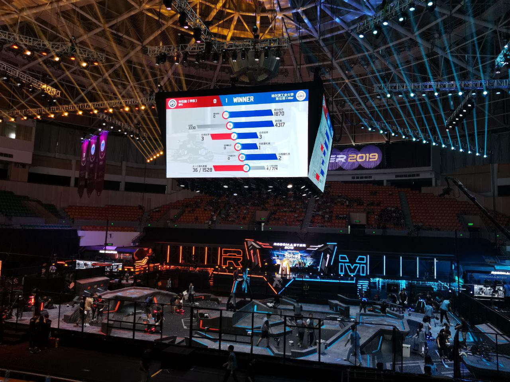

# About

[Robomaster](https://www.youtube.com/watch?v=ECr4zgK6cPA) is an annual robotics competition held in Shenzhen, China and is organized by DJI.  The purpose of Robomaster is to develop young talents in the field of robotics and engineering. This year, NUS will be forming a team with the intention of participating in the 2020 Robomaster competition.

If you want to develop your engineering and robotic skills and be put into a challenging and competitive environment, we want YOU!

Students of all years (PG and UG students) are welcome.

In 2019, 17 teams outside mainland China competed in the International Regional, with 2 of the teams entered the Top-32 global ranking, among a total of 170+ teams. Below is a short documentary about the Virginia Tech RoboMaster team.

<iframe width="100%" height="380" src="https://www.youtube.com/embed/dlOEqCMw1xI" frameborder="0" allow="accelerometer; autoplay; encrypted-media; gyroscope; picture-in-picture" allowfullscreen></iframe>

# A Glimpse of RoboMaster 2019

Watch the 2019 season on [Twitch](https://www.twitch.tv/robomaster/videos)!