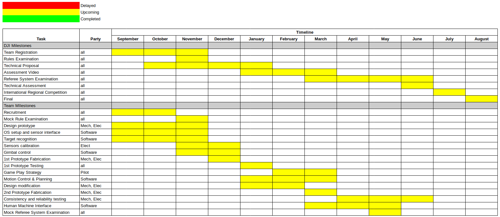
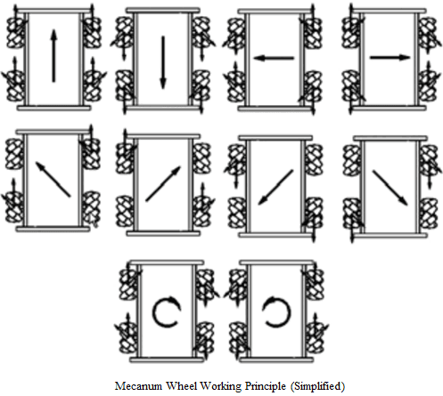
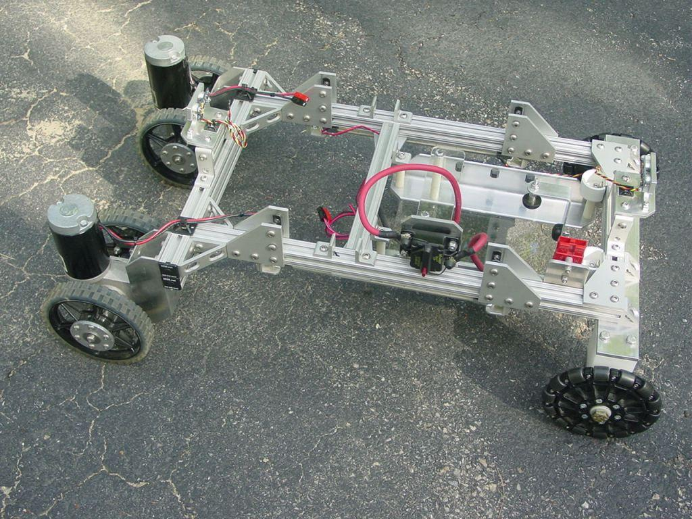
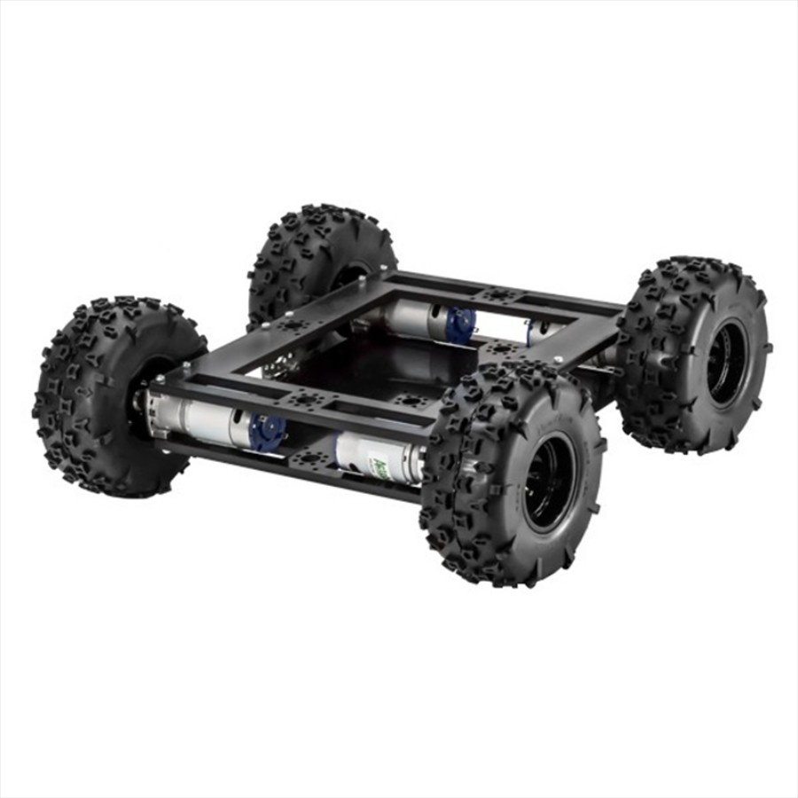
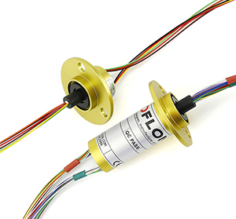
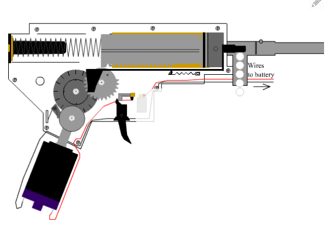
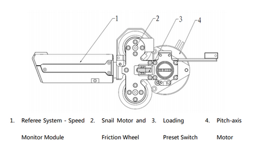
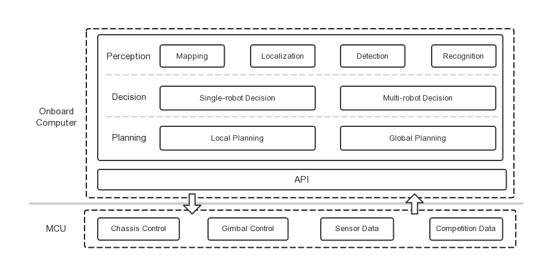
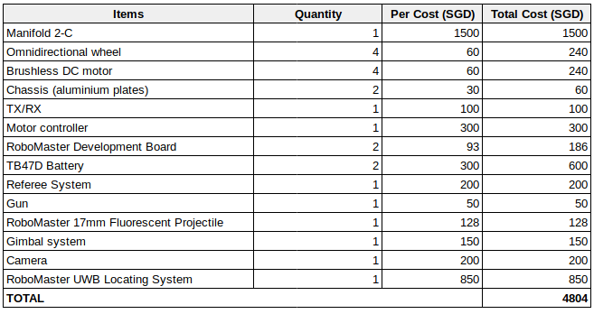

# NUSBOT

## Introduction

 - Liew Jia Min

  I am Jia Min,  a Final Year Mechanical Engineering Student. Currently i am working on a project involving autonomous flight path planning for a facade inspection system. I am proficient in C, Python, Matlab and Solidworks.I am interested in pursuing robotics in the future and hope to learn skills related to the software aspect of the robot through this competition. 
                                                                                                                   
 - Andrew Leong Jiacheng

  I am Andrew, a Final Year Mechanical Engineering student working on autonomous cooperative control for AGVs and an indoor positioning system. Proficient in C, Python, MATLAB, Solidworks, ANSYS CFX.
 - Teh Zhi Da

  This is Zhi Da, year 4 Mechanical Engineering aeronautical specialisation student who has deep interest in robotics as well. ROS, Python, C, C++, MATLAB, Qt, Solidworks, ANSYS CFX. Previous experience in Autonomous Vehicle @ KXR, STELS & path-following differential wheeled robots.

### Proposed Manpower Arrangement
No| Role          |  Description                                | Assigned to       | 
--|-----------------|---                                        |---                |
 1|  Mechanical     | Chassis; Suspension                       |  Andrew           |
 2|  Mechanical     | Gun, Gimbals System                       | Open Position     |
 3|  Electrical     | Power Management; Electric Drive; Failsafe|  Andrew           |
 4|  Electronics    | Sensor Interface; Close-loop Control      |  Zhi Da           | 
 5|  Software       | Linux OS, Sensor Drivers                  |  Zhi Da           | 
 6|  Software       | Computer Vision; Motion Planning          | Jiamin, Andrew    | 
 7|  Operation      | Sponsorships; Chinese-English Translation | Open Position     |   
 8|  Operation      | Accounting; Publicity Materials           | Open Position     |  
 9|  Pilot          | TX & RX system; Game-play strategy        | Open Position     |
 
 For interested people to join our team, please contact Telegram @liewjiamin

## Timeline & Milestones

## Robot Design Considerations

The standard robot is a “general” use assault robot in the robomaster line up. It is required to have a high degree of mobility and maneuverability as it transits from task to task. It can be used in offensive, defensive and strategic maneuvers during a match. These include assaulting the opposing sentry to gain entry to fire at the enemy base; defending from attacking robots and firing at the rune system to gain power-ups for the team.

Due to the mobility and maneuverability requirement an omni-wheel setup should be employed for standard. However, this may incur a high power draw requirement due to the need for 4 driven wheels, this must be taken into consideration due to the limited total 80W power draw for standards.

Fig 0: Mecanum wheel general working principle

Additionally, due to the competition terrain, a suspension based system should be employed for the chassis and the overall robot must robust and be designed to take drops from the various steps on the competition battle grounds.

One popular tactic for standards is to continuously rotate on spot while firing to increase the difficulty for opponents to target the referee armour system. This requires a freely rotating gimbal and firing system. One design challenge would be to design this yaw gimbal to allow for this; pass-through wiring would simply tangle up.

As the battle pace is relatively quick, fully manual piloting of the standard robot would be extremely cumbersome and ineffective. Software side development goals would need to include some sort of machine vision aim-assist system, trajectory prediction and firing error correction system, driver assist system, and a localisation system for individual pilots to identify friendlies and their status on a map-level view.

## General Design & Fabrication Methodss

General design philosophy: The robot has to endure massive significant abuse during the competition, **it will probably break at least once; make the robot easy to build and repair by modularizing the components.** 

Time/Effort allocated to the design and fabrication for the robot: 30%. This is due to the significant amount of time that will be required in developing and tuning the various software components in addition to mechanical and custom electrical components.

#### Chassis design and fabrication

General Chassis and mechanical design components should be designed for manufacture and assembly based on the design philosophy. 

One possible method of construction is the use of standard aluminum extruded profiles and assembled with connector pieces. This reduces the number of custom machined parts that may require significant effort to manufacture, and increases the speed and ease of manufacture significantly at the cost of some weight. Figure 1 illustrates an example of such a robot. This method can be manufactured by simply cutting the extruded aluminum to length with a bandsaw or equivalent and assembled with the necessary pieces.

Fig 1: Sample wheeled robot using aluminum extruded profiles

Another alternative construction method would be to design the robot using 2d-cut aluminum pieces which are attached together to form the chassis, as seen in figure 2. This method of construction would help reduce weight at the expense of increased production cost and speed. Such pieces can be manufactured either through traditional CNC milling at low speed, or be outsourced to CNC laser cutting service providers in Singapore.

Fig 2: Sample wheeled robot using 2d aluminum cut-outs. 

#### Turret gimbal design and fabrication

To allow for free >360 degree rotation some means of passing power and data from the launching and targeting system to the main power distribution system and onboard computer is required.

One solution would be to use a slip-ring mechanism to allow wire pass-through from a stationary input and rotating output. 

Fig 3: Slip Ring wire pass through

The remainder of the gimbal system is fairly standard for a 2-axis system, for yaw and pitch; 2 brushless DC motors + a gimbal control board and an IMU on both the turret and main chassis. The gimbal system will likely take some time for tuning for optimum stability.

#### Launching Mechanism

As per the design requirements, the launching mechanism must be able to accurately and precisely control the exit velocity for the projectile to prevent incurrence of damage penalties from simulated overheating of the barrel.

For ease of transport it would be reasonable to exclude a compressed gas-powered system. This largely restricts the design to electrical based systems.

Exploring how BB guns function leads to one design method: to use an electric motor to “charge” the weapon by pulling back on an air cylinder; and to launch the projectile a spring rapidly discharges the volume of air accumulated in the cylinde

Fig 4: Airsoft Pistol firing mechanism

An alternative mechanism employed in the ICRA 2019 DJI RoboMaster™ AI Challenge AI Robot would be to directly employ the use of a high-speed rotating wheel to accelerate the projectile:

Fig 5: Launching mechanism used in the DJI RoboMaster™ AI Challenge AI Robot.

#### Loading Mechanism

Depending on how Engineer robots are designed to transfer the projectiles, the general design consideration for loading mechanism is to have a large receiving area. As the projectiles are observed to be elastic, they can easily bound off from the loading platform. Therefore, the loading mechanism has to ensure a soft landing to reduce or prevent from wasting the projectiles during loading. This can be done through, for example using a net to catch the projectiles.

## Software Architecture

Fig 6: Software Architecture example from RoboRTS design

As mentioned above, the battle pace is relatively quick, fully manual piloting of the standard robot would be extremely cumbersome and ineffective.

Sensors for enemy identification and tracking – detect enemy robot in the area and its position
Sensors to obtain Real Time Robot information - HP Value,  projectile speed, number of projectiles left etc.

Vision system to assist in target aiming - Computer Vision for target detection and sensors to assist pilot in aiming for the targets (Trajectory prediction and firing error correction system)
Motion Planning to aid in the maneuverability of the robot

Low level computing platform STM32 microcontroller can be used to run task which require low computing power and real time processing capabilities:
- Close loop control
- Acquisition, pre-processing and forwarding of sensor information
- Information related to competition such as HP Value

On board processor manifold 2 can be used to execute algorithms with large amount of computations:
- Environment perception involving real time localisation, mapping, target detection, enemy identification and tracking
- Motion planning
- Decision frameworks used to conduct intelligent decision making 

Component | General Design          | 
--|---------------|---                                  |---                |
 Base		|  - Omniwheel robot    - Keep centre of mass between wheels   - Light-wheel impact resistance chassis  |
 Gimbal		|  - 2DoF, which are yaw and pitch   - Capable of aiming all 360° by gimbal control or robot motion |
 Propulsion	|  - Battery powered DC motors x4 |
 Software	|  - Perception for aim assist and enemy identification and tracking   - Localization for game strategy planning   - Motion planning and control for robot maneuverability   - Behavior reasoning for assisted decision making   - Human Machine Interface for pilot assist |
 Loading Mechanism	|  -Quick transfer of projectile   - Simple receiving mechanism with less mechanical complexity |

Hardware will be mostly fabricated through CNC machining and complex structure with less stress loading will be fabricated through 3D printing

## Proposed Budget

Take note that this is just a rough estimation. Further research along the way is required to pick the best configuration and might result in different cost.

