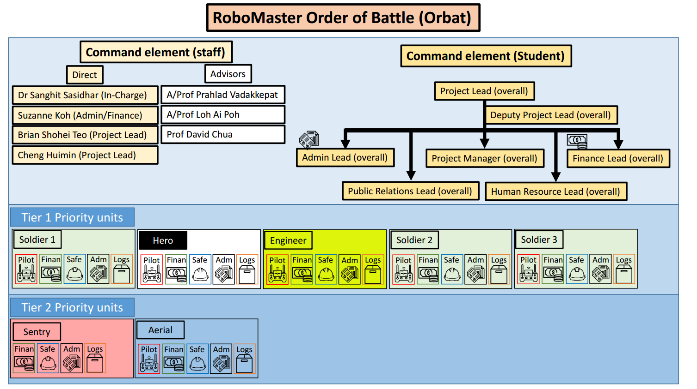

# Introduction of Teams

Registration for NUS RoboMaster Team is open until __12th September 2019__. All participants have to register as a team, not as individuals. 

If you have read the 2019 rules, you may understand that there are 7 robots to be built in total. As it is the first year we are joining the competition, we have absolutely zero existing assets.

Therefore, we are breaking up all NUS participants into several teams (around 5 ~ 7), each responsible to build one type of robot, mostly independently. We believe this is the fastest way to get us ready, as our timeline is tight! However, for this registration process, we limit the number to be 3 ~ 5, for the benefit of easy assessment. The team could autonomously recruit more people upon successful registration and evaluation.

We require each team to be able to operate independently, hence a good mix of talents from all disciplines would be beneficial.

## Presentation Slides

[Presentation Slides](/20190831Meet&Greet.pptx) and
[Presentation Recording](https://youtu.be/-1_5Fg2ZIe0)
## Team Registration
Registration by __12th September 2019__.

- Fill up the [__Registration form__](/RoboMaster_Team_Registration.doc) with 3 ~ 5 core team members' particulars, email to [nusrobomaster@gmail.com](mailto:nusrobomaster@gmail.com)
- Assign one person to be in the __RoboMaster Room Committee__ (indicate in the form), to:
    - Keep a record of the assets of the teams in the Room
    - Ensure room safety
    - Arrangement for wall deco, sofa, chairs, water dispenser etc. to make our place cosier
- Assign one person to be responsible to manage Git and GitHub, for uploading the [deliverables](./#registration-deliverables) and subsequent maintainance of the official NUS RoboMaster Team GitHub Organisation.

::: tip Open-Access Google Sheet for Team Forming
[Google Sheet](https://docs.google.com/spreadsheets/d/1WsfkJXkzwRbXjLkWeUFtLLv81pmUrfsi2hC5idDB5Zg/edit?usp=sharing)
:::

### Notes on RoboMaster Student Exco (Orbat)

If you are interested in joining the __NUS RoboMaster Student Exco__, you must be registered as a member of a team first. You could take on either technical or non-technical roles, and contribute to the team operations. The nomination and electron process will be released after the team registration period.

## Registration Deliverables
Each team has to submit their GitHub deliverables by  __16th September 2019__.

Design a __web page__ under the Teams Page, and may include:
- Self introductions
- 1 Standard Robot General Proposal (equivalent to a 5-page A4 Word document with 12 Font size). Recommended content:
    - Proposed manpower arrangement
    - Proposed timeline and milestones
    - Key aspects of the robot to consider (publicly available past competition resources might help)
    - General design and fabrication methods
    - Proposed budget

::: tip Why Only Standard Robot?
Restricting teams to propose for the standard robot is for the convenience of standardised assessment only. On top of this, if the team wish to propose ideas regarding the robot they eventually want to work on, it will be a bonus.
:::

The point of the registration process is not to force you to fix your team members. It is a practice for you to work with a team to tell a complete story, and to show your understanding of the competition to your best knowledge. It needs not to be technically comprehensive, but the team should demonstrate good understanding of the design goals and constraints.

### Notes on Creating The Web Page

#### Using Git and VuePress

Git Version Control is very important in managing digital work of the team. It is worth learning if no one in the team knows it yet.

The website we are using is created by VuePress, which is a web generator from Markdown language. Markdown is very simple to learn (in minutes) hence you dont need to know much html to start writing web pages!

Explore yourselves and read more from the README file at the [repo](https://github.com/nusrobomaster/nusrobomaster.github.io).

---

<ClientOnly>
<Disqus shortname="nusrobomaster" />
</ClientOnly>