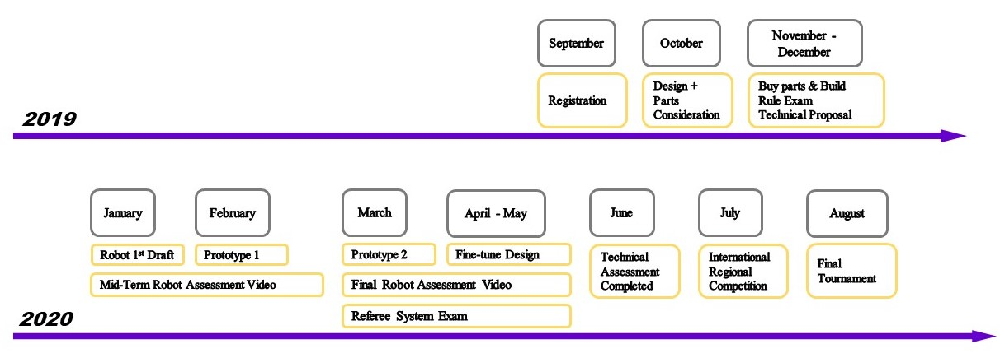
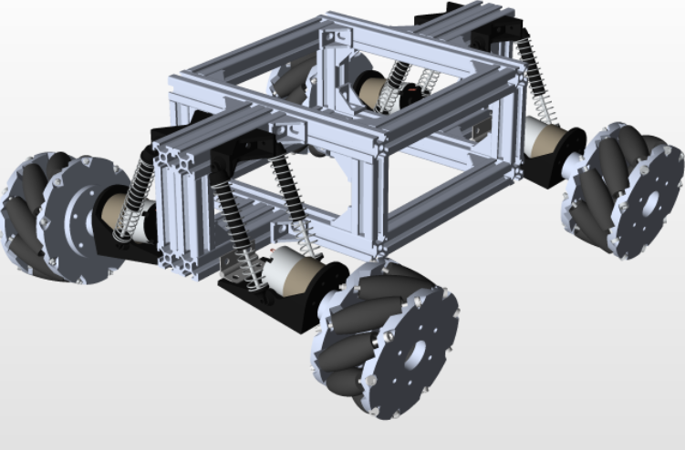

# Team Arigato Roboto

## Introduction
### Tay Kai Yang (Leader)
I am currently a Year 2 Electrical Engineering Student. I have always been excited about how technology has had a profound impact in changing the world. I try to apply  whatever EE has taught me wherever possible. I find that I learn best through trial and error, tinkering with stuff till I find the solution. Thus was born my enthusiasm to partake in this competition where the only way to learn is through independent exploration. I believe that the only two possible outcomes of this competition are that either we learn or we win and I strongly believe in the latter.
### Prabhakaran Gokul
I am a Year 2 Mechanical Engineering Student. I enjoy hands on work and thus I joined competitions such as Innoventure Programme and Hornet. I got to hone my skills as a mechanical engineer,especially in CAD, through these programmes. I am interested in robotics/AI thus I self learnt computer vision. I also exposed myself to software development by participating in orbital program. I want to pursue my passion in robotics/AI in the future. 
### Karnati Sai Abhishek
I am a Year 2 Student majoring in Computer Engineering. I am a core believer of the motto that learning does not stop outside the classroom and hence during my time at NUS, I have done self-initiated projects like orbital and also taken part in competitions like Hack & Roll. My immense interest in the real-life application of the concepts I learned in my modules also made me take up a software engineering internship at A*Star during my summer break. My experiences have aided in developing me as a holistic student with both soft and hard skills. Over the past year, I have also grown to like the fascinating field of artificial intelligence and wish to pursue this passion in the future. I believe that the challenging self-learning journey as a Robomasters core team member will aid me in gaining intriguing insights into artificial intelligence.
### Hans Kurnia
I am a Year 3 Computer Engineering student. Since my polytechnic days i have participated in several drone involved projects and competitions, such as SAFMC. From these experiences, I have developed an interest in drones as a hobby. Given my interest in drones and remote controlled platforms, I want to take part in the Robomasters competition.
### Ijaz Ahmed Navas
I am a Year 2 Electrical Engineering Student. In my first year in NUS I have actively tried to increase my exposure by participating in the Innoventure Programme and Hornet. I have a keen interest in Embedded systems and have accumulated experience in C, Python, Verilog and ARM Development Language. I am excited about the chance to apply the theoretical concepts I have learnt into practice through this experience. If there is one thing I have learnt from the lab sessions and other projects similar to this is that there are always a myriad of factors that you would not have considered in a theoretical model. The smallest issues could snowball and cause an error that would be difficult to trace back. However, when you finally troubleshoot the issue you would have learnt about peripheral issues you would not have ever thought about and the satisfaction is unmatched.

## Proposed Manpower Arrangement
No| Role          |  Description                        | Assigned to       | 
--|---------------|---                                  |---                |
 1|  Electronics   |  Sensor interface; Close-loop Control  |  Tay Kai Yang (Leader)|
 2|  Electrical   |  Power management; Electric Drive; Fail-safe   |   Ijaz Ahmed Navas |
 3|  Software     | Computer vision; Motion planning    |  Karnati Sai Abhishek    |
 4|  Software     | Linux OS; Sensor drivers            | Hans Kurnia     | 
 5|  Mechanical   |  Gun; Gimbals system                | Prabhakaran Gokul|
 6|  Mechanical  |  Chassis; Suspension |  Open Position|
 7|  Operation    | Sponsorships; Chinese-English Translation | Open Position     |   
 8|  Operation    | Accounting; Publicity Materials     | Open Position     |  
 9|  Pilot        | TX & RX system; Game-play strategy  |  Open Position  |

 For interested people to join our team, please contact Telegram @kaiyang21 

## Timeline & Milestones

## Robot Design Considerations
From looking at the roles played by the standard robot, we have agreed that it should be one that is compact, resilient to impact and agile for movement. Noting that they are the ones constantly moving throughout the field, jumping ramps and achieving objectives. Additionally, from studying the various segments of a robot and their intended functions, we have identified several key design features that each segment should fulfil.

**Wheels:**

*   Omnidirectional Movement
*   Sufficient friction for sharp change of direction
*   Sufficient gap between ground and base to traverse over small obstacles

**Suspensions:**

*   Conventional shockers in rc cars will be used to provide a suitable level of damping for the robot to move smoothly
*   Able to withstand the weight of the whole robot
*   Maximise contact of the tires with the ground

**Turret:**

*   360[°](https://www.degreesymbol.net/) Horizontal rotation
*   90[°](https://www.degreesymbol.net/)  Vertical rotation (Minimally able to shoot above and below the middle axis)
*   A combination of a good suspension and Gimbal system for Fluid and precise movement (For better control and aim)
*   2 flywheels spinning in opposite directions will be used for launching projectiles
*   A magazine will be mounted above the launcher. Projectiles will be fed into launcher via an opening in the magazine 

**Main Controller Unit:**

*   Sufficient input and output ports to all other onboard systems

**Chassis:**

*   Durable, able to take crashes without bending
*   Light
*   Weight placement concentrated closer to the base so as to enable stability.
*   Doesn’t take up too much space. (Need to save on board space for different components and keeping the robot compact)
*   Compartments and guide-lines will be created for cable management purposes
*   Aerodynamics of the whole structure will be taken into account for efficient movement of the robot. It will also be used to cool the electronic components down(heat sinks will be used depending on necessity). 
*   The section consisting of the gun and the section attached to the wheels are both able to rotate independently of each other. Allows versatile motion.
*   A sample of the preliminary design is shown in CAD below with the suspensions and the main structure. The chassis is not fully constructed yet. 
  

**Screws, bolts, nuts, washers:**

*   Not to use too many different types. (complicates development)

**Transmitter / Receiver:**

*   Communications are able to work without LOS (battlefield has structures blocking)
*   Sufficient range to cover the whole battlefield

**Sensors on board**

*   Consider having edge processing system
*   Includes an IMU and at least 2 cameras to provide detailed analysis of motion and 360 degree view 
*   Immediate live updates through usage of OpenCV to analyse the images from the cameras
*   A pressure sensor included to detect when ammunition is low

### Proposed Budget
<table>
  <tr>
   <td>
<strong>Category</strong>
   </td>
   <td><strong>Item</strong>
   </td>
   <td><strong>Description</strong>
   </td>
   <td><strong>Cost</strong>
   </td>
  </tr>
  <tr>
   <td rowspan="2" >Wheels
   </td>
   <td>Robomaster Mecanum Wheels
   </td>
   <td>2 left wheels, 2 right wheels
   </td>
   <td>176
   </td>
  </tr>
  <tr>
   <td>RoboMaster M3508 P19 Brushless DC Gear Motor
   </td>
   <td>To control wheels. 1 for each wheel
   </td>
   <td>316
   </td>
  </tr>
  <tr>
   <td rowspan="6" >Turret
   </td>
   <td>RoboMaster GM6020 Brushless Motor
   </td>
   <td>Gimbal movement
   </td>
   <td>189
   </td>
  </tr>
  <tr>
   <td>RoboMaster 2312 ESC-420S
   </td>
   <td>To control GM6020 motor

Electronic speed controller 
(5 x 6)
   </td>
   <td>30
   </td>
  </tr>
  <tr>
   <td>M2006 P36 Brushless DC Gear Motor
   </td>
   <td rowspan="2" >Projectile loading
   </td>
   <td>41
   </td>
  </tr>
  <tr>
   <td>RoboMaster C610 Brushless DC Motor Speed Controller
   </td>
   <td>25
   </td>
  </tr>
  <tr>
   <td>DJI Snail 2305 Racing Motor
   </td>
   <td rowspan="2" >Projectile launching
   </td>
   <td>19
   </td>
  </tr>
  <tr>
   <td>Snail 430-R Racing ESC
   </td>
   <td>8
   </td>
  </tr>
  <tr>
   <td>MCU
   </td>
   <td>RoboMaster Development Board Type A
   </td>
   <td>MCU
   </td>
   <td>68
   </td>
  </tr>
  <tr>
   <td>
   </td>
   <td>RoboMaster Development Board Type B
   </td>
   <td>
   </td>
   <td>35
   </td>
  </tr>
  <tr>
   <td>
   </td>
   <td>RoboMaster Development Board OLED
   </td>
   <td>
   </td>
   <td>14
   </td>
  </tr>
  <tr>
   <td>
   </td>
   <td>RoboMaster Development Board Cables
   </td>
   <td>
   </td>
   <td>40
   </td>
  </tr>
  <tr>
   <td rowspan="3" >Chassis
   </td>
   <td rowspan="3" >
   </td>
   <td rowspan="3" >Estimated budget
   </td>
   <td rowspan="3" >100
   </td>
  </tr>
  <tr>
  </tr>
  <tr>
  </tr>
  <tr>
   <td>Battery
   </td>
   <td>TB47D Battery
   </td>
   <td>CP.TP.000130
   </td>
   <td>216
   </td>
  </tr>
  <tr>
   <td>Battery Charger
   </td>
   <td>RoboMaster TB47 Battery 100W Charger AC Cable
   </td>
   <td>CP.BX.000034
   </td>
   <td>4
   </td>
  </tr>
  <tr>
   <td>Remote Control
   </td>
   <td>RoboMaster Robot Remote Controller Set
   </td>
   <td>CP.RM.000034
   </td>
   <td>56
   </td>
  </tr>
  <tr>
   <td>Receiver
   </td>
   <td>RoboMaster Robot Remote Controller Receiver
   </td>
   <td>CP.RM.000030
   </td>
   <td>16
   </td>
  </tr>
  <tr>
   <td rowspan="2" >UWB Locating System
   </td>
   <td>RoboMaster Tag for UWB Locating System
   </td>
   <td>CP.RM.00000002.01
   </td>
   <td>95
   </td>
  </tr>
  <tr>
   <td>RoboMaster Anchor for UWB Locating System
   </td>
   <td>CP.RM.00000004.01
   </td>
   <td>133
   </td>
  </tr>
  <tr>
   <td>ESC system
   </td>
   <td>RoboMaster ESC Center Board
   </td>
   <td>CP.RM.000048
   </td>
   <td>5
   </td>
  </tr>
  <tr>
   <td rowspan="10" >Referee System
   </td>
   <td>RoboMaster Referee System Main Controller Module MC02
   </td>
   <td>CP.RM.00000060.01
   </td>
   <td>72
   </td>
  </tr>
  <tr>
   <td>RoboMaster Referee System Armor Module AM02
   </td>
   <td>CP.RM.00000063.01X4@96
   </td>
   <td>384
   </td>
  </tr>
  <tr>
   <td>RoboMaster Referee System Armor Module AM12
   </td>
   <td>CP.RM.00000064.01
   </td>
   <td>104
   </td>
  </tr>
  <tr>
   <td>RoboMaster Referee System Armor Module Support Frame AH02
   </td>
   <td>CP.RM.00000065.01 x 4
   </td>
   <td>51
   </td>
  </tr>
  <tr>
   <td>RoboMaster Referee System Armor Module Support Frame AH12
   </td>
   <td>CP.RM.00000066.01  
   </td>
   <td>50
   </td>
  </tr>
  <tr>
   <td>RoboMaster Referee System Speed Monitor Module

 SM01
   </td>
   <td>CP.RM.00000021.01
   </td>
   <td>73
   </td>
  </tr>
  <tr>
   <td>RoboMaster Referee System Speed Monitor Module SM11
   </td>
   <td>CP.RM.00000022.01
   </td>
   <td>84
   </td>
  </tr>
  <tr>
   <td>RoboMaster Referee System RFID Interaction Module FI02
   </td>
   <td>CP.RM.00000105.01
   </td>
   <td>45
   </td>
  </tr>
  <tr>
   <td>RoboMaster Referee System Power Management Module PM01
   </td>
   <td>CP.RM.00000061.01
   </td>
   <td>74
   </td>
  </tr>
  <tr>
   <td>RoboMaster Referee System Light Indicator Module LI01
   </td>
   <td>CP.RM.00000062.01
   </td>
   <td>74
   </td>
  </tr>
  <tr>
   <td>Total Cost: 
   </td>
   <td>
   </td>
   <td>$2567 ++
   </td>
   <td>2600
   </td>
  </tr>
</table>
