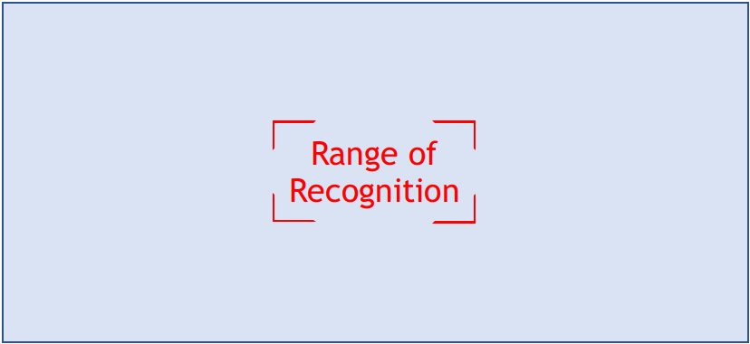
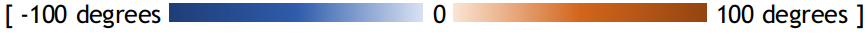
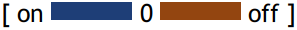
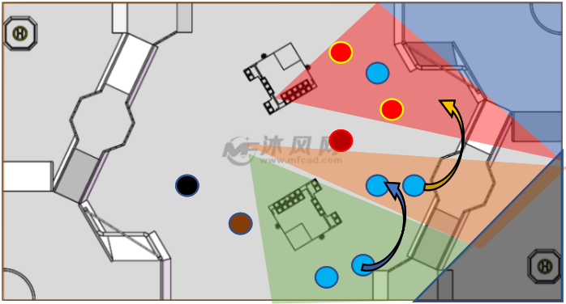
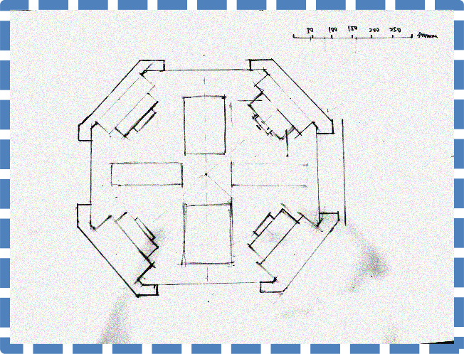
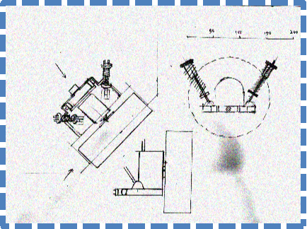
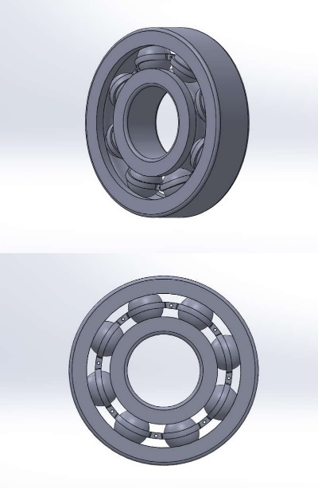
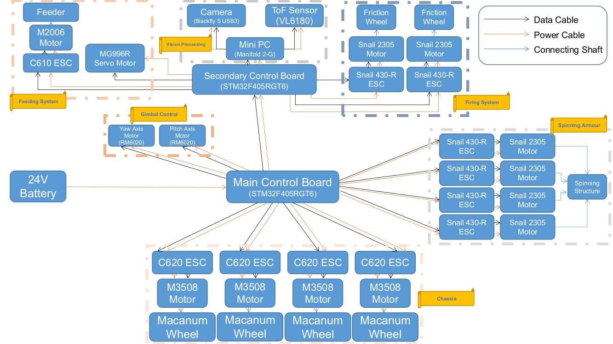

# Team BeebleBum

## Who Are We?

 

Liu Tiedong (Team Leader)

  - EE Student
  - Skills:
    - Programming Skills:
      - C, C++, C#, Python, Java, HTML, CSS, JavaScript, PHP, Ruby, Go, ARM & X86 Assembly, Verilog, VHDL
    - Mathematical Skills:
      - Discrete structure, mathematical modelling, Matlab, operational research, llinear and convex optimization, stochastic process
    - Electrical Engineering Skills:
      - Automatic control system, robotics, robotics, feedback control system, signals and systems, machine learning (pattern recognition and neural networks), computer vision, digital design, embedded system, FPGA

 

Li Bozhao

  - CEG Student
  - Past Projects:
    - Arduino-based autonomous vehicle for Robocup (Rescue Team)
    - Mathematical function plotter based on Tupper's Interval Arithmetic
    - 3D-printed personal mobility device
    - 3D-printable pneumatic prosthetics for upper limb deficiencies
    - Text-to-speech generator
  - Skills:
    - Robotics
    - 3D printing and design on SOLIDWORKS
    - Programming in C#, VB.NET
    - OpenCV based computer vision
    - ROS based system design
    - Vocal synthetics
    - Chinese-English translation
  - Future Plans:
    - Try to achieve something in RoboMaster
    - Learn more during the process
    - Meet new people as well

 

Li Ruochen

  - EE Student
  - Past Experience:
    - BF interpreter on TI graphing calculators
    - Port luatool (NodeMCU script loader) to Python3
    - Youtube batch downloader
    - Self-balancing robot
  - Skills:
    - Programming in Python, C, Node.js, Lua, Go
    - Microcontrollers: 8051, STM32 (ARM Cortex-M3), NodeMCU, Arduino
    - HTML, CSS, JavaScript
    - Linux shell scripting
    - Matlab/Octave
    - ROS
    - OpenCV

 

Liu Yiming

  - ME Student
  - Skills and Past Experience:
    - Experienced in Chinese-English Translation
    - Interested in hands on engineering experience
    - Owns a Weibo channel with 250K followers which focuses mainly on spaceflight and other technology related information
    - Participated in 2019 China Space Conference as media crew
  - Future Plans:
    - Try my best in RoboMaster 2020 and gain meaningful experience

 

Wang Zesong

  - CEG Student
  - Past Projects:
    - Wechat Mini-program development
  - Skills:
    - JavaScript
    - HTML
    - ROS based system design
    - C
    - Python
    - Matlab

## Culture

Robomaster is the first international competition involving shooting confrontation between robots. Merging the elements of robotics technologies with e-sports, it not only sets up an exciting competitive combating platform but also creates a stage for robotics competition of a higher level. It is drawing attention of hundreds of institutions and robotics enthusiasts from all over the world. This year, with the addition of Missle and Radar Station, the commpetition will surely become more competitive.

Our team will focus on the research of robotics structural design, movement control and system integration and keep track of latest researches on key technologies in robotics. We will come up with innovative designs that target the new rules this year.

## Standard Robot Proposal

### Role

The Main Battle Robot in the field, performs tactical attack, defense, cooperation and maneuvers, triggering the Double Damage Power Rune, as well as long range shooting. Our design of standard robot will mainly play a defensive role.

### Design Requirements

Figure 1: Overall Design Requirements

### Software Design

We opt for a defensive strategy. Below are the main tactics we apply, the ones that have an influence on our software design are highlighted:

1. During battle we will not actively rush towards enemy’s base.
2. <mark>We will hold enemies back at a relatively safe range.</mark>
3. <mark>We will aim for all Runes, especially the second one.</mark>
4. We will form a seduce-and-destroy approach to single out enemy’s standard robot.
5. We will have quick sideway maneuvers and rotations to make the robot harder to hit.
6. <mark>We will have a large field of view from fused different sensors to detect enemies earlier.</mark>
7. <mark>We will always break the battlefield into sections in which we outnumber the enemy.</mark>
8. Our victory depends on the wave of attack after getting the second Rune.
9. In case the enemy gets the Rune, we tighten the formation and defend around our base so that the sentry fire covers the enemy side-on while we counter-attack.
10. In response to the new rule, we need to deploy effective anti-missile defense.
11. We need to use missiles to strike out enemy front fortress.
12. <mark>We need to have high frame rate vision on radar station with assist anti-missile defense.</mark>

Therefore, the software system needs to have the following features (to be explained next):

1. High precision in recognizing the enemies at a far range
2. High precision in recognizing and tracking the Runes
3. Stable and smooth movement of the gimbal to extend the shooting range
4. Account for the distance between the barrel and the target so that the bullet speed can be adjusted to hit the target at a speed within the optimal sensing speed range 8-12m/s
5. High speed to handle data from a camera with high frame rate for faster reaction
6. Generate guide curves and simulated trajectories for better aiming
7. Real-time aiming aid to auto-lock-on to a specified enemy robot or unlock it
8. Generate on-screen tactical suggestions so that players can outnumber and enclose the enemy in each crossfire section while enemy robots are blocking each other and firing ineffectively
9. Sensor fusion enabling the robot to alert its player when enemies appear out of view
10. High frame rate real-time recognition of incoming missiles from the radar station

Elaboration of design:

- Recognition
  - Recognition is based on the OpenCV library. There are three levels of recognition, namely object-level, target-level and feature-level. The object-level recognition (sees the enemy robot) is omitted as the player can recognize the enemy robot from the terminal more reliably than the software. However, target-level recognition (sees the armor plate) and feature-level recognition (sees the Rune) is largely automatic.
  - As seen from Figure 1 below, although the camera frame is not cropped giving us a larger-than-needed field of view, the target-level and feature-level recognition only start within a much smaller range (adjustable by keyboard) for the following reasons:
    1. Make the algorithm respond faster
    2. Give the player the ability to manually target a certain robot
    3. Maximize the use of the region where lens distortion is insignificant
    4. Keep larger filed of view for easier spotting of enemies for players

    

    Figure 2: Range of Recognition

  - We recognize the target (armor plate) by detecting the light strips at the sides of an armor plate. We do not recognize the inner number of the armor plate to save processing power and boost reaction speed. We take the center-weighted average of the color of the area between the light strips to determine whether it is an actual armor plate. The reason why armor detection is automatic is because most teams have opted for rotating their robot upon crossfire so that the time when the armor plate is facing the opponent is shortened, making the bullet harder to hit even at zero-range and at the highest fire rate.
  - For the feature-level detection (runes), we plan to use an open-loop tracking method which will be described in the next section.
- Tracking
  - For tracking of the armor plate, sparse optical flow is used based on OpenCV. Since the enemy robot is most likely rotating during an encounter (reasons already explained), it is safe to assume that the enemy’s rotation speed will not drastically change between the adjacent two frames due to inertia (given the frame rate is high). It is then concluded that optical flow can not only track the target but also provide a good estimation of the position of the target in the next frame. Armor tracking starts upon pressing the fire button (left click) and ends when the target is no longer detectable if the player is not holding down the fire button. To flood bullets, the player can hold down the fire button.
  - For rune tracking, there are manual and automatic modes. In manual mode (default), the program will try to track the rectangle-like feature of the rune that is within the range of recognition. Such range can be adjusted by the player using mouse wheel scroll. If no detectable Rune is inside the range, the program will look for the feature of a Rune around the region until it finds one. If no one is found after the full frame has been checked, the program will quit rune mode. Once a rune is found, optical flow will be implemented to track and predict its position. In automatic mode, the program always tries to look for a rune on the entire frame. Two modes can be switched by keyboard, and the player can manually enter or quit rune mode using a right-click.
- Movement
  - Movement of the gimbal has two modes, ease-in-and-out mode and fast mode. In ease-in-and-out mode, there will be a Gaussian filter applied on the signal values sent to the driver and the output motion will be smooth. Meanwhile a PID controller is applied to the gimbal so that the player’s mouse or control movements are mapped to value instructions rather than binary instructions and the gimbal is controlled by a PID controller.
  - For example, mapped to the amount of degrees to be turned: 
  - It makes the movement smooth and stable yet limits the turn range which is suitable for far-range exchange of fire but has a small delay and is not suitable for close-on combat.
  - In fast mode the gimbal always moves at the fastest speed with no smoothing, so that the gimbal movements precisely reflects the player's control:  This mode allows the player to quickly turn the robot by a very large degree which is unsuitable for long-ranged shot but suitable for short-range combat.
  - These two modes can be switched using a hotkey.
- Time-of-Flight sensor integration
  - We do not accept the Time-of-Flight data until a target is being tracked. When a target is being tracked, depth data is read at maximum speed and mapped onto each frame. This depth data is transferred to firing algorithm (unless too far) which will calculate the power supplied to the launching motors based on the formula given by the mechanical team members. For presentation purposes, it is represented as P = f(g(h(x))) where x is the depth of the target, h gives the initial bullet speed required given x and drag in air, g gives the speed of the frictional wheels given h and the frictional wheel configuration and material, and f gives the power required with the launching motors given g. 
- Optimization using hardware acceleration
  - We are using Manifold 2-G (a mini computer made by DJI) as the brain. It contains a NVIDIA TX2 graphics unit which has 128 CUDA cores, making it respond quickly when processing images at a super high frame rate or when using a neural network for advanced recognition (to be implemented after basic functions are completed). We will use OpenCV library for hardware acceleration on image processing. Also, we will use multithreading to optimize the use of the CPU which has multiple cores.
- Optimized UI interface
  - The UI interface provided by the referee system can be overlaid by an additional layer of graphics for the additional Radar Screen. It can show customized UI, which provides the following highlights:
    
    Figure 3. Battle Section View (map from www.mfcad.com)
      - As shown by the figure, our half of the battlefield is segmented into different regions and we aim to outnumber the enemy in each region. When a region is in red, it signals to the player in the adjacent region to come as an aid.
      - According to the new rules, this map will be generated by using a fisheye camera pointing from a high position. It requires lens correction which can be done by using the OpenCV library. This function should be independent from the anti-missile algorithms and they should use different cameras.
    - Enemy Danger Index
      - Enemies are colored differently according to their danger index calculated by their position and density. The most dangerous enemies are in red and less dangerous ones are in less and less saturated colors. Not only in the Battle Section View, but also in other views.
    - Tactical Suggestions
      - Tactical suggestions appear on the Battle Section View as curved arrows instructing players to move to better tactical positions. It also appears as custom text messages on the UI of involved player in the designated message area. Examples are: [05 Move Right] [03 Seek Sentry Fire Cover]
    - Idle-time detection and automatic response
      - When the player is not moving the robot (such as when the player fails to see any enemy) or the robot cannot be moved for some time (such as when the motors fail), idle-time detection triggers and the target-level detection runs on the whole frame while the gimbal gradually swings left and right . When a target is detected, the robot automatically locks-on it using optical flow and fires automatically until the player moves the robot.
    - Communication via Wi-Fi when debugging
      - When debugging, the robot transfers test output and logs through Wi-Fi back to the control terminal for easier debugging. 
    - Scanning alerting system
      - When the radar detects an enemy close to a player, it sends text data to the sentry which then displays onto the destinated text area, alerting the player.
    - Anti-missile system
      - This is to be achieved by standard robot collaborating with the radar station. When a radar system detects the pre-launching motion of the launching platform of the enemy, it calculates the trajectory of the missile and sends instructions to nearby standard robots, which will enter the anti-missile mode. In this mode, the region of recognition enlarges to encompass the entire frame and the text “MISSILE COMING” is displayed in the text area to alert the player. As soon as something enters the frame it will be picked up by the optical flow algorithm based on very high frame rates of the camera. If the motion speed (calculated from the output of optical flow) is manageable, the program will treat it as a normal target and start shooting. If its speed is too high, the program will flood the trajectory with bullets at maximum speed and frequency.

The Software division handles vision and target-oriented programming solutions. The control system which allows the robot to be maneuvered by the player via driving motors, getting sensor data and setting gimbal positions is handled under Electrical and Electronics division.

### Mechanical Design

We would like to propose the design of chassis and suspension based on the following strategies:

1. We will not rush to the enemy base to attempt a sudden assault; instead, we will keep enemies at a distance with our accurate firing control systems.
2. We should have quick sideways maneuvers and rotations to make it harder for enemies to target us, and meanwhile creating the opportunity for the robot to attack.
3. The purpose of rotation is to minimize the time armor plate is exposed to the enemy, so as to reduce the chance of being hit. However, rotation using wheels will restrict the movement of robot, thus, we use a set of independent rotation mechanism, where armor plates will rotate independently with respect to the wheels, allowing the robot to move while rotating.

Thus, we design our chassis and suspension with following features:

1. Our wheels are arranged in a way similar to the fashions of the soccer robot which gives us greater control in confined space to do sideways maneuver.
2. We apply two sets of shock absorbers to each wheel to further reduce the vibration, which will stabilize the robot for better shooting.
3. Our suspension systems should have suitable rigidity and this will make it easier for our robot to climb up the slides and this is important to preform shooting of the Rune.

And we would like to propose the following design:

Figure 4: Manuscript of the chassis(top plane vision)

- The arrangement of the wheels is from that of other robots. To increase the rigidity of the chassis, we cancel the hollow holes of the chassis and plan to add more suspension frames in the rectangular areas drawn in the horizontal and vertical axes of the chassis.

Figure 5: Manuscript of the independent suspension of a wheel.

- Two shock absorbers are mounted perpendicular to each other and two sets of deep groove ball bearings join the mounting plate with the chassis. This will provide two degrees of freedom for the wheel and allow the shock absorbers to function normally.

Figure 6. The CAD showing the relationship of the shock absorber and the mounting plates of the motor and the wheels.

Figure 7. The CAD showing the deep groove ball bearings

Considering our design features, our chassis need to have good load-bearing capability and bending resistance. Hence, we consider polybutylene terephthalate (PBT) as a good material choice. PBT is a kind of semi-crystalline thermoplastic, with very stable molecular structure and excellent mechanical strength, its main advantages are as follows:

- Sufficient mechanical strength (Tensile strength - 8690 psi)
- Sufficient bending resistance, preventing it from deforming (Flexural modulus – 330000 psi)
- Its rigidity will not be affected by temperature.
- Low density (1.30 g/cm3, half of aluminum)
- Acceptable cost, easy to fabricate.

The main disadvantage of PBT is that it is unstable under high temperature/humidity environment, which is generally not related to our competition situation. Hence, after considering these factors, we would like to propose PBT as the main material for chassis.

Figure 8. The CAD of the spinning armour structure

- Remove the spinning structure from the chassis by adding an additional spinning layer.
- Use a gear system and a counter balance load to stabilize the overall torque.
- The gear system is like that of a planetary gearbox, with planets connected to fixed motors and other parts of equal mass rotate accordingly. 

### Manpower Arrangement

|No|Role       |Description                          |Assigned to  |
|--|-----------|-------------------------------------|-------------|
|1 |Mechanical |Chassis; Suspension                  |Yiming       |
|2 |Mechanical |Gun Control; Gimbal System           |Open Position|
|3 |Electrical |Power management; Circuit Design; Fail-safe|Tiedong|
|4 |Electronics|Sensor interface; Close-loop Control |Ruochen      |
|5 |Software   |Linux OS; Sensor Drivers; UI         |Open Position|
|6 |Software   |Computer Vision                      |Bozhao       |
|7 |Software   |Motion Planning                      |Zesong       |
|8 |Operation  |Chinese-English Translation, Publicity|Yiming      |
|9 |Operation  |Accounting                           |Open Position|
|10|Pilot      |TX & RX system; Game-play strategy   |Open Position|

For interested people to join our team, please email <a href = "mailto: liruochen@u.nus.edu">liruochen@u.nus.edu</a>

### Electrical Design

Figure 9. The structure of hardwares mounted on the robot

### Hardware List and Budget (Hardware from DJI at 40% discount)

- DJI Manifold 2-G
  - Weight: 230g
  - Processor: NVIDIA Jetson TX2 (256 CUDA cores)
  - Memory: 8GB 128 bit DDR4 1333MHz
  - eMMC: 32GB, SATA-SSD: 128GB
  - Comprehensive I/O ports
  - High speed Wi-Fi for debugging
  - Unit Price: **S$840**
  - Quantity: **1**
- STM32F405RGT6
  - ARM Cortex M4 Core
  - 1024KB flash
  - 192KB RAM
  - Large flash for large programmes
  - Unit Price: **S$10**
  - Quantity: **2**
- Sparkfun ToF Sensor VL6180
  - Measures absolute range up to 10cm
  - Unit Price: **S$36**
  - Quantity: **1**
- Blackfly S USB3 (BFS-U3-04S2C-CS)
  - 522 FPS
  - Global Shutter
  - Unit Price: **S$365**
  - Quantity: **1**
- Robomaster Macanum Wheel
  - Unit Price: **S$60**
  - Quantity: **4**
- Robomaster M3508 with C620 Brushless DC Motor Speed Controller
  - Rated Voltage：24 V
  - Max rotational speed with a continuous torque of 3N·m：469rpm
  - Used for chassis (wheels)
  - Unit Price: **S$105**
  - Quantity: **4**
- Robomaster M3508 Accessories Kit
  - Includes cables and a terminal board for the motors on the chassis
  - Unit Price: **S$40**
  - Quantity: **1**
- DJI Snail 2305 Racing Motor with Snail 430-R Racing ESC
  - Can provide a large thrust
  - Speed constant: 2400rpm/V
  - Used for the friction wheels of the firing system
  - Also used for spinning armour structure
  - Unit Price: **S$35**
  - Quantity: **6**
- Robomaster GM6020 Motor
  - Has built-in driver, does not require ESC
  - Max continuous torque: 1.2N·m
  - Max speed at rated torque: 132 rpm
  - Used for the yaw and pitch axes of the gimbal system
  - Unit Price: **S$105**
  - Quantity: **2**
- MG996R Servo Motor
  - Stall torque at 6V: 15kg-cm
  - Operating Speed: 0.13sec/60deg
  - Used to open/close the cover of the feeding tank
  - Unit Price: **S$9**
  - Quantity: **1**
- Robomaster M2006 Brushless Motor with C610 ESC
  - High output rotational speed
  - High power density
  - Compact design
  - Used for the feeding system
  - Unit Price: **S$50**
  - Quantity: **1**
- Total Price:
  - **S$2440**

## Project Timeline

## Training Timeline

> The team need to make good use of the open source materials to familiarize with their respective technical skills.
> Each team can divide members into subgroups to conduct group learning and regular group discussion. 
> The proposed training timeline is shown below.

## Content Sharing

> As first-year participants, it is important to ensure efficient communication and sharing of information between and within the team.
> In order to ensure efficient online collaboration, here are proposed platform and sources of information.

## RoboMaster 2020 Robotics Competition Rules Framework (from Robomaster official website)

<embed src="https://drive.google.com/viewerng/viewer?embedded=true&url=https://rm-static.djicdn.com/documents/13194/884e0a668cb2d1569399369046323083.pdf" style="width:100%; height:714px">

