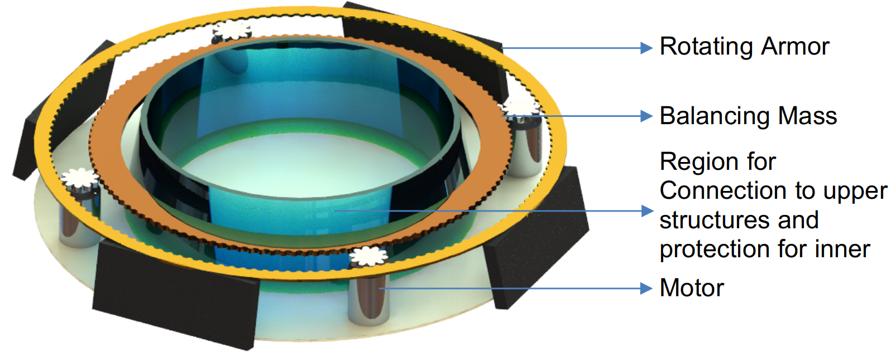

# Team BeebleBum

## Who Are We?

 

Liu Tiedong (Team Leader)

  - EE Student
  - Skills:
    - Programming Skills:
      - C, C++, C#, Python, Java, HTML, CSS, JavaScript, PHP, Ruby, Go, ARM & X86 Assembly, Verilog, VHDL
    - Mathematical Skills:
      - Discrete structure, mathematical modelling, Matlab, operational research, llinear and convex optimization, stochastic process
    - Electrical Engineering Skills:
      - Automatic control system, robotics, robotics, feedback control system, signals and systems, machine learning (pattern recognition and neural networks), computer vision, digital design, embedded system, FPGA

 

Li Bozhao

  - CEG Student
  - Past Projects:
    - Arduino-based autonomous vehicle for Robocup (Rescue Team)
    - Mathematical function plotter based on Tupper's Interval Arithmetic
    - 3D-printed personal mobility device
    - 3D-printable pneumatic prosthetics for upper limb deficiencies
    - Text-to-speech generator
  - Skills:
    - Robotics
    - 3D printing and design on SOLIDWORKS
    - Programming in C#, VB.NET
    - OpenCV based computer vision
    - ROS based system design
    - Vocal synthetics
    - Chinese-English translation
  - Future Plans:
    - Try to achieve something in RoboMaster
    - Learn more during the process
    - Meet new people as well

 

Li Ruochen

  - EE Student
  - Past Experience:
    - BF interpreter on TI graphing calculators
    - Port luatool (NodeMCU script loader) to Python3
    - Youtube batch downloader
    - Self-balancing robot
  - Skills:
    - Programming in Python, C, Node.js, Lua, Go
    - Microcontrollers: 8051, STM32 (ARM Cortex-M3), NodeMCU, Arduino
    - HTML, CSS, JavaScript
    - Linux shell scripting
    - Matlab/Octave
    - ROS
    - OpenCV

 

Liu Yiming

  - ME Student
  - Skills and Past Experience:
    - Experienced in Chinese-English Translation
    - Interested in hands on engineering experience
    - Owns a Weibo channel with 250K followers which focuses mainly on spaceflight and other technology related information
    - Participated in 2019 China Space Conference as media crew
  - Future Plans:
    - Try my best in RoboMaster 2020 and gain meaningful experience

 

Wang Zesong

  - CEG Student
  - Past Projects:
    - Wechat Mini-program development
  - Skills:
    - JavaScript
    - HTML
    - ROS based system design
    - C
    - Python
    - Matlab

## Culture

Robomaster is the first international competition involving shooting confrontation between robots. Merging the elements of robotics technologies with e-sports, it not only sets up an exciting competitive combating platform but also creates a stage for robotics competition of a higher level. It is drawing attention of hundreds of institutions and robotics enthusiasts from all over the world.

Our team will focus on the research of robotics structural design, movement control and system integration and keep track of latest researches on key technologies in robotics. More attention will be given to specialized robots, industrial robots and unmanned driving technologies. By encouraging team members to participate in various contests in robotics, we will hone their abilities in self-inquiry and innovation potentials.

## Standard Robot Proposal

### Role

The Main Battle Robot in the field, performs tactical attack, defense, cooperation and maneuvers, triggering the Double Damage Power Rune, as well as long range shooting.

### Design Requirements

### Key Features

- Problem 1: Robots Cannot Move While Spinning
  - Solution:
    - Remove the spinning structure from the chassis by adding an additional spinning layer.
    - Use a gear system and a counter balance load to stabilize the overall torque.
    - The gear system is like that of a planetary gearbox, with planets connected to fixed motors and other parts of equal mass rotate accordingly. 
- Problem 2: The Operator Cannot Pinpoint His Robot's Location Relative to Other Robots
  - Solution:
    - Present a real-time mini map to assist operators.
    - Make use of LIDAR to detect the location of the nearby robots.
    - Use LIDAR to detect nearby robots and send the information as a real-time mini map to the operator together with the first-person view captured by the camera.
- Problem 3: The Ballistic Trajectory of the Bullet is Inaccurate
  - Solution:
    - Use two sets of friction wheels at the same plane to accelerate the bullet at the same time.
    - Separately control the x- and y-directions of the bullet.
    - Prevent the bullet from touching the barrel.

### Other Considerations

- Parts and design:
  - With a tight schedule, we should make full use of off-the-shelf components and make our design fit these available parts from the very beginning.
- Fabrication accuracy and tolerance for errors:
  - Due to different fabrication methods, there are minor differences from our design and the actual parts. It is also necessary to take this into account in the designing process.
- Chassis rigidity and the displacement wheels position:
  - Many teams reported problems on the displacement of the wheels in the direction of the spindle. We attribute this pitfall to the lack of rigidity in the chassis design, especially around the mounting place of the wheels. We may overcome it by refine the design and make full use of open-source materials. 
- Anti-clash protection of the wheels:
  - Clashing is unavoidable in real-life competitions, as we discovered through analyzing the videos. By moving the wheels inwards and protect them by the outer frame of the chassis, it prevents the possible damage to the wheels owing to clashes.
- Light and efficient suspension system:
  - While some complicated suspension systems provide outstanding stability, we strive to develop a light and efficient system that consists of less movable components and provides better stability.
- Reliable feeding and accurate firing system:
  - We can use the Archimedean spiral and motor to address the problem of failure to feed. Meanwhile, we can use the optimization of the angle range for the best shooting accuracy. Besides, by giving the ball an angular speed in the moving direction through mounting the flywheels with a specific deviation from the pointing direction of the barrel, we may have a better shot.

### Manpower Arrangement

|No|Role       |Description                          |Assigned to  |
|--|-----------|-------------------------------------|-------------|
|1 |Mechanical |Chassis; Suspension                  |Yiming       |
|2 |Mechanical |Gun Control; Gimbal System           |Open Position|
|3 |Electrical |Power management; Circuit Design; Fail-safe|Tiedong|
|4 |Electronics|Sensor interface; Close-loop Control |Ruochen      |
|5 |Software   |Linux OS; Sensor Drivers; UI         |Open Position|
|6 |Software   |Computer Vision                      |Bozhao       |
|7 |Software   |Motion Planning                      |Zesong       |
|8 |Operation  |Chinese-English Translation, Publicity|Yiming      |
|9 |Operation  |Accounting                           |Open Position|
|10|Pilot      |TX & RX system; Game-play strategy   |Open Position|

For interested people to join our team, please email <a href = "mailto: liruochen@u.nus.edu">liruochen@u.nus.edu</a>

### Hardware List and Budget

|Hardware Name      | Description    |Unit Cost (SGD)| Quantity| Total Cost|
|-------------------|----------------|---------------|---------|-----------|
|DJI Manifold 2-G   |Onboard Computer|1400           |1        |1400  |
|STM32H7            |MicroController |20             |5        |100   |
|Sparkfun ToF Sensor|Tof Sensor      |36             |2        |72    |
|RPLIDAR S1-360     |LIDAR           |900            |1        |900 |
|Blackfly S USB3 (BFS-U3-04S2C-CS)|Super High Framerate Global Shutter Camera|680|1|680|
|Robomaster Mecanum Wheel|Mecanum Wheel (Left and Right)|100|4 |400 |
|RoboMaster M2006 P36 Brushless DC Gear Motor|Used for Firing System and Spinning Armour|52|6|312|
|RoboMaster RM35 Brush DC Gear Motor|Used for Chassis|130|4 |520|
|RoboMaster GM6020 Brushless DC Motor|Used for Gimbal|260|2 |520|
|RoboMaster DR16 Receiver|Remote Control|50|1|50|
|RoboMaster UWB Positioning System Set|Positioning System|1400|1|1400|
|RoboMaster Remote Controller|For Testing|180|1|180|
|Main Control Module MC02|Referee Sysyem |165|1|165|
|Power Management Module PM01|Referee Sysyem |170|1|170|
|Light Indicator Module LI01|Referee Sysyem |170|1|170|
|RoboMaster VTM Transmitter VT12|Referee Sysyem, Video Receiver|301|1|301|
|RoboMaster VTM Transmitter VT02|Referee Sysyem, Video Transmitter|301|1|301|
|Speed Monitor Module SM01|Referee Sysyem |200|1|200|
|Armor Module AM12|Referee Sysyem |240|1|240|
|Armor Module AM02|Referee Sysyem |220|4|880|
|Armor Module Support Frame Type B|Referee Sysyem |115|1|115|
|Armor Module Support Frame Type A|Referee Sysyem |117|4|468|
|Positioning module UW01|Referee Sysyem | ? | 1 | ? |
|RFID Interaction Module FI02|Referee Sysyem | 104|1|104|
|RFID Interaction Card TC01|Referee Sysyem, For testing|65|1|65|
|RoboMaster Cable Package CP02|Referee Sysyem |68|1|68|

## Sentry Robot Proposal

### Role

The main defense robot in the field, forms the first and the most important line of defense for the base. It features autonomous rontrol and automatic shooting. If sentry is taken out, the base will lose its shield, making it much more vulnerable.

### Design Requirements

### Key Features

- Problem 1: No Manual Control
  - Solution:
    - Implement advanced recognition and aiming system
    - While enemy is detected, shoot it at the furthest range possible
    - Use stereo vision with optical flow to get depth data for better aiming at far range
- Problem 2: The Movement of the Sentry is Predictable
  - Solution:
    - Move with varying speed and randomized direction
    - Let sentry randomly reverse direction or navigate to a new direction on the track
    - While moving along the track, use an ease-in and ease-out motion by providing non-constant power from the motors. After each reverse in direction, generate a random number corresponding to a random location on the track. Assign weightage to such randomized location and use it as a parameter to determine the next reverse location or the next counter-attack location based the detected enemy location. If the sentry is hit while stopped at a certain location, immediately escape to a random location while spinning the armor layer. If the enemy is being attacked by the sentry at the same time, shoot the enemy while navigating to the new location

### Manpower Arrangement

|No|Role       |Description                          |Assigned to  |
|--|-----------|-------------------------------------|-------------|
|1 |Mechanical |Chassis; Suspension                  |Yiming       |
|2 |Mechanical |Gun Control; Gimbal System           |Open Position|
|3 |Electrical |Power management; Circuit Design; Fail-safe|Tiedong|
|4 |Electronics|Sensor interface; Close-loop Control |Ruochen      |
|5 |Software   |Linux OS; Sensor Drivers; UI         |Open Position|
|6 |Software   |Computer Vision                      |Bozhao       |
|7 |Software   |Motion Planning                      |Zesong       |
|8 |Operation  |Chinese-English Translation, Publicity|Yiming      |
|9 |Operation  |Accounting                           |Open Position|

For interested people to join our team, please email <a href = "mailto: liruochen@u.nus.edu">liruochen@u.nus.edu</a>

### Hardware List and Budget

- Hardware List:

## Project Timeline

## Training Timeline

> The team need to make good use of the open source materials to familiarize with their respective technical skills.
> Each team can divide members into subgroups to conduct group learning and regular group discussion. 
> The proposed training timeline is shown below.

## Content Sharing

> As first-year participants, it is important to ensure efficient communication and sharing of information between and within the team.
> In order to ensure efficient online collaboration, here are proposed platform and sources of information.

