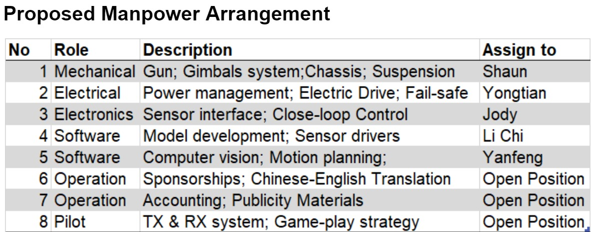
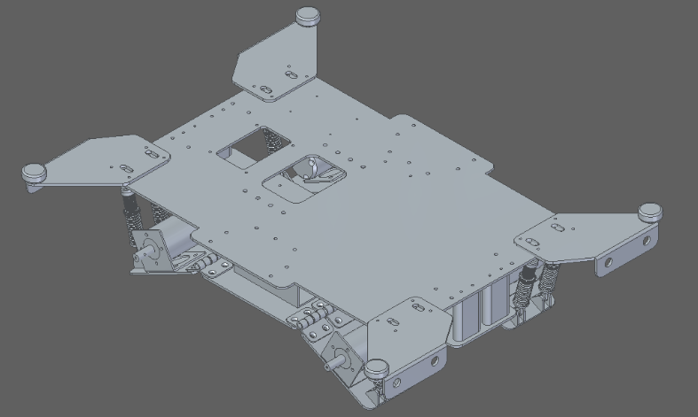
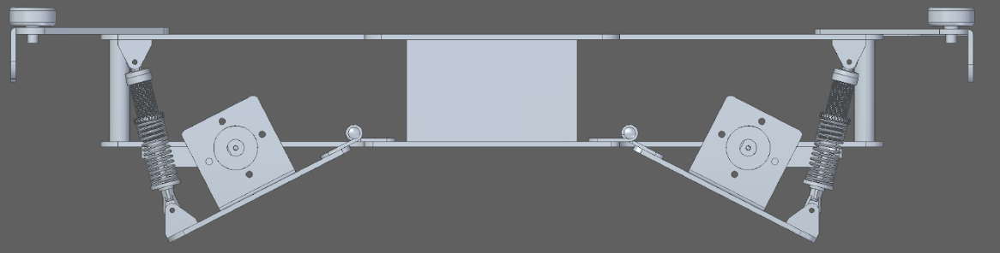
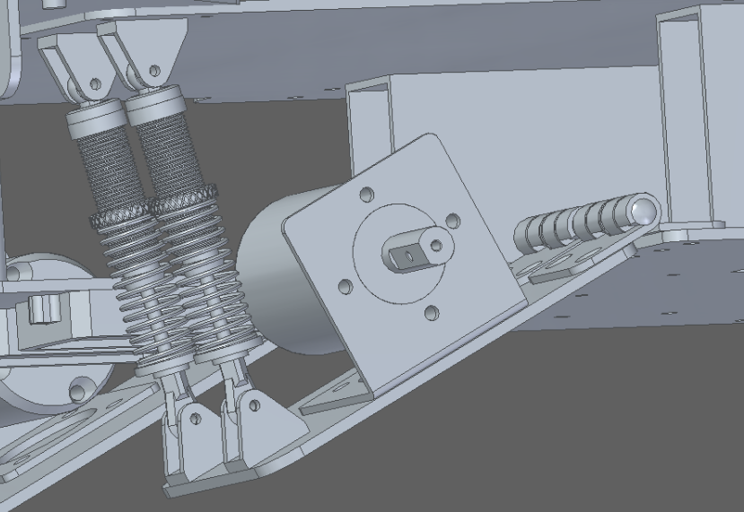
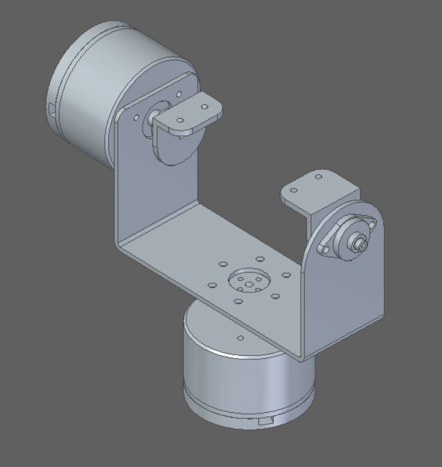
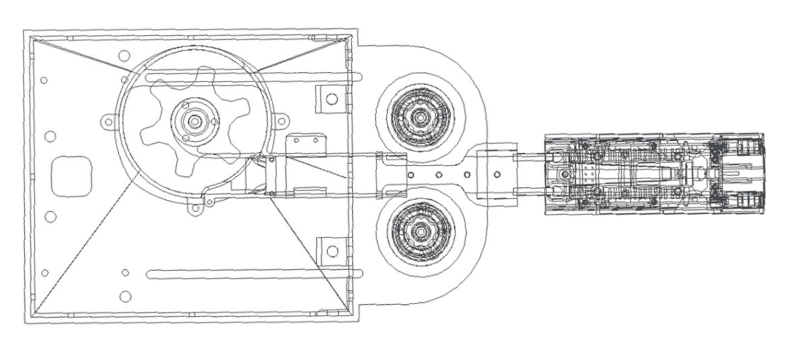
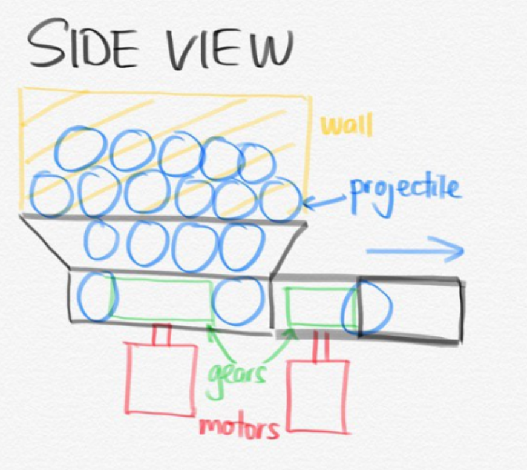
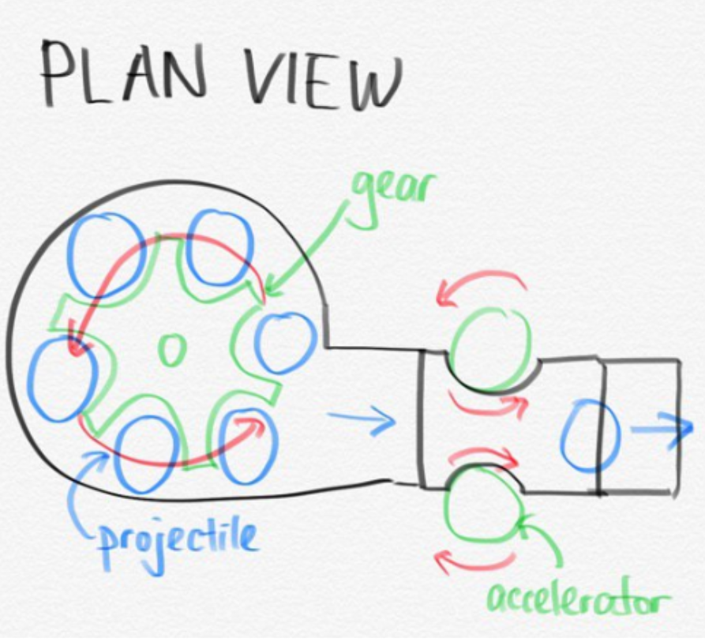
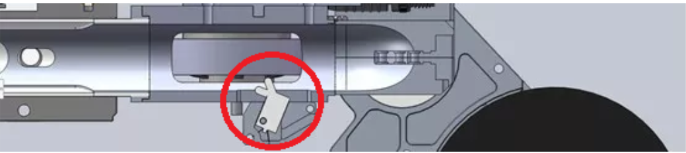
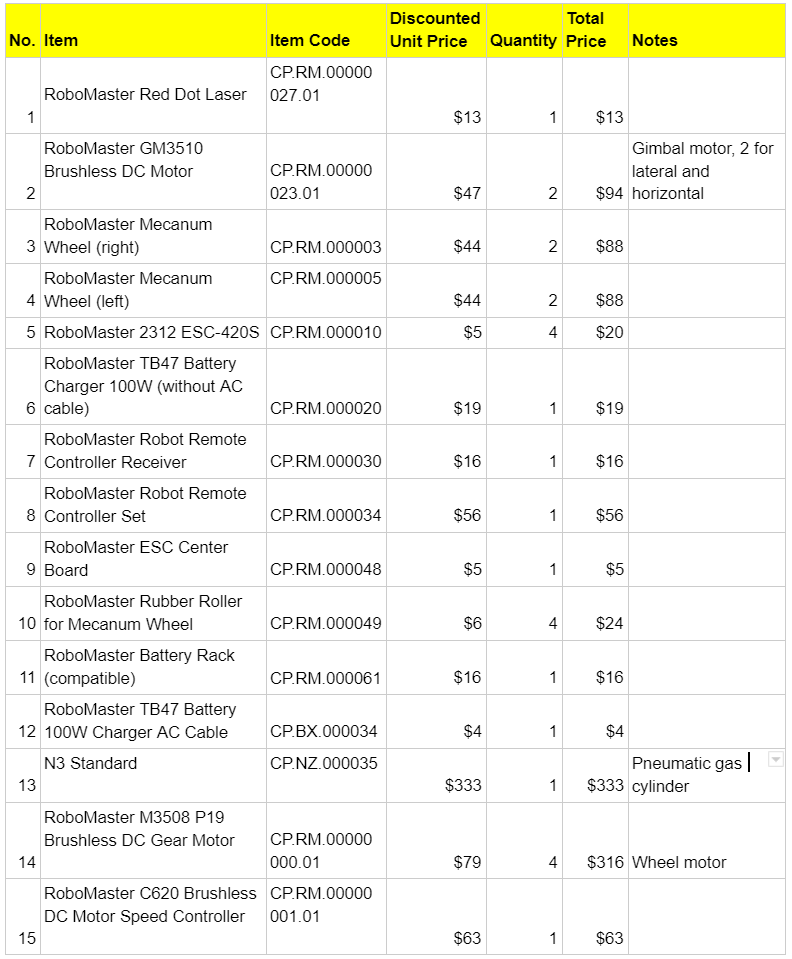

# Team FTFT

## Introduction
### Li Chi (Leader)
I’m a year 1 master of technology student. Previously, I obtained my bachelor of science in statistics from NUS as well. After that, I worked in credit risk modelling in financial institute. I’m interested in the field of predictive modelling, feature engineering, big data engineering and Graph & Web mining using Hadoop, R, Python

### Wang Yongtian
I am a year 3 Mechanical engineering student. With the knowledge that I learnt from my major courses, I can help with the fields of mechanical design, assembling and testing. In addition, I am also interested in embedded programming, python, vision system. When I was in polytechnic, I have done projects about embedded programming with pretty good results. I have learnt python at summer school with a grade of A+. I also helped to make vision system to check failure products and surface cleanliness during the internship period. I have a good understanding and skilful at CAD, circuit troubleshooting and CNC machines. I hope my inter-disciplinary knowledge and skills could help our RM team.

### Liew Shaun Kheng
I am a Year 3 undergraduate student from Mechanical Engineering. I am very Interested in Robotics and planning to specialize in this field in my upcoming year. During my academic years in Singapore Polytechnic, I pursued in Diploma in Mechanical Engineering, and I have done some projects that require good designing and fabrication skills. I have great dexterity in fabrication, CAD and Solidworks drawing, and have some fundamental knowledge in Python. I will work hard and commit to this project in order to enhance my technical and team-working skills through this project.

### Zou Yanfeng
Interested in Robotics and planning to specialise in AI and communication systems. I have some experience in Autocad software and would like to learn more knowledge and skill taking part in this project.

### Jody
I am a year 2 Electrical Engineering w/ 2nd major in Economics undergraduate. I have basic knowledge on CAD and coding on several platforms. I am interested in robotics and the idea of building a working object from scratch. I feel that it is the best way to explore my interests and apply what I have learnt so far by putting it into practical uses. I feel that this journey will provide a different angle of learning, process and fulfilment that will be both memorable and valuable.

 
 
 ## Proposed timeline and milestones 
 

## Standard Robot Specifications:
According to the Robomaster 2019 Robotics Competition Rule Manual: 

Item | Limit | Remarks |
---- | ----- | ------- | 
Initial Blood | 200 | - | 
Operating Mode | 1 Remote Controller | - | 
Total Power Supply (Wh) | 200 | - | 
Power Supply Voltage (V) | 30 | - | 
Robot Chassis Power Consumption (W) | 80 | Buffer energy 60J |
Maximum weight (kg) | 20 | Gross Weight | 
Maximum initial Size (mm) | 600 x 600 x 500 | The height must not exceed 500, and the orthographic projection on the ground must not exceed 600 x 600. Before the 3-minute match starts, the robot size must be within the maximum initial size range | 

## Purpose of the Robot
The most basic type of robot, characterised by its quick, nimble movements and high firing accuracy. It replenishes its ammunitions in a timely fashion and is able to dissipate heat efficiently to keep within the power limit.

The base is constructed with a parallelogram platform that is consistently optimised to remove excess weight and increase mobility. Through testing various methods of launching projectiles, the platform will utilise the solution with the best balance of firing rate and reliability.

## Key aspects
The design of the Standard robot is referred to the open source from Hubei University of Technology (HBUT). 

### Chassis design: 

### Mecanum wheels
* Robots can move parallel in all directions without turning their visual fields around in the game, so as to achieve a variety of ‘zigzag’ movement and precise strikes in the battle.
* It is mainly composed of wheel hub and rollers. The wheel hub is the main support of the whole wheel, and the rollers has no power source. The rollers can freely roll and they are installed around the wheel hub.
* Mecanum wheel chassis: It is suitable if we do not focus on rotation efficiency, instead, high mobility and flexibility of the robot is required. It allows the robot to move freely over all kinds of rough terrain.
* A fabricated aluminium guard must be placed to cover the wheels to prevent impact.
* A suspension system will be placed at the wheels to increase the stability of the vehicle. This is also to prevent vibration during maneuvering.

Item | Description | Quantity | 
---- | ----------- | -------- |
Wheels | RoboMaster Mecanum Wheels | 4 | 
Motor | RoboMaster M3508 P19 Brushless DC Gear Motor | 4 |

The chassis allows it to move in multiple directions, including forwards, sideways, diagonally, and rotate. A mecanum wheel will be used on the robot. Four motors are required as the wheels will be driven by the motors directly. 

The guard for the wheels can be improved by covering the entire corner of the wheels, the improvement of the design will provide a better protection for the wheels to prevent it from external impact from other vehicles or structures. The guard can be fabricated with aluminium due to it's light weight to strength ratio.

This design of the suspension system is very simple and easy to manufacture. The motor and the holder is connected to a plate hinged to the main body. Two suspension piston is connecting the hinged plate and the main chassis, serving as the suspension system for the standard robot. The function of this design is to minimize the vibration of the standard robot during maneuvering, increasing the stability of the vehicle, and ensuring that the body of the standard robot remains upright when driving through uneven terrain or slope. Two suspension springs are used instead of one to prevent misalignment of the hinged plate and the main body. 

The orientation of the suspension spring is for balancing the vehicle's pitch axis. This will enable the vehicle to remain stable and reduce the vibration when it is passing through uneven terrains and climbing slopes. When the vehicle is moving at a high speed, the suspension system is able to minimize the vibration on teh vehicle and ensuring that the wheels remain in contact with the ground at all times.

### Two-Axis Gimbal:
Robot must be able to have a stabilized gimbal platform of which a camera and the launching mechanism would be mounted.The camera should be able to transmit a live first person view of the camera with clear resolution and little time delay back to its controller. The launching mechanism could be mounted on the same or different gimbal platform as the camera feed.

Two motors will be installed on the gimbal with two different orientation based on the axis. The motor below the frame will be controlling the x-axis, allowing the firing mechanism and the camera to turn left and right, while the motor on the side of the frame will be controlling the y-axis of the gimbal, allowing it to turn up and down. Brushed motor will be used to allow the gimbal to turn in both directions by inverting the polarity of the applied voltage. Brushed motor will be used to allow the gimbal to turn in both directions by inverting the polarity of the applied voltage. 

### Projectile Supplying System:
The projectile supplying system will be mounted on top of the gimbal. The firing system should be designed to be able to fire 17mm projectiles at its maximum barrel speed of 30m/s, with a range distance of minimum 20m (arena is 28m long) with minimal spread. The referee system will be tracking its own firing speed to prevent point deduction due to barrel overheating violations.

The specifications of the projectiles and the firing speed is shown below.

Launching Mechanism Type | 17 mm projectile | Only 1 Launching Mechanism and 1 laser sight can be installed |
--- | --- | --- |
Initial firing speed Limit (m/s) | 30 | 16.9mm (±0.1 mm) |

The design on the feeding system is shown below. A plate will be manufactured to as shown in the figure to act as a funnel to contain the projectiles and to direct them to the feeding system. A wall will be 3D printed and fixed at the sides of the funnel to contain all the projectiles. This is to prevent the projectiles from falling out from the container as the vehicle will be maneuvering across uneven terrains. There will be a rotating gear at the bottom of the funnel to feed the projectiles into the pipe.

In order to reduce the launch response time (delay) and to ensure the accuracy of the number of projectile launches.For example, to ensure that only one projectile is launched at a time, and no consecutive shots are allowed at some circumstances.A limit switch is installed before the projectile moves along the pipeline and touches the friction wheel. Its working logic is as follows:

When there are no projectiles in the projectile supply pipeline and the magazine is full of projectiles, start the projectile pulling mechanism;The projectile pulling mechanism continuously rotates to fill the projectile supply pipeline until the projectile presses (continuously triggers) the limit switch;Limit switch feedback signal to stop the rotation of the device;At this time, the launching mechanism enters the state of waiting for firing.When receiving the single shot command, the projectile pulling mechanism starts to rotate and the projectile presses over the limit switch. At this time, the projectile contacts the rotating friction wheel and is launched, and the limit switch is reset.The projectile mechanism continues to rotate until the next projectile presses the limit switch again and the projectile mechanism stops rotating, thus completing a cycle of single shot.

The logic can also be applied to burst mode(3 projectile at one time)  and automatic mode(keep firing). 

When automatic mode is needed, the continuous firing command can be sent, the feedback signal of limit switch will be ignored, and the projectile pulling mechanism can rotate in a higher frequency according to the need of the projectile. The limit switch can move forward and backward to adjust the launch delay: when the limit switch is close to the friction wheel, the launch response is very timely, but there are accidental launches caused by the vibration and impact of the robot.When the limit switch is far away from the friction wheel, the response will be worse, but the safety will be improved, which requires the designer to debug by himself.

This projectile feeding mechanism needs greater torque, because there are more ammunition stored in the projectile feeding pipe, the projectiles are easy to bump against each other, and the resistance is relatively large when passing through the elbow. Therefore, in order to transport the projectiles to the launching mechanism, it is necessary to optimize the design of the projectile feeding mechanism.

Here are three points of feeding mechanism to be considered:

(1) Pipeline adapter: generally, the pipeline adapter is bent at 90°. Considering that the 90 degree Angle will cause greater resistance, bearing is usually installed on the inner wall of the turning to help the transition of the projectile. We can also enlarge the arc radius of the turning Angle to make the transition easier.

(2) The projectile shifting mechanism needs to optimize the thrust. Although the bearing is added in the swivel joint, the lower projectile feeding pipeline is long and there is still a large friction in the pipeline, so the projectile shifting mechanism needs to provide a greater force.

(3) Reduce the length of the pipeline as far as possible, also considering the excessive resistance caused by too many bullets.

## Sensors
* Robot should take advantage of the camera mounted to recognise armour plates, helping it to aim at enemy robot’s armour plate. This can be done by recognising the shape and lighting that form the parameter of the armour plate.
* IR Sensor can be utilised to check the distance of enemy robot. This information can then be used to alert the player when the enemy is too close/too far from the optimal shooting range.
* Gyroscope, accelerometer and magnetometer should be used to align and calibrate the position and movement between gimbal and main body of the robot.
* Especially in the developmental stages of robot, it is crucial to equip as many parts of the robot with sensors to enable the collection of comprehensive data that will aid in the development and tweaking of each component of the robot. Thermometer sensors, can be used to detect temperature levels at different parts of the robot such as CPU and Motors. Accelerometer can be placed near the wheels to detect the vibration levels from the suspension system.

#### Camera module: IMX291
* USB connected 
* 1920*1080 resolution
* 1/2.8’’ sensor

#### Accelerometer + Gyroscope:MPU-6050
* 6 Axis, Accurate: 16-bits analog to digital conversion hardware for X,Y,Z channel simultaneously
* Provide accelerations values, calculation of pose and heading based on readings
* Connects with I2C-bus
* Cheap

#### 3D Magnetometer IST8310
* Calibration free after strong magnetic interference
* Connects via I2C-Bus
* Wide dynamic range of ±1600 uT (x,y axis) and ±2500uT(Z axis)
* Software and algorithm support available

#### Current Sensor Module RB-Dfr-149
* 50A Current Sensor (AC/DC)
* Fully integrated Hall Effect based linear ACS758 current sensor
* Sensitivity: 40 mV/A

#### Temperature and Humidity Sensor TMP36
* 10 mV/°C scale factor
* ±0.5°C linearity
* Temperature range: −40°C to +125°C

#### Distance Sensor Modules Adafruit 3978 
* Accuracy of ± 2cm
* Provides super­fast distance readings up to 1000 times per second
* Connects via USB connector
* Range up to 14m.
* Laser free

## General Design and fabrication method
The material for the individual customized component of the robot will made up of aluminium metal blocks. The selection of aluminium as the building material of the robot is because of it's light and corrosion resistance property. The other advantage of using aluminium is it is easily be designed and fabricated into our desired dimension in the workshop through milling, lathing, CNC etc. 

For some of the components that does not require high strength, we will be using 3D printing to save cost and reduce the total weight of the robot.

## Proposed Budget

