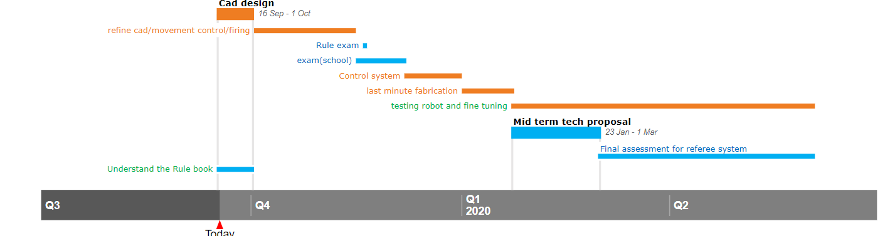
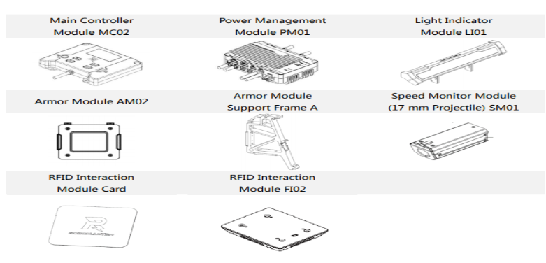
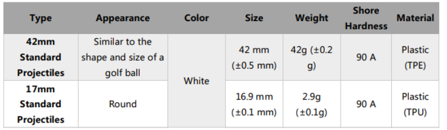
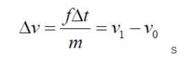
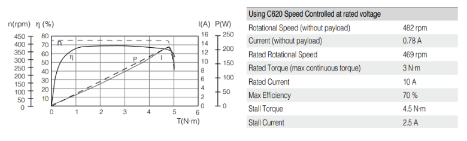
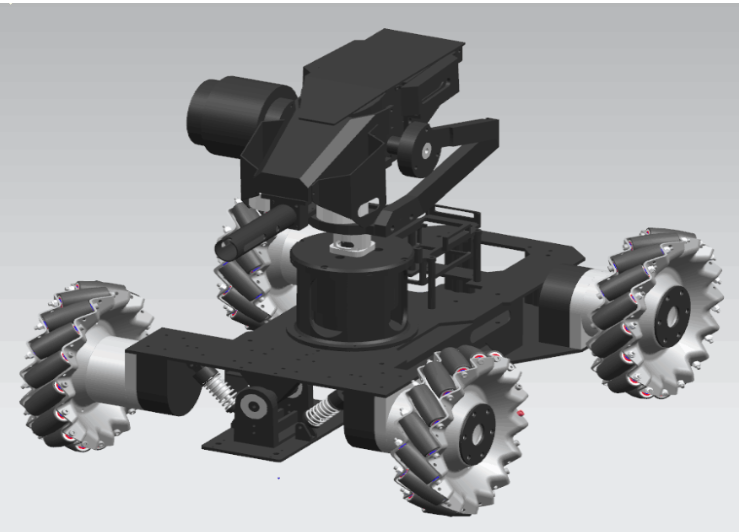
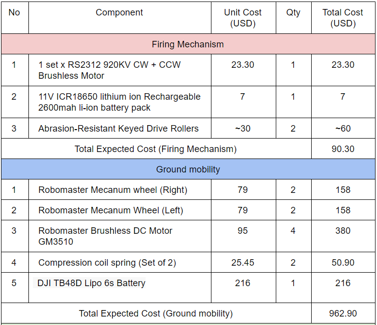
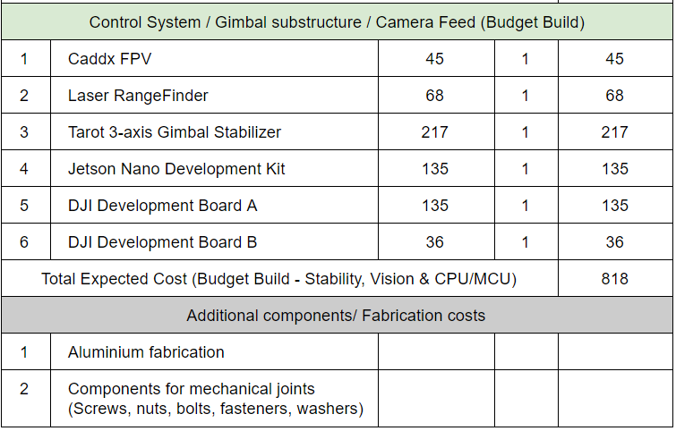

# Team HERO 

## Introduction

### Yong Kuan
Third year Eng. Sci. student who has an interest in computer vision with specific application to the field of robotics. One of my previous projects involved the use of both deep learning and traditional vision techniques for trajectory planning and obstacle avoidance in a 7-DoF humanoid robotic manipulator. The current project I’m actively working aims to use neural networks for generalized region localization using image feed comparison. Besides computer vision, I also have had prior experience working with CAD, CNC fabrication, basic PCB design, Robot Operating System (ROS) for interfacing multi-platform robotic systems, and microcontroller programming.

### Daryl Yap
I am a year 3 Mechanical Engineering student doing IDP as a second major as well as pursuing a specialisation in Robotics. I have had experience working on several projects such as developing an exosuit suit to alleviate back injuries due to repetitive bending as well as taken part in several hackathons which requires both software and hardware design. With my experience gained thus far, I am able to contribute to design (CAD), electronics, fabrication (Experienced with general manufacturing methods), microcontroller interfacing (Arduino), and computer vision (OpenCV). In joining the Robomaster team, I would really like to learn from my peers and strengthen my current knowledge and skill sets and hopefully share some of my experience with the team too! 

### Huynh Thi Thu Trang
I am a year 2 Electrical Engineering with second major in IDP. I have an interest in IoT and integrated circuit as well as embedded system. I have basic knowledge on CAD design and programming Arduino for automated car. As an electrical student, I can contribute to the design of PCB, powering and sensor systems, as well as microcontroller programming. I believe being a member of Robomaster will help me gain more experience and knowledge in my field of study.

### Liu Tianhang
I am a year 3 Computer Engineering who have an interest in ML with supervised learning. Coupling ROS with openCV for the computer vision part would be an interesting part for me. I am also able to work on the RTOS for the robotics underlying system. I can also work on the communication protocol between the robot and controller. Currently, I am working on an internship which deal with cloud service and full stack development. If needed, I can help with design of website or running ML model on the cloud. 

### Proposed Manpower Arrangement

| No |  Role | Description    | Assigned to     |
| ---| ----- | -------------- | ----------------   |
| 1|  Mechanical   |  Chassis; Suspension                |  Daryl Yap  |
| 2|  Mechanical   |  Gun; Gimbals system                | Daryl Yap |
| 3|  Electrical   |  Power management; Electric Drive; Fail-safe   |  Huynh Thi Thu Trang |
| 4|  Electronics  |  Sensor interface; Close-loop Control | YongKuan          | 
| 5|  Software     | Linux OS; Sensor drivers            | Tianhang     | 
| 6|  Software     | Computer vision; Motion planning    | YongKuan, Tianhang    | 
| 7|  Operation    | Sponsorships; Chinese-English Translation | Open Position     |   
| 8|  Operation    | Accounting; Publicity Materials     | Open Position     |  
| 9|  Pilot        | TX & RX system; Game-play strategy  |  Open Position          |

## Timeline & Milestones

## Robot Design Considerations

### Standard Robot Specifications:

#### Overall Specifications: 

- Total Power Supply Capacity: 200 Wh
- Power Supply Voltage: 30V
- Robot Chassis Power Consumption: 80W
- Initial Firing Speed Limit: 30 m/s (Note: Barrel Heat game mechanic)
- Maximum Weight: 20 kg
- Maximum Initial Size (mm): 600 x 600 x 500 (h) [L & B: Orthographic projection]
- Maximum Expansion Size (mm): 700 x 700 x 600 (h) [L & B: Orthographic projection]
- Only 17mm standard projectiles
- RoboMaster Referee System: 4 Small Armor Modules, 1 Large Armor Module, Speed Monitor Module (17 mm projectile), Video Transmission Module (VTM), RFID Interaction Module, Positioning Module, Main Control Module, Power Supply Management Module, Light Strip Module

#### Projectile Specifications

### Key considerations in robot design

#### Firing mechanism

gif file

Components:
- Motor for the firing wheel mechanism
- <a href="http://www.readytosky.com/e_productshow/?273-RS2312-920KV-CWCCW-Brushless-Motor-273.html">RS2312 920KV CW/CCW Brushless</a>
    - KV: 920kv
    - No-Load Current (Io/10V) 0.45 Amps
    - Motor Resistance (Rm) 0.117 Ohms
    - Max Continuous Current 14 Amps
    - Max Continuous Power 220 Watts
    - Weight 48 ± 2g
    - Outside Diameter 27.7 mm
    - Body Length 26 mm
- <a href="https://www.alibaba.com/product-detail/11V-ICR18650-lithium-ion-Rechargeable-2600mah_62069335985.html?spm=a2700.7724857.normalList.1.61ff5aa9d0KiuJ&s=p">11V ICR18650 lithium ion Rechargeable 2600mah li-ion battery pack</a>                    
    - Nominal Voltage: 11V(10120 rpm no load )
    - Capacity: 2600mAh(11.14 mins at max current )
    - Cycle life: >500 Times
- Friction wheels for firing mechanism
    - Abrasion-Resistant Keyed Drive Rollers             
        - 38.1mm
        - Wear resistant & for high torque application
        - Radius to be large to increase contact time but not too large to compromise on weight and size of firing mechanism 
    
- Projectile storage and feeder        
    - Multi-angled base with a channel of decreasing width up to the friction wheel propulsion system
    - Consider adding an agitator within the storage compartment to ensure smooth feeding
        - Rotating arm   
- Barrel  
    - Aluminium profile for sturdiness and with gaps to minimise air resistance in barre

- Gimbal
   - Commercial-bought 2-axis stabilizing gimbal (~40-50USD, but usually made only for smartphones) (3-axis variants are more industrial-grade, but in range of few hundreds) with PID modulation on step servos and integrated controller board that can interface using GPIO with computational device of choice
   - <a href="https://tinyurl.com/y5fad6os">Tarot 3-axis (GPIO-compatible,, 149$)</a> 
   - <a href="https://tinyurl.com/y23fkopc">Feiyu 3-axis (GPIO-compatible, 349$)</a> 
   - Alternatively, a gimbal can be fabricated from scratch to alleviate budget concerns (but not recommended due to manpower/time constraints). Below are the parts needed:
        - 2 x 5208 Brushless motors
        - 1 x 2200mAh 3s Lipo Battery
        - Linear Hall sensors
        - Custom angle brackets and joint covers
        - Suitable microcontroller boards
            
         
    
- Things to test out:  
    - Motor
        - Velocity of projectile
    - Friction wheels for firing mechanism
        - Stiffness of roller
        - Roller distance from one another
               
    
    

#### Sighting

- Optical Laser Rangefinders
    - <a href="https://www.robotshop.com/community/blog/show/lidar-light-amp-laser-based-distance-sensors">Lidar 1</a>
    - <a href="https://www.digikey.com/products/en/sensors-transducers/optical-sensors-distance-measuring/542?FV=1f140000%2Cffe0021e&quantity=0&ColumnSort=-42&page=1&pageSize=25">Lidar 2</a>
    - <a href="https://www.jenoptik.com/products/metrology/laser-distance-sensors">Lidar 3</a>

#### Ground mobility

- Wheels
    - <a href="https://www.robomaster.com/zh-CN/products/components/detail/135">Mecanum wheels</a>
        - Wheel diameter: 152.5mm 
        - Wheel width: 45mm 
        - Weight: 590g 
        - 6 mounting holes with a diameter of 5.2mm 
        - Cost: 499RMB

- Suspension
    - <a href="https://www.monotaro.sg/g/00141241/">Compression coil spring</a>
        - Spring constant: 3.089N/mm
        - Allowable load: 104.93N
        - Wire diameter 2.3
        - Loaded length: 44mm
        - Free length: 78mm
        - Weight: 70g
    

#### Chassis built

- Aluminium profile (Rectangular frame for stability)
    
    - 500mm x 500mm (Maximise base with allowance for wheel protrusion)

#### Motors and Powering System

Another key consideration of the standard robot is high speed, light weight and flexibility. Therefore a constant and reliable power supply as well as a powerful motor are crucial in increasing and ensuring the performance of the fighter. 

- System Battery:
    - Model: DJI TB48D
    - Type: Lipo 6s
    - Voltage: 22.8V
    - Battery Capacity: 5700 mAh (high capacity)

The battery has long run times with 6 cells and high power. This intelligent battery keeps informing about its performance, including real-time information about remaining battery power. Additionally, the battery automatically provides information about the voltage of each cell, the total lifetime charges and discharges, and its overall health and status, which make things easy to supervise.

- Motor for the Mecanum Wheel: 
    
    - Model: Robomaster M3508 Brushless DC Gear Motor with C620 Brushless DC Motor Speed Controller (ESC)
    
        - Total power: 220W
        - Rated Voltage: 24V
        - Stall torque: 5 N.m
        - Max rotational speed with a continuous torque of 3N·m：469rpm (2.5 m/s with 10cm-diameter wheel)
            Wide Operating Temperature Range：32°~122° F (0~50° C)
            
        - Price: M3508: $79; C620: $63
    
    

M3508 is chosen as the main motor because its compactness (98.4mmx42mm), powerfulness that allows acceleration shortly and high safety with multiple embedded sensor such as temperature sensing with automatic alarm. Besides, the control is flexible with both PWM and CAN bus supporters.

#### Proposed Optical and Stability Mechanisms
One especially important robot specification lies in the stability of its barrel and the corresponding vision field that enables the human controller to take aim. From the observations of successful teams in past DJI competitions, standard robots made use of the following techniques for effective deployment of its robot in both offensive and defensive aspects:

- When stationary, constantly spinning the robot chassis while keeping barrel and camera fixed to prevent enemy robots from targeting its armour modules easily
- Programmatic auto-correction/aiming onto important on-screen targets like enemy armour modules/power boosts/towers (can be toggled on/off quickly for outlier cases)
- Keeping camera and barrel fixed when robot is going down slopes/bumps (able to be turned off/on easily)

Most of these points imply the need to maintain two separate coordinate systems: one for the barrel/camera (the barrel assembly coordinate system) and the other for the chassis & wheels (chassis coordinate system) within the standard robot. The key goal is to keep the orientation of the barrel assembly coordinate system (relative to the global coordinate system) invariant to any change in orientation of the chassis coordinate system (relative to the global coordinate system). Note that the robot intentionally does not correct for translational change - it is more natural (game-like) for the human controller. Furthermore, the above proposed auto-targeting system can also take care of translational changes within the robot if needed.

The main stabilization substructure to be used would be a stabilizing gimbal (both 2-axis and 3-axis would be suitable). The camera can be either bought integrated with the gimbal, or as a third-party mount. Both methods are feasible, but the former might allow for customizability based on the camera function needed.

- Gimbal Stabilization
    
    - The isolation of the barrel assembly coordinate system from the chassis can be done in one of two ways, both of which require the gimbal to be motorized:
    Open-loop correction of the barrel assembly system for every detected orientation change in the chassis coordinate system. This would remove the need for sensors on the limited space available on the gimbal structure, but is not recommended due to long-term error shift and “jerkiness” in error correction.
    Closed-loop gimbal correction using linear hall-effect sensors and PID microcontroller board (most likely software-based PID instead of hardware-based). This would be the preferred way as the hall-effect sensors can take direct measurement of the barrel assembly eulerian orientation relative to the global coordinate system, with smooth error correction.
    
    - Since real-time stabilization is extremely crucial for effective human control, the latter method would be used. To aim the barrel and camera in an FPS-style manner with stabilization, the human controller would essentially control the set-point of the gimbal PID relative to the global coordinate system. The movement of the mouse would be internally translated into changes in the PID setpoints.
    - Proposed motorized gimbal mounts/costs can be found in earlier sections of this proposal. The parts needed for a custom DIY implementation of a gimbal substructure can also be found within the same section.

- Camera
 
    - There are three possible choices for camera types depending on the budget constraints and computational setup (next section): 
    
    - Basic mono-camera vision: Any hobbyist/drone FPV compact camera with sufficient resolution (>1080p) for a computer monitor. While basic computer vision techniques (thresholding, filter etc) can be performed to determine the onscreen position of targets, the camera would need to be combined with a laser-range finder (specs and possible laser-range finder models listed in earlier sections) to accurately determine target distance.
        - Possible models: <a href="https://tinyurl.com/y4ttctxu">Caddx</a> , <a href="https://tinyurl.com/y597ze4c">Runcam </a>
        - Advantages: requires the low computational power (Sensor fusion for distance estimation likely to be achievable in real-time on PI3)
        - Disadvantages: requires sensor fusion with range-finders for target distance estimation, which needs accurate mounting and prior calibration. 
 
    - Stereo-camera vision: Mount two cameras side by side. Target distance can be triangulated using gray-scale feature mapping in OpenCV or open-source stereo libraries and estimated without the need for a range-finder. 
        - Advantages:  No need for range-finders, able to perform distance estimation
        - Disadvantages: Significant computational overhead (may not run real-time on Pi3 CPU Model), Requires two cameras to be bought, accurately mounted, and properly calibrated (taking up precious gimbal mounting space), and not fully accurate in estimating distance of outlier features.

    - Native depth-sensing cameras: a camera with inbuilt RGB colour vision and depth-sensing/point-cloud capabilities. It essentially fuses both range-finder and camera capabilities, and can be extended into fast 3D mapping (most likely not needed for Standard robots, but may be needed for Sentry) using its generated point-clouds.
        - Possible models: <a href = "https://tinyurl.com/yyzsc253">Intel D435I</a>, <a href="https://tinyurl.com/y5mns9ex">Intel D415</a>
        - Advantages: Depth/distance is estimated natively across the entire image within the camera module itself without further software processing.
        - Disadvantages: Extremely costly (factor of 7x to 10x more than regular FPV cameras: 298$ for D435/ 240$ for D415), requires installation of dedicated Intel RealSense SDK/libraries to read depth images from camera.
    
    The overall camera recommendation for a Standard Robot would be to use a mono-camera vision coupled with a single laser range-finder. This is to keep budget costs down while providing a proper system for mimicking a FPS-shooter style mechanic (laser-range finder only needs to compute distance to the center targeting point of the camera image). If budget permits, the use of the third option (depth-sensing camera) would be optimal as it shifts the computational burden and responsibility of distance estimation to the camera module. The second option (stereo-vision) would most likely not be feasible due to the computational complexity needed for feature-processing both images each frame as well as the fact that the distance estimations from the technique may not be necessarily accurate and usable in real-time.
    

#### On-board Computation & Software Features
The on-board CPU/GPU for the standard robot would handle all incoming/outgoing feed from the human controller to the robot, as well as to perform the necessary computations needed for gimbal stabilization, projectile launch, adjusting PID setpoints for gimbal control, and auto-targeting/aiming. In addition, neural networks may also be used as either a complementary or alternative option to traditional computer vision techniques if the on-board CPU/GPU is fast enough (eg. trained RNNs like YOLO to detect armour modules).

There are four main choices in this area, all of which are based primarily off the ARM architecture as is common among embedded systems. The primary OS for use would be linux (final robot system should aim to use a headless setup with direct boot into terminal to save computational power on unnecessary GUI renders).

| CPU/GPU Model |  Description | 
| ---| ----- |
|Raspberry Pi 4 Model B|https://tinyurl.com/yxh4ajjw, $89|
| |1.5 GHz Quadcore CPU (Cortex A-72)|
| |500 MHz VideoCore GPU|
| |4GB DDR4 RAM (customizable to be lower)|
| |64-bit ARMv8 Architecture|
| |Native 40-pin GPIO|
| |88mm by 58mm by 19.5 mm  dimensions|
| |3.4 wattage power consumption |
|Jetson Nano Developer Kit|https://tinyurl.com/y3bowql4, $135|
| |1.43 GHz Quadcore (A-57)|
| |128-core Maxwell GPU|
| |4GB DDR4 RAM|
| |64-bit ARMv8 Architecture|
| |Native 40-pin GPIO|
| |69mm by 45mm by 20mm dimensions|
| |5 - 10 watts power consumption|
|Jetson TX2 Module / Developer Kit|https://tinyurl.com/y23tr6gz, 564 SGD|
| |Dual-core Denver 2 64-bit CPU and |
| |quad-core ARM A57 complex CPU|
| |256-core Maxwell GPU|
| |8 GB 128-bit DDR4 RAM|
| |Native 40-pin GPIO|
| |170mm by 170mm by 30mm|
| |7.5 - 15 watts power consumption|
| ||
| |https://tinyurl.com/y3bvo39k, 301 SGD (Carrier) + 657 SGD (Independent TX2 module)|
| |Compact carrier for TX2. Need to buy the carrier and TX2 modules separately 50mm by 87mm by 30mm |
| |https://tinyurl.com/y4943e3w, 1464 SGD Compact enclosure without GPIO pinouts, but is price-prohibitive.|
| |153mm by 30mm by 101mm.|
|DJI Manifold 2 |https://tinyurl.com/y27yfeyt, 1706 SGD Same specs as TX2 as it uses a TX2 internally.|
| |Not recommended due to price point and its specialized purpose for aerial drones|
| |91mm by 61mm by 34mm|

For optimal budget and wattage, the Jetson Nano is thus one of the best choices for mounting onto the Standard Robot. Since the standard robot is primarily user-controlled, only elementary computer vision techniques will be used for auto-targeting/correction along with gimbal stabilization/control, which the Jetson Nano and Raspberry Pi 4 are both sufficient for. The on-board 128-core GPU of the Jetson Nano may even allow it to run shallow or medium-size neural networks if necessary for object recognition (as a complementary “deep” approach to recognize armour modules alongside traditional computer vision).
Additionally, the dimensions of the TX2 and Manifold may pose a challenge when installing it onto a standard robot. Although the dimensions of the TX2 may be reduced by directly using the CPU/GPU module with third-party board carriers (listed above), it is extremely price prohibitive and thus not recommended. 
This proposal hence recommends the use of the Jetson Nano or the Raspberry Pi 4 Model B as the primary onboard computer (in order of preference).

#### real time operating system for the robot 
We probably going to be using the  [ROBORTS](https://github.com/RoboMaster/RoboRTS). As we have not get the robot, it is very hard to mention about the firmware and system.

### General Design and Fabrication Method

For the bulk of material used in the robot, such as the main chassis, stabilisation system and the firing mechanism, aluminium would be used primarily due to its lightweight nature. Even though steel is stronger than aluminium, the (almost 2.5-3 times in weight) weight difference would outweigh the benefits for this robot due to the constraints such as weight limit, battery capacity, opportunity cost for essential components. Fabrication of the aluminium to fit the specifications of our robot would also be cheaper as compared to steel. Fabrication of the aluminium frames can be carried out within school workshops but can be outsourced as well for more complex dimensions (Firing mechanism).

Carbon fibre can also be considered as an alternative to aluminium but the cost would be a major factor. Carbon fibre is lighter, stronger and more rigid than aluminium, thus is way more desirable due to its greater resistance to deformation and impact.

Small components used for construction such as screws, nuts, bolts, washers can be bought directly online or should be available for use as provided by school workshops. For complex parts which do not experience high stresses, 3D printing can be used to manufacture such components to save cost.

Assembly of the robot would be done in-house once all the individual components are ready. There should be no need for welding in the assembly process as parts would either be produced whole or bolted/screwed together.

### Proposed Budget

