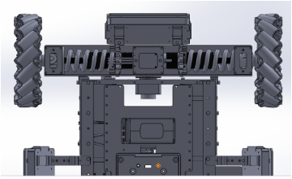
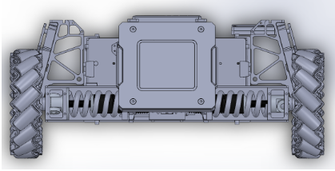
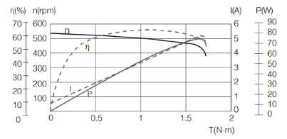

# Team MECHABirdBox

## Introduction of Team members 

### Samantha Song (Leader)
I am a year 3 Biomedical Engineering student. I am in interested in robotics, AI and machine learning, and hope to  further my skills in these areas during my 6 months stay in Shenzhen. With knowledge that I learnt from my internship at a makerspace, I have experience in building robot cars, and can help in the fields of hardware/electronics and software.

### Tan Ning Xuan
I am a Year 4 Mechanical Engineering student, with an interest in controls and robotics. Over the years, I have built up my skills in programming and tinkering with various microcontrollers and embedded systems. During my student exchange at the University of California, Berkeley, I worked on a smart cycling helmet that featured real time image processing and multitasking. I have also worked on establishing communication between STM32 microcontroller and ROS as part of a autonomous golf buggy project. More recently, as part of the NUS Smart Shuttle autonomous vehicle trial, I developed a python script to pull data from APIs and perform simple data analysis to generate ridership insights. In terms of modelling software, I have had basic experience with CAD, Revit and ANSYS. I am confident these skills will be useful to the team in developing our robot.

### Kevyn Lim Zi Rong
I’m a year 4 BME student and i have had a keen interest in robots and robotic combat since childhood. I also really like thinking out of boxes and trying to make these ideas work in reality.

### Damien Chan 
I am a year 4 Industrial and Systems Engineering student. I do not have much experience with robotics but have some experience with programming and optimization. I hope to be able to use my skills to value add to build a strong robot.

## Proposed manpower arrangement

No| Role          |  Description                        | Assigned to       | 
--|---------------|---                                  |---                |
 1|  Operations   |  Idea generation, Robot Design      |  Everyone  |
 2|  Mechanical   |  CAD design of mechanical aspects                | Ning Xuan |
 3|  Operations   |  Procurement of electrical and mechanical components  |  Samantha, Kevyn |
 4|  Mechanical  |  Designing MCU, driver board and electronics layout | Samantha, Kevyn          | 
 5|  Mechanical     | Mecanum Wheel Robot (lower)          | Kevyn, Ning Xuan     | 
 6|  Mechanical     | Mecanum Wheel Robot (upper)   | Samantha, Damien    | 
 7|  Software    | Controls Programming | Damien    |   
 8|  Hardware/Software    | Prototype 1.0     | Everyone     |  
 9|  Mechanical   | Navigation system (Lidar) |  Kevyn, Damien            |
 10|  Mechanical   | PID motion control  |  Ning Xuan           |
 11|  Mechanical        | Targeting System  |  Samantha           |
 12|  Software        | Smart Controls System  |  Damien           |
 13|  Hardware/Software        | Prototype 2.0   |  Everyone            |
 14|  Mechanical        | Armor  |  Ning Xuan            |
 15|  Mechanical        | Blaster System  |  Samantha            |
 16|  Operations        | Media: Camera, video  |  Damien, Kevyn            |  

## Battlefield Role of Standard Robot

* Objective: To make the battlespace as confusing as possible for the opposing team while being able to pose a threat to enemy robots through a combination of burst damage and mobility

* To accomplish this objective, several modifications will be required. For one, the turret of standard robots will be provided with “bodykits” to make them look like the turret of a Hero robot. The dimensions for Heroes are larger than Standard robots, but if designed with similar silhouettes and when projected onto a screen, it is possible to mistake a smaller Standard at a certain distance from the viewer as being a Hero at a slightly further distance away.

* Another modification is to augment the mecanum wheels with small weights attached via a strip of connective material. When in motion, these weights are intended to extend normal to the axis of rotation of the wheel due to the influence of rotational inertia and deflect incoming projectiles. There is a maximum of 10cm allowed for in-game structural expansion, so the max legal increase in radius, the length of the connective strip, of each wheel is 5cm.

## Key aspects of the robot to consider

### Mecanum wheels

* Lower part: spin stabilisation, Upper part: stationary
* Consists of wheel rollers and damping rings.
* Wheel extensions -> Objects secured to the wheels via a strip of connective material. When in motion, these weights are intended to extend normal to the axis of rotation of the wheel due to the influence of rotational inertia and deflect incoming projectiles. This idea works with mecanum wheels because the angle the wheel makes with the chassis is constant in all motions, so there will be no interference of the wheel and the extension.

### Chassis

* Front, Rear, Left, Right chassis have shock absorbers incorporated to reduce damage to robot parts.

* Figure 1.1 and 1.2: bottom and front view of shock absorber added to mecanum wheels (drawing taken from https://www.robomaster.com/en-US/products/components/detail/1843, edited to include shock absorber)

* Impact detector: Transmit health of robot efficiently to controls system, direction of impact to the pilot UI.
* Intelligent sensing armour -> Infrared sensors near armour to detect when aiming beam lands on robot. Or gel pads to detect which part of the robot is being hit to move away accordingly
* Suspension system: as our design involves wheel extensions, we will not be including suspensions to minimize the risk of entanglement. Furthermore, since horizontal forces will already be damped by the shock absorber, the benefit of a suspensions lies in damping vertical forces, which will be minimal since its only experienced when mounting ramps and curbs. As long as the curb is significantly small, the robot should still be able to cross it.
* Motor selection: RoboMaster M2006 P36 Brushless DC Gear Motor (Side note: also used by DJI RoboMaster AI Challenge Robot)

* Figure 2.1: Speed Torque characteristics of M2006 P36 Brushless Motor.

Specs         | Value|
-----------------|---   |
 No load speed|  500rpm   |
 No load current|  0.6A   |
 Rated speed|  416rpm   |
 Largest continuous torque|  1Nm   |
 Rated voltage|  24V   |

 * Table 1.1: M2006 P36 Specs (taken from https://rm-static.djicdn.com/tem/17348/RM%20M2006%20P36直流无刷减速电机使用说明.pdf)

 * For a 20kg robot to move off ,
 * W = mg = 20 x 9.81 = 196N
 * Frictional force = 𝜇N = 0.45 x 196 = 88.3N
 * Torque required = Fr = 88.3 x 0.04 = 3.53Nm
 * Torque per wheel = T/4 = 0.883Nm (well within specs)

### Gimbal

* Upper body of the robot will be mounted on the gimbal, such as the camera, blaster mechanism, high stability needed. If possible, 3-axis industrial grade gimbal will be used.

### Sensors

* IMU
* Monitoring sensors: detect any malfunctioning parts.
* Ammo sensor: detect amount of ammunition available, when under a certain amount signal warning to pilot.
* Targeting system: Smart sensors to help robot target objectives, assist pilot in aiming. Estimated projectile trajectory motion to help compensate for long-distance shooting. 

### Ammo launching/loading system 

* Ammo loading should not have jamming of projectiles
* Ammo should be fed to launching mechanism at a fast and steady rate.
* The launching mechanism will be calibrated to launch the official 17mm, 3.2g projectile through a barrel angled at ϴ degrees to have a speed of approximately 12m/s (the value at which the armor sensor best detects 17mm projectiles) after travelling a displacement of roughly 3m parallel to the ground such that the absolute values of the maximum upwards (normal to ground) and final downwards (towards ground) displacement does not exceed ⅓ of the vertical height of the sensing portion of the armor module when measured on a plane normal to the ground that contains the midpoint of the front of the robot and the midpoint of the rear of the robot. From the Referee Specification manual, the vertical height is 128mm. The restriction on the maximum upwards displacement is to allow operators to be able to fire accurately at close range.
* Using an iterative method accounting for air resistance and a timestep of 0.01ms, a ϴ of 4 in conjunction with an initial velocity of 13m/s would have a final velocity of 12.33m/s at 2.82m before the downwards displacement exceeded 42 ⅔ mm, with a maximum positive displacement of 42.0mm.
* This would add 13 heat per shot, which is 21.67% of the Barrel Cooling Value Per Second, 60, allowing for indefinite firing at a rate of 4.61 projectiles per second.

### Media

* Camera (vision), GPU: should transmit a FPV view of the robot with clear resolution and minimal time lag from control system(pilot). Vision should be steady when robot moves across slopes/bumps, in-flight.

### Programming

* Targeting system, AI tracking systems
* STM32 main microcontroller
* Evasive Maneuvering Program (Spinning)

### Power

* TB47D Li Po Battery selected for high energy density
* Voltage: 22.8V, Capacity: 4500mAh, Weight: 0.676kg
* Regulations state that total power capacity must be <200Wh, this one adds up to 103Wh.
* Side note: also used by DJI RoboMaster AI Challenge Robot

### Controls

* PID motion control
* Blaster targeting controls
* Intelligent Controlle

### General design and fabrication methods
* Most parts should be bought online and machined to desired specifications. Prototype, lightweight materials can be 3D printed with Kevyn’s 3D printer, using ABS/PLA material. Samantha can buy cheap electronics and mechanical parts in Shenzhen as well if possible, as well as use laser cutting, lathing equipment etc.

## Proposed Budget
No | Component Name                        |  Unit Cost (USD) | Qty | Total |
---|---------------------------------------|---              |---  |---    |
 01|  RoboMaster Tag for UWB Locating System |  95             | 1   | 95   |
 02|  RoboMaster UWB Locating System |  667             | 1   | 667    |
 03|  RoboMaster Anchor for UWB Locating System    |  133             | 1   | 133    |
 04|  RoboMaster GM3510 Brushless DC Motor  |  47             | 1   | 47    |
 05|  RoboMaster Red Dot Laser  |  13            | 1   | 13   |
 06|  RoboMaster Mecanum Wheel (right)  |  44             | 2   | 88   |
 07|  RoboMaster Mecanum Wheel (left)              |  44              | 2   | 88     |
 08|  RoboMaster 2312 ESC-420S     |  5             | 4   | 20    |
 09|  RoboMaster TB47 Battery Charger 100W (without AC cable) |  19            | 2   | 38   |
 10|  RoboMaster Robot Remote Controller Receiver  |  16             | 1   | 16   |
 11|  RoboMaster Robot Remote Controller Set  |  56             | 1   | 56    |
 12|  RoboMaster ESC Center Board    |  5             | 1   | 5    |
 13|  RoboMaster Rubber Roller for Mecanum Wheel     |  6             | 8   | 48    |
 14|  RoboMaster Battery Rack (compatible)      |  16             | 1   | 16    |
 15|  DJI E2000 PRO Tuned Propulsion System CCW-R           |  248             | 4   | 992    |
 16|  DJI E2000 PRO Tuned Propulsion System CW-R            |  248             | 1   | 248    |
 17|  2170R Folding Propeller (CW set, without screen-print, box package)      |  48            | 0   | 192   |
 18|  2170R Folding Propeller (CCW set, without screen-print, box package)     |  48            | 1   | 48   |
 19|  RoboMaster TB47 Battery 100W Charger AC Cable    |  4             | 2   | 12   |
 20|  N3 Standard            |  333             | 1   | 666    |
 21|  RoboMaster M3508 P19 Brushless DC Gear Motor        |  79             | 2   | 158    |
 22|  RoboMaster C620 Brushless DC Motor Speed Controller        |  63             | 1   | 126    |
 23|  RoboMaster M3508 Accessories Kit     |  54            | 1   | 108   |
 24|  RoboMaster Development Board Type A      |  68            | 1   | 136   |   
 25|  RoboMaster Development Board Type B         |  35             | 1   | 70    |
 26|  RoboMaster Development Board OLED           |  14             | 1   | 28    |
 27|  RoboMaster M2006 P36 Brushless DC Gear Motor        |  41             | 1   | 82    |
 28|  RoboMaster C610 Brushless DC Motor Speed Controller             |  25             | 1   | 100    |
 29|  RoboMaster Development Board Cables         |  20             | 2   | 400    |
 30|  TB47D Battery|  216            | 2   | 431   |
 31|  RoboMaster GM6020 Brushless DC Motor| 189             | 1   | 567    |

### Total: 4078 USD

