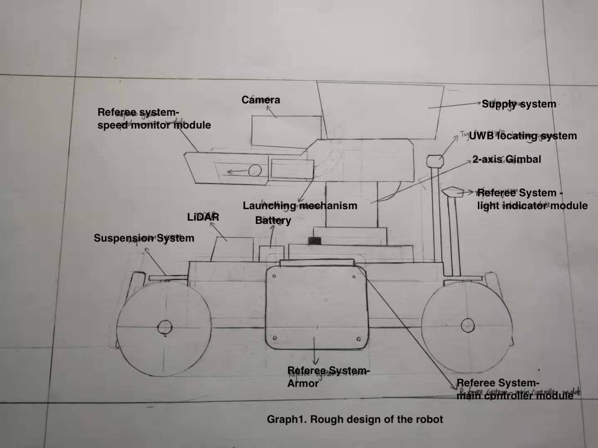
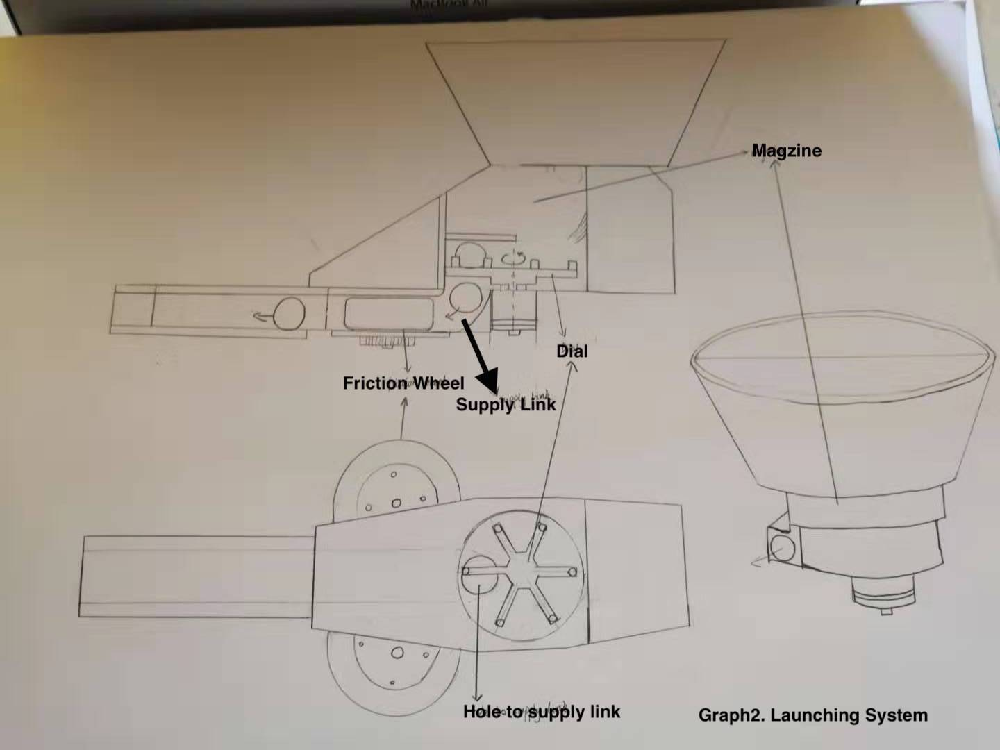
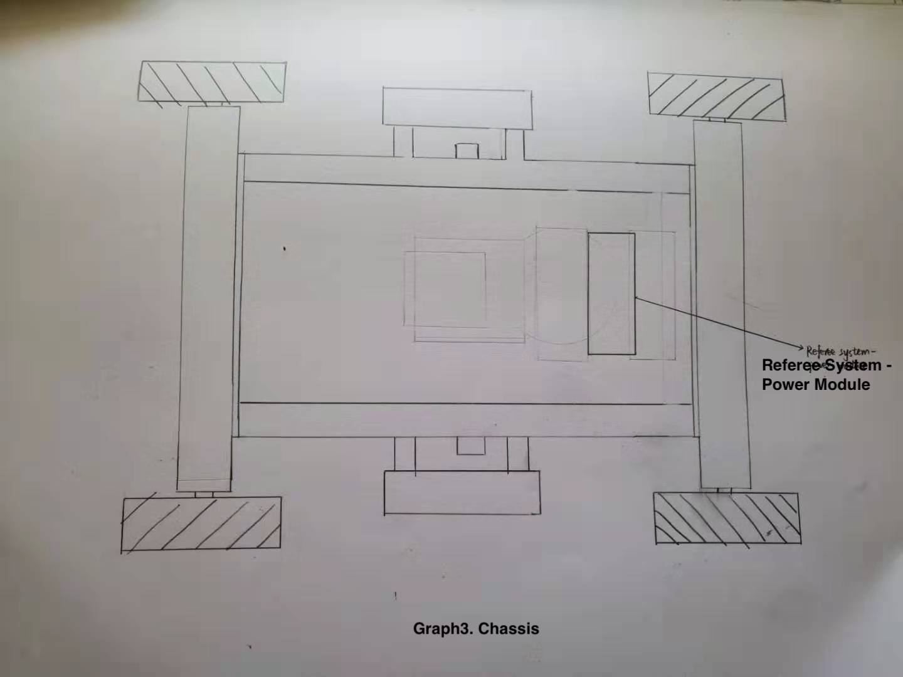
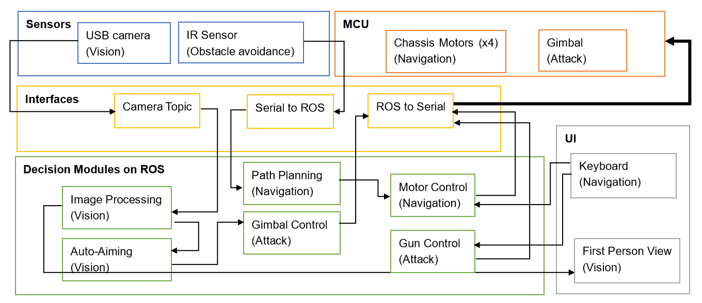
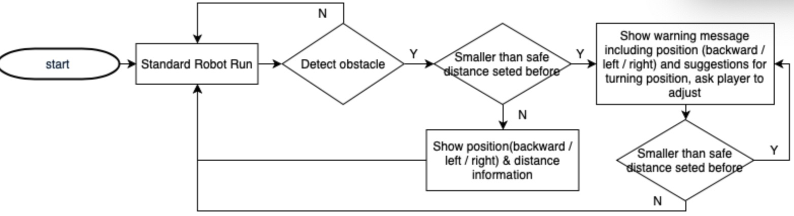
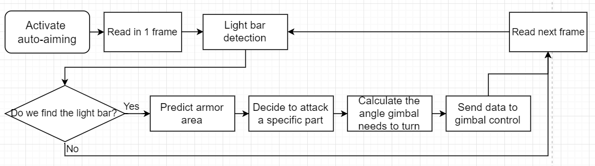

# NUSNextBot

## Introduction

 - Chen Tong :computer:

   I am Chen Tong, a CEG year 2 student. In my high school I have joined VEX robotic team and participated in competitions as a structure designer. The highest prize I received is first prize In Asian-Parcific Robotic Championship. In NUS, I have joined Bumblebee Team Hornet during last year. I have experience writing computer vision algorithm in Team Hornet and I am quite familiar with the use of ROS. I am interested in learning web page design and computer vision in the future.                                                                                                                    
 - Zhao Shi :electric_plug:

   I am Zhao Shi, a year 2 student reading electrical engineering and economics. I have past coding experience using C and python. Moreover, I am familiar with hardware description languages and starting to learn assembly language this semester. Maybe I can cover more of the hardware portion.

 - Liu Haoran :wrench:

   I am Liu Haoran, a year 2 mechanical engineering student. I do not have any experience about the modeling of the robot, but I am trying to learn how to design the gun and chassis.

 - Rebecca Oei :computer:

   I am Rebecca Oei, a year 2 studying Computer Engineering. I did robotics in Secondary school, in particular competing in the VEX Robotics competition which has similar elements to Robomaster. I am interested in working on the  electrical and software aspects of the robot, as well as administrative or management roles for the team.

 - Yuan Jiayi :computer:

   I am Yuan Jiayi, a year 2 computer engineering student. I have coding experience on C and C++. I have also written motor control code in CG1112 project and held obstacle avoidance part in CG1111 project. I am interested in obstacle avoidance design of the robot.

### Proposed Manpower Arrangement
No| Role          |  Description                        | Assigned to       | 
--|---------------|---                                  |---                |
 1|  Software     |  Computer vision; Motion planning   |  Chen Tong (Leader)|
 2|  Hardware     |  Hardware programming; Circuit design  | Zhao Shi       |
 3|  Mehchanical  |  Chassis; Suspension                |  Liu Haoran       |
 4|  Software     |  Sensors; Referee System            |  Rebecca     | 
 5|  Software     |  Obstacle avoidance                 | Yuan Jiayi    | 
 6|  Mechanical   |  Gimbals System; Gun                | Open Position     | 
 7|  Operation    |  Sponsorships; Chinese-English Translation | Open Position     |   
 8|  Operation    |  Accounting; Publicity Materials    | Open Position     |  
 9|  Pilot        |  TX & RX system; Game-play strategy |  Open Position    |
 10| Electrical   |  Power management; Electric Drive; Fail-safe   |  Open Position |

 For interested people to join our team, please contact Telegram @chentong

## Timeline & Milestones

  tbc...

## Robot Design Framework

### Mechanical Key Design

*Graph1. Rough Design of The Robot*

&nbsp;&nbsp;&nbsp;&nbsp;This graph is the draft of the robot. As all the components are not available now, the size and shape are unknown. Therefore, it can only be drawn roughly. For mechanical parts, the robot can be divided into 3 parts: chassis, gimbal and gun system. The design of the chassis includes the suspension system design as well.

#### Gun System

*Graph 2. Launching system*

&nbsp;&nbsp;&nbsp;&nbsp;The systems shown in graph 2 is the launching system, which is important for the robot to attack opponents in the competition. Above the system is the magazine, which is used to store the projectiles needed for launching. There is a dial under the magazine , which is responsible for dialing the projectile into the supply link. Each time the dial rotates, a projectile is dialed into the hole of the supply link.

&nbsp;&nbsp;&nbsp;&nbsp;After a projectile fall into the hole, it will slip onto the friction wheel. The friction wheel is driven by two reverse-rotating DC brushless motors. Projectile is subjected to the squeezing friction of the two rotating friction wheels to obtain the kinetic energy for launching.
    
  1. **Magazine:**
  The magazine is used to load projectiles and the design of it has great impact on the launch. If the magazine is loaded too much, the excessive load will make the previous adjusted parameters inaccurate. When aiming at the shooting, the muzzle will shake and affect the stability.  Therefore, optimum number of projectile needs to be considered, when testing the design.
  
  1. **Dial:**
  Poor design of the dial is the major cause of the stuck of projectiles. There are many aspects should be considered. Firstly, the dial cannot be too high. Otherwise, the projectiles may be squeezed under the dial when turning. Secondly, the turning angle of the dial motor should keep constant. If not, the projectile cannot be sent into the hole of supply link and stuck at the hole. Thirdly, when the dial is rotating, many bullets will want to fall down together resulting in stuck. Using some guide tools like brushes and 3D-printing parts can prevent the problem of accumulation of projectiles. 

  1. **Supply link**
  The curving part between the supply link hole and the friction wheel should be designed well. Otherwise, when the gun is raised to aim at the target at high location, the projectile cannot roll towards the friction wheel and cannot launch. After the gun heads down, although there is no order of launching, the residual projectiles will slide onto the friction wheel causing misfire.

  1. **Friction wheel**
  Friction wheel consists of two parts, outer layer and motor. The outer layer will be in contact with the projectiles and it is generally made of a material with soft texture and large surface friction, such as silica gel. A pair of friction wheels rotate in different directions. After one projectile leaves the friction wheel, another friction wheel will contact the friction wheels consecutively.

#### Chassis

*Graph3. Chassis*

*Graph4. Suspension System*

&nbsp;&nbsp;&nbsp;&nbsp;The suspension system in graph 4 is one kind of non-independent suspension system, which has the advantages of high loads, low cost and simple structure.

### Electrical Key Design

&nbsp;&nbsp;&nbsp;&nbsp;Based on our initial understanding of the robots, the components that requires a separate motor to drive include launching mechanism, supply mechanism and the four wheels. The referee system and gimbal contains built-in motor; therefore, we only need to consider their power consumptions and ensure that total power meets the competition requirements. The Lidar can be just connected directly to MCU for exchange of information and MCU will supply power of 5V1A to the Lidar for it to operate normally.

&nbsp;&nbsp;&nbsp;&nbsp;Since the motors we are going to use have different specifications, at least 2 transformers are needed in the robot to step up and down voltage to required ones. For instance, the wheels require a higher voltage supply while launching and supply mechanism only need a smaller voltage i.e. 5V.

&nbsp;&nbsp;&nbsp;&nbsp;We will also work on hardware programing which enables MCU to control motors based on the instructions output from CV algorithms i.e. CV outputs which direction the gimbal should move to, e.g.(up by one unit); MCU will hence send binary signal to control circuit that is made of logic gates, and diodes. This control circuit will control motor directly based on received instructions from MCU.

### Software Key Design

*Figure1. Software Framework*
&nbsp;&nbsp;&nbsp;&nbsp;Here is the software framework which illustrate the general design of the robot in the software part. Moreover, we have 2 detailed ideas for software design based on analysis of the competition.

#### Obstacle Avoidance:

*Figure2. Flowchart of Obstacle Avoidance*

&nbsp;&nbsp;&nbsp;&nbsp;We plan to use sensors on the left, right, and trail of the robot to do obstacle avoidance work. Consider not to affect the operation of the player during competition, the obstacle avoidance is designed to show warning message only instead of stopping the robot compulsorily. We will test and give a safe distance value. If the distance between the robot and the obstacle is less than safe value, a warning message with the distance and position of the obstacle will be shown. Consider the colors of floor and environment are dark, we cannot use IR sensors. And consider the weight and the cost of laser, we may not use laser as well. Some of us tried laser and SLAM in the former project, it is nice when the speed of the robot is slower. So we may use ultrasonic sensors and KITTI vision.Obstacle avoidance algorithm will be added if we decide to use a click to set a destination.

#### Auto-Aiming:

*Figure3. Flowchart of Auto-aiming*

&nbsp;&nbsp;&nbsp;&nbsp;Since it is hard for a pilot to aim opponents’ robot, we think it is necessary to implement a function to help the robot to auto-aim the target (armors) when it is close to the enemy. Thus, we designed a part of control system to make it work. This algorithm (Figure2) will read in image information from image processing module when auto-aiming is activated. After trying to detect the light bar around the armor, if it captures the light bar improperly, the module will proceed to read the next frame of the video. Otherwise, the algorithm will try to predict the areas which may have the armor and decide which part we are going to attack. Then, the algorithm will analyze the position of the target area and its distance from the center point on the screen. After processing the data, this module will send a value to gimbal control to adjust the position of the gun then shoot the target armor.

## Proposed Budget

  tbc... 
