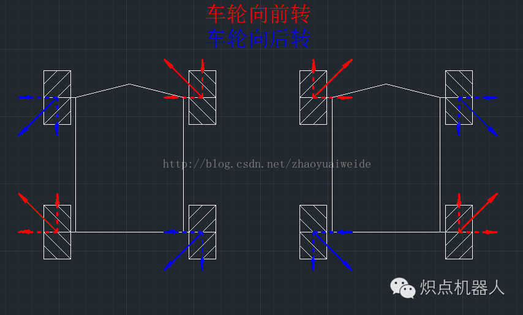
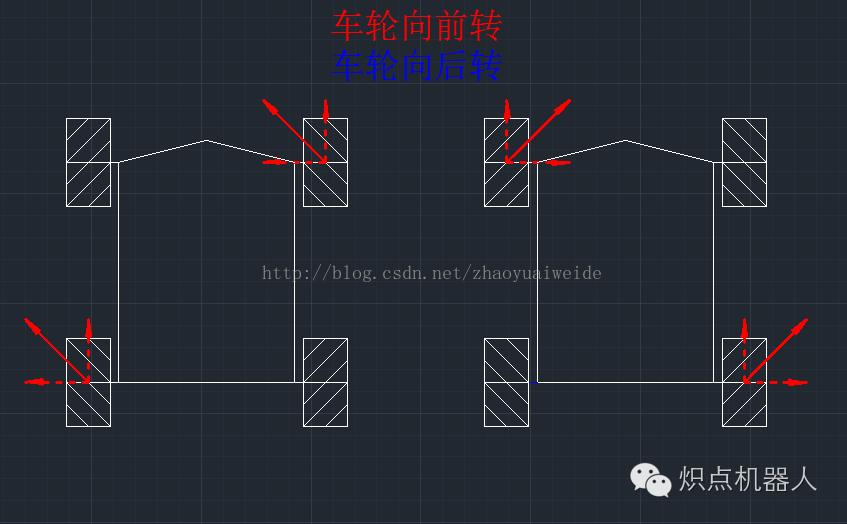
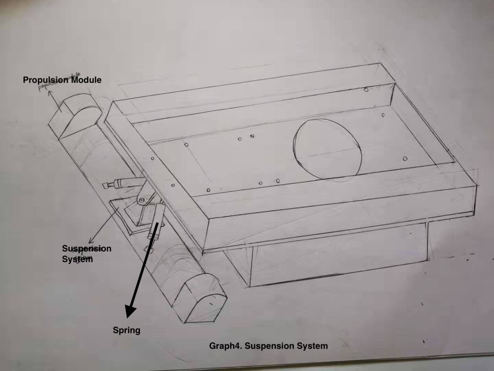
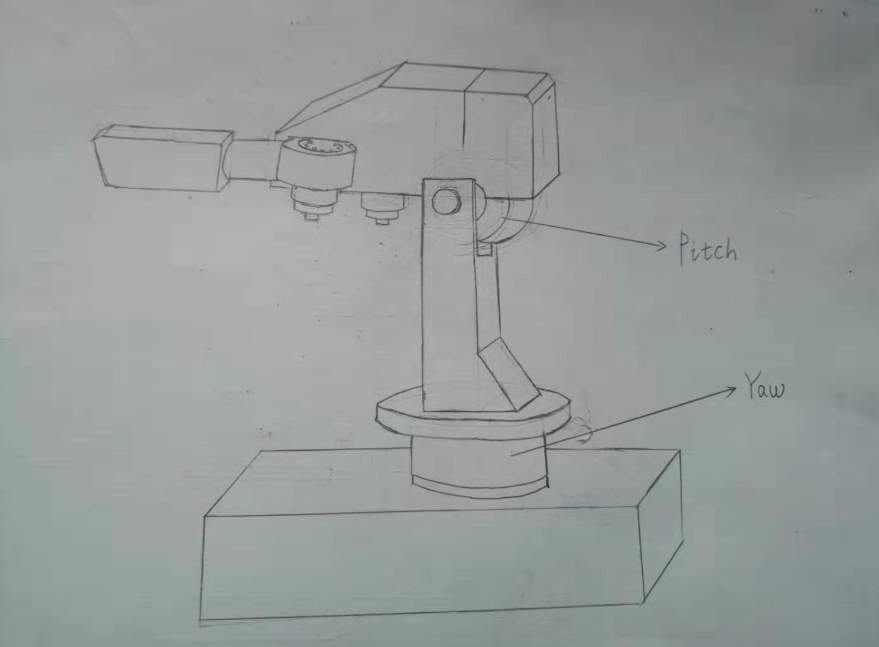
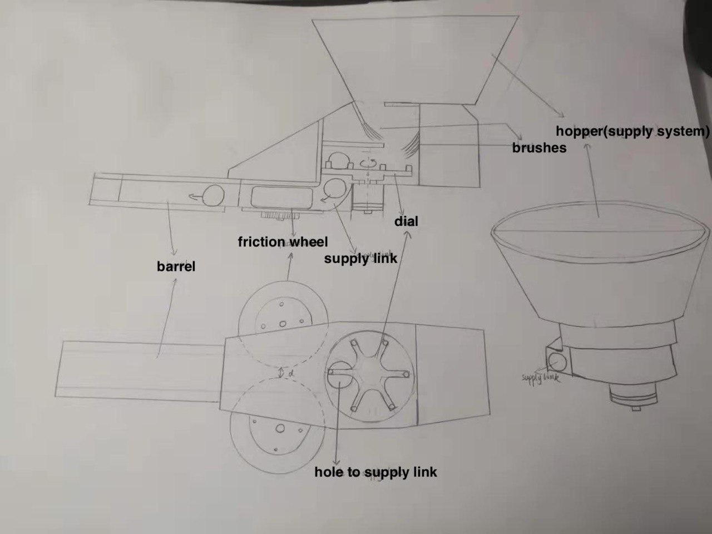
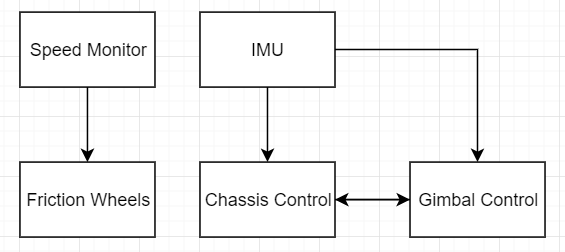
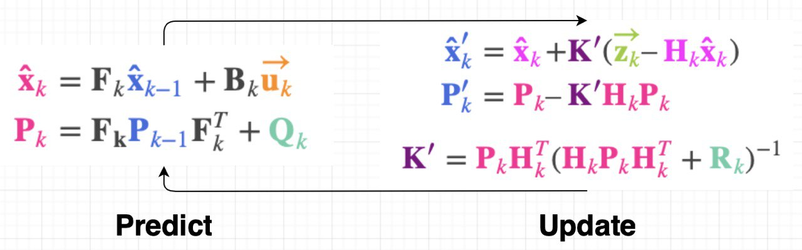
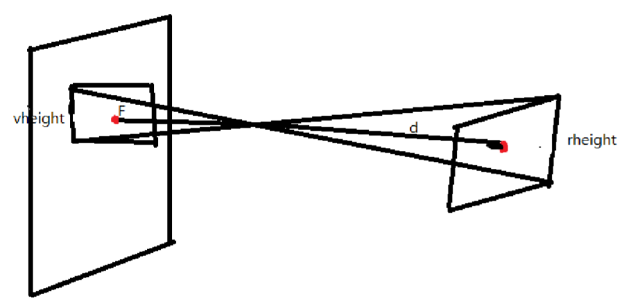

# NUSNextBot

## Introduction

 - Chen Tong :computer:

   I am Chen Tong, a CEG year 2 student. In my high school I have joined VEX robotic team and participated in competitions as a structure designer. The highest prize I received is first prize In Asian-Parcific Robotic Championship. In NUS, I have joined Bumblebee Team Hornet during last year. I have experience writing computer vision algorithm in Team Hornet and I am quite familiar with the use of ROS. I am interested in learning web page design and computer vision in the future.                                                                                                                    
 
- Zhao Shi :electric_plug:

   I am Zhao Shi, a year 2 student reading electrical engineering and economics. I have past coding experience using C and python. Moreover, I am familiar with hardware description languages and starting to learn assembly language this semester. Maybe I can cover more of the hardware portion.

 - Liu Haoran :wrench:

   I am Liu Haoran, a year 2 mechanical engineering student. I do not have any experience about the modeling of the robot, but I am trying to learn how to design the gun and chassis.

 - Rebecca Oei :computer:

   I am Rebecca Oei, a year 2 studying Computer Engineering. I did robotics in Secondary school, in particular competing in the VEX Robotics competition which has similar elements to Robomaster. I am interested in working on the  electrical and software aspects of the robot, as well as administrative or management roles for the team.

 - Yuan Jiayi :computer:

   I am Yuan Jiayi, a year 2 computer engineering student. I have coding experience on C and C++. I have also written motor control code in CG1112 project and held obstacle avoidance part in CG1111 project. I am interested in obstacle avoidance design of the robot.

### Proposed Manpower Arrangement
No| Role          |  Description                        | Assigned to       | 
--|---------------|---                                  |---                |
 1|  Software     |  PID Controllers; RTOS             |  Chen Tong (Leader)|
 2|  Hardware     |  Hardware programming; Circuit design  | Zhao Shi       |
 3|  Mehchanical  |  Chassis; Suspension                |  Liu Haoran       |
 4|  Software     |  Sensors; Referee System            |  Rebecca     | 
 5|  Software     |  Computer Vision                 | Yuan Jiayi    | 
 6|  Mechanical   |  Gimbals System; Gun                | Open Position     | 
 7|  Operation    |  Sponsorships; Chinese-English Translation | Open Position     |   
 8|  Operation    |  Accounting; Publicity Materials    | Open Position     |  
 9|  Pilot        |  TX & RX system; Game-play strategy |  Open Position    |
 10| Electrical   |  Power management; Electric Drive; Fail-safe   |  Open Position |

 For interested people to join our team, please contact Telegram @chentong

## Timeline & Milestones

  **Now ~ Oct 2019** Based on the rules of RoboMaster2019, all members start to learn relevant skills and concepts for their roles.
  - Mechanical: Get familiar with suspension system, launching system and modeling of the robot
  - Electrical: Familiar with designing of power system and microcontroller programming
  - Software: Get familiar with ROS and some useful tools. Utilize the official forum

  **Oct 2019 ~ End Nov 2019:** Prepare for ***rulebook exam (November 20)*** and the submission of ***season schedule (November 30)*** . Based on the rules of RoboMaster2020, plan the strategies and the relevant design in detail. If possible, start to assemble some components of the robot based on the plans.
  - Mechanical: Try to finish the modeling of each part of the robot
  - Electrical: Simulate power system to ensure that it meets the requirement of DJI
  - Software: Write some parts of the module (obstacle avoidance, image processing, etc.)

  **Dec 2019 ~ Jan 2020:** Assemble the Standard robot. Prepare for the submission of the ***Technical Proposal to the competition committee (January 23)*** .
  - Mechanical: Assemble the mechanical parts of the robot
  - Electrical: Test the electrical system and completed hardware programming
  - Software: Enhancements

  **Jan 2020 ~ Feb 2020:** Integrate mechanical/electrical/software components. Begin testing the robot and film the ***Mid-term Robot Assessment Video (March 1)*** .
  - Mechanical: Test and adjust the launching system to fulfill the mid-term assessment requirements
  - Electrical: Work on any sections that does not fulfill the trail
  - Software: Test and adjust the system according mid-term assessment requirements

  **Mar 2020 ~ April 2020:** Purchase and assemble the referee system for the robot. Continue to test and improve robot capabilities. Practice and refine interactions between robots (eg. Engineer passing projectiles to Standard). 
  - Mechanical: Assemble all the sections of robot
  - Electrical: Assemble the final product and ensure that the electrical system works as expected (i.e. enough operation time)
  - Software: Complete and test UI to ensure operations are smooth

  **May 2020 ~ June 2020:** Pilot training. May organize some competitions with other standard robots in NUS team to discuss and improve the strategies. ***Film the final robot assessment video (June 3)*** and ***prepare for the online referee system exam (June 4)*** . Keep adjusting the robot for better performance. Analyse the gameplay of teams from China (regional competitions will start in May) and improve our robot and strategies.
  - Mechanical: Adjust the mechanical sections of the robot for better performance
  - Electrical: Integrate the referee system and ensure that the robot is ready for competition
  - Software: Test referee system and adjust the software sections for competition

  **July 2020:** International Regional Competition starts. No more significant changes. 

  **July 2020 ~ August 2020:** Final Tournament

## Tasks and Analysis

**Key: Agility and accuracy**

1. The standard robot can return to the Restoration Zone to regain health and refill projectiles when it is still alive. Otherwise, the fellow engineer will pull it back to restoration zone to recover, which takes the longer time. Hence, the standard robot should move fast enough to go back to restoration zone when they are seriously injured. 

1. During the competition, the standard robot should aim to attack the opponent’s hero and the standard robot near it since the accuracy may decrease when attacking from a distance. Furthermore, the standard robot is not supposed to attack the engineer since the engineer has high HP and it is hard and time-consuming to kill it. Engineers are generally heavier and larger than the standard robot, they may block the way. Thus, the speed and agility of the standard robot are highly important so that it can keep away from the engineer to escape or attack other targets.  

1. During the competition, it should also assist the hero robot in attacking the opponent’s sentry, in order to open the base shield. 

1. After a few minutes, the runes will be available and infantry should try to get the rune since the hero’s shooting speed may be slower (Hero may have 42mm bullet). Hence, The gimbal of the standard robot should have wide attacking range to allow the gun to shoot the rune.  

1. Besides attacking, the standard robot is supposed to occupy the bridge top region or the bunker in order to get the bonus. To decrease the damage, we will implement a mode to make the chassis keep spinning when it is occupying the regions. 

1. Finally, when the opponent’s sentry is dead, the infantry should move close to the base and shoot. 

&nbsp;&nbsp;&nbsp;&nbsp;Conclusiton: Since the infantry is best suited to attacking enemy robots in a short distance and it needs to go back to gain health and refill, we should focus on its agility in order to attack or defend effectively. Accuracy is the second focus since the infantry aims to hit the rune and attack the enemies. 

## Overall Mechanical Design

*Figure1. Rough Design of The Robot*

&nbsp;&nbsp;&nbsp;&nbsp; Size: Length: 50cm; width: 50cm; height: 50cm (according to competition standard)

## Chassis

The height of the chassis is 5 cm from the ground, to lower the center of gravity. At the same time, this prevents the robot getting stuck on either type of projectile.

*Figure2. Chassis*

### Wheels (Mechanical):

&nbsp;&nbsp;&nbsp;&nbsp;We would like to use Mecanum wheels in the robot to make it agile. The reason is that if we use traditional wheels, the changing of direction of movement will take one more additional step than using Mecanum wheels, turning, which takes much time and space. However, using Mecanum wheels, by controlling the direction of rotation of the wheels, the robot can move in different directions instantaneously without turning. Moreover, it does not need a rotating shaft to yaw rotate the direction of the wheels, so that it simplifies the mechanical designs and reduces the weight of the vehicle, enabling it to run faster and become more agile. The movement of individual wheels will be programmed so that the pilot can easily control the movement of the robot using WASD keys. 

&nbsp;&nbsp;&nbsp;&nbsp;Unlike traditional wheels that only create friction force point forward and backward, Mecanum wheels create a diagonal force so that different combinations of rotation directions on different wheels can create four movement patterns. These are forward/backward, leftward/rightward (Figure 3), diagonal movements (Figure 4) and on-spot yaw rotations.

[*Figure3. Rotation of the wheels to achieve sideways movement
Red arrows refer to wheels turning forwards, while blue arrows refer to wheels turning backwards.*](https://blog.csdn.net/zhaoyuaiweide/article/details/75560257)

[*Figure 4: Rotation of the wheels to achieve diagonal movement (forwards)*](https://blog.csdn.net/zhaoyuaiweide/article/details/75560257)

### Suspension System (Mechanical):

*Figure 5: Suspension System*

&nbsp;&nbsp;&nbsp;&nbsp;The suspension system in figure 5 is one kind of non-independent suspension system, which has the advantages of high loads, low cost and simple structure.

## Gimbal System: 2-axis Gimbal

*Figure 6. Two axis gimbal system*

### Motors (Electrical)

&nbsp;&nbsp;&nbsp;&nbsp;The gimbal should use [GM6020 DC brushless motor](https://store.dji.com/cn/product/rm-gm6020-brushless-dc-motor), which has high precision. This is crucial since the gimbal is used to control the movement of the gun barrel as well as the camera. It is compact so that it can fit into the internal structure of gimbal.

### Design of chassis and gimbal systems (Software)

&nbsp;&nbsp;&nbsp;&nbsp;We have a separate chassis and gimbal to allow autonomous spinning on each part. We will implement the robot controls such that the camera and gun barrel move independently from the spinning of the chassis. 

&nbsp;&nbsp;&nbsp;&nbsp;We intend to ensure that the gun barrel will stay still relative to the surroundings, while the chassis is spinning clockwise. At algorithmic level, while the chassis is spinning, the gimbal will rotate in the opposite direction by the same degree, to offset the wheel’s rotation. As such, the gun barrel will always point to the same direction without pilot intervention. This ensures precision when aiming at the same target, allowing the chassis to simultaneously spin in order to avoid incoming bullets hitting the armor modules.

&nbsp;&nbsp;&nbsp;&nbsp;From the pilot’s perspective, the spin of the chassis will be controlled by the keyboard. The mouse is used to control the aiming of the gun barrel. Without moving the mouse, the algorithm mentioned above will ensure that gun barrel is relatively still. 

## Launching system:

&nbsp;&nbsp;&nbsp;&nbsp;The launching system is important for the robot to attack opponents in the competition. There are four main methods of launching, namely gunpowder launching, pneumatic launching, spring launching and friction wheel launching. Among these four methods, friction wheel launching has the advantages of security, simple design, low cost and stable launching.

*Figure 7. Overview of the launching mechanism*

### Design of the structure (Mechanical)

&nbsp;&nbsp;&nbsp;&nbsp;The system shown in Figure 6 is the friction wheel launching system, which consists of the hopper, dial, supply link and friction wheel. Projectiles entering the hopper will fall on to the dial with the lead of brushes or 3D-printed parts. The dial will push projectiles into the hole of the supply link.

&nbsp;&nbsp;&nbsp;&nbsp;After a projectiles drop into the hole, they will slip onto the friction wheel through the supply link. Two friction wheels are driven by two reverse-rotating motors, so these 2 wheels will rotate in opposite direction (one rotates clockwise, and the other anticlockwise) but with the same frequency. The distance between 2 friction wheels is slightly smaller than the diameter of projectiles, so when projectiles get contact with 2 friction wheels, they will be squeezed and continue moving forward in the barrel of the gun. In this process, projectiles will experience frictional force and compression due to the high-speed rotation of friction wheels. When projectiles are released, they will have kinetic energy from being accelerated by the friction wheels.

 - Dial:

   Poor dial design is the primary cause of the projectiles getting stuck. Thus there are many important factors to consider for dial design. Firstly, the dial cannot be too high, as this may cause the projectiles to be squeezed under the dial when turning. Secondly, the turning angle of the dial motor should be constant. If not, the projectile will not be sent into the hole of supply link, and end up stuck at the hole. Thirdly, when the dial is rotating, we may have many bullets cluster together and get stuck. Using guides like brushes and 3D-printed parts can prevent the problem of accumulation of projectiles. In above figure, the system uses brushes to guide projectiles to fall on the dial.

 - Supply link:

   The curved portion between the supply link hole and the friction wheel should be well-designed to make sure projectiles can smoothly roll down to the friction wheels. Otherwise, when the gun reaches its maximum elevation(+23.5 degrees), projectiles falling from the hole may stop at the curving part and may not continue to fall to reach the friction wheel. Therefore, the radius of the curving part should be large enough to prevent this kind of situation.

 - Friction wheel:

   Friction wheel consists of two parts, the outer layer and the motor. The outer layer will be in contact with the projectiles, and is generally made of a material with soft texture and large surface friction, such as silica gel. A pair of friction wheels rotate in different directions. After one projectile leaves the friction wheel, another projectile will contact the friction wheels consecutively.

### Motor of friction wheels (Electrical)

&nbsp;&nbsp;&nbsp;&nbsp;Snail 2305 motor and 430R electrical speed controller are used together to power the frictional wheels. This motor and corresponding controller can deliver high torque and power instantaneously to the wheel so that the projectile can be released with a relatively high speed (just under 30m/s, within the competition requirements).

## General Design

### PID Controllers (Software)

&nbsp;&nbsp;&nbsp;&nbsp;In order to improve the robot’s agility, we should have a fine degree of control over the motors, which will allow it to move at the exact speed or angle that we want. For instance, the shooting speed of the gun should be limited under a specific value, and the robot should move and stop precisely as controlled. 

&nbsp;&nbsp;&nbsp;&nbsp;A proportional–integral–derivative (PID) controller is a control loop mechanism with feedback loop to provide a parameter to adjust the current value. It is employed here in order to control the actuators.

&nbsp;&nbsp;&nbsp;&nbsp;Thus, PID controllers will be implemented in projectile, chassis, gimbal control modules to control the motors on friction wheels, Mecanum wheels and gimbal respectively. PID controllers will work together with Inertial measurement unit (IMU) and wheel encoders to improve the agility (Figure 8).

*Figure 8. Rough Structure of PID controllers*

### Auto-aiming (Software)

&nbsp;&nbsp;&nbsp;&nbsp;During the competition, it might be hard to aim at enemies’ armours accurately, thus, we require computer vision to assist the pilot once they have roughly aimed at the target. Moreover, in order to get the rune, the robot has to shoot 5 armors continually within 2.5 seconds, which is difficult for the pilot to aim and shoot. Hence, auto-aiming should be used to shoot the runes instead of manual control. 

*Figure 9. auto-aiming workflow*

&nbsp;&nbsp;&nbsp;&nbsp;We will use Kalman filters to predict the armor areas, since it only needs estimated state from the previous time step and the current measurement without history of observations or estimates to compute. To simplify, we decide to assume the robot has a constant speed in a short period of time. The use of Kalman filter is shown in Figure 10. In Figure 10, x represents state, P represents error covariance, F is the prediction function, Bk is the control matrix, uk is the control vector depends on known external influences, Qk is additional uncertainty from environment, K is the Kalman gain, Hk is a set of sensor readings, Rk is the covariance of the sensors’ uncertainty, and zk is the mean according to the reading we observed. We will use position and velocity of the target as state components, and then predict its current state. 

[*Figure 10. Process of Kalman filters*](https://www.bzarg.com/p/how-a-kalman-filter-works-in-pictures/)

&nbsp;&nbsp;&nbsp;&nbsp;Then, the algorithm will analyze the position of the target area and its distance from the center point on the screen. After processing the data, this module will send a value to the gimbal control to adjust the position of the gun, and then to shoot at the target armor.

### User-friendly keyboard controls (General)

 - We have selected controls that are similar to FPS gaming. Thus, they would be familiar to our drivers who are likely used to such controls. 

 - Chassis movement: 

    - WASD for basic movement.

    - Combination of keys (eg. W+A) to move diagonally. (This permits greater freedom of movement, allowing the robot to navigate faster.)

    - Additional keys for yaw spinning/rotating.

 - Shooting:

    - Use mouse to aim

    - Use left mouse button to shoot

    - When the left button mouse is first clicked, the dial will start to rotate to supply projectiles into the supply link hole. Each click will make the dial rotate 60 degrees. If the left mouse button is pressed and held down, the dial will rotate with the speed of 3 revolutions per second, which means the maximum frequency of shooting is 18 projectiles per second.

### Choice of sensors

 - Referee system client UI allows for our own custom data to measured and shown to the driver on the screen. Thus, the distance between the gun and the target can be added in. Sensor information can be relayed to the driver through the UI, as well as used for the auto-aiming system. To achieve this, we generate 2 plans.
 
 - Plan A: Use ultrasonic sensor to measure the distance from the target, to help with aiming. This one is simple but may not be stable enough.

 - Plan B: Simply use the camera to calculate the distance.
   Mechanism:
   
   the height of the armor in the real world (rheight) 
   
   the height of the projection in the camera (vheight)
   
   The focal length of the camera (F)
   
   Distance between the camera and the armor (d)
   
   Focal length of the camera will be derived from camera calibration.
   
   **rheight/vheight = d/F**
 
   
   *Figure11. Mechanism of measuring the distance (Source: Fujian University of Technology)*
  
   It is technically difficult but may be reliable.

 - We will test and choose one of them based on their performance.

 - Consider drivers will operate the robot according to the images transferred back from the camera, and the accuracy of auto-aiming, we prefer a camera with a high resolution. Since the agility of the robot is the other key point we focused on, we prefer to use a small size and light camera. Thus, we will choose [Sony IMX179 camera](https://www.dhgate.com/product/8mp-hd-mjpeg-usb-camera-sony-imx179-sensor/416524185.html), which can maintain 800X600 resolution when the transfer rate reaches 30fps, a wide vision angle(75 degree), and a small size(38mm*38mm).

### Choice of MCU

 - Robomaster development board type A are to be used for our design. This board has multiple ports to connect different devices. This is the main board that connects to the usb-systems of the robot i.e. referee system and remote controller. 

 - This board is used in conjunction with type B, which allows us to connect different sensors to it. It is compact so that it can fit into our robot. The ultrasonic sensor used will be connected to this board.

### Choice of onboard computer: [DJI Manifold 2-G](https://dl.djicdn.com/downloads/manifold-2/20190528/Manifold_2_User_Guide_v1.0_EN.pdf)

 - Since most of the components we choose are DJI products, using Manifold2-G may be a convenient choice.

 - Manifold 2-G is powerful since it use Nvidia Jetson TX2 as processor and its memory is adequate to support our system

 - Manifold 2-G has is light (~230g) and the power it required (3-25W) is lower than the limit.

## Budget

| No. | Title | Quantity | Price (USD) | Total Price (USD) |
|-----|---------------------------------------------------------|----------|-------------|-------------------|
| 1 | RoboMaster GM3510 Brushless DC Motor | 1 | 47 | 47 |
| 2 | RoboMaster Red Dot Laser | 1 | 13 | 13 |
| 3 | RoboMaster Mecanum Wheel (right) | 2 | 44 | 88 |
| 4 | RoboMaster Mecanum Wheel (left) | 2 | 44 | 88 |
| 5 | RoboMaster 2312 ESC-420S | 4 | 5 | 20 |
| 6 | RoboMaster TB47 Battery Charger 100W (without AC cable) | 1 | 19 | 19 |
| 7 | RoboMaster Robot Remote Controller Receiver | 1 | 16 | 16 |
| 8 | Robomaster Robot Remote Controller Set | 1 | 56 | 56 |
| 9 | Robomaster ESC Centre Board | 1 | 5 | 5 |
| 10 | Robomaster Rubber Roller for Mecanum Wheel | 4 | 6 | 24 |
| 11 | Robomaster Battery Rack(compatible) | 1 | 16 | 16 |
| 16 | RoboMaster TB47 Battery 100W Charger AC Cable | 1 | 4 | 4 |
| 18 | RoboMaster M3508 P19 Brushless DC Gear Motor | 4 | 79 | 316 |
| 19 | RoboMaster C620 Brushless DC Motor Speed Controller | 1 | 63 | 63 |
| 20 | RoboMaster M3508 Accessories Kit | 1 | 54 | 54 |
| 21 | RoboMaster Development Board Type A | 1 | 68 | 68 |
| 22 | RoboMaster Development Board Type B | 1 | 35 | 35 |
| 23 | RoboMaster Development Board OLED | 1 | 14 | 14 |
| 24 | RoboMaster M2006 P36 Brushless DC Gear Motor | 1 | 41 | 41 |
| 25 | RoboMaster C610 Brushless DC Motor Speed Controller | 1 | 25 | 25 |
| 26 | RoboMaster Development Board Cables | 1 | 40 | 40 |
| 27 | TB47D Battery | 1 | 216 | 216 |
| 31 | Manifold 2-G | 1 | 879.2 | 879.2 |
|  |  |  | total | 2147.2 |

*Components in referee system are omitted.*