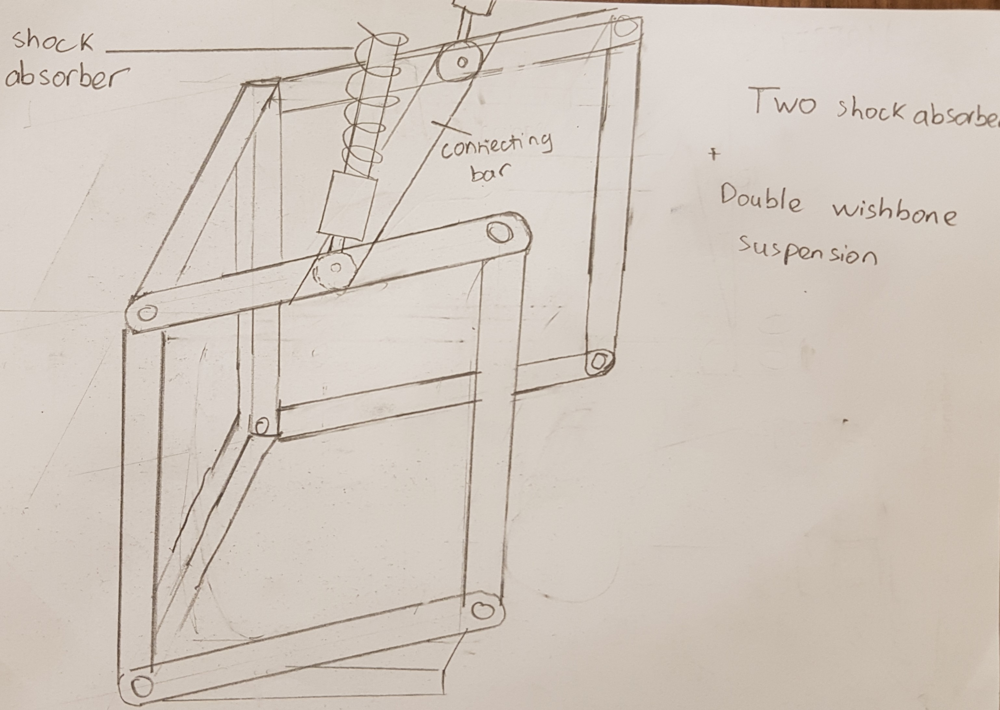

# Team RoboCop

## Introduction

### Nguyen Tuan Dung

I am currently a year 1 Mechanical Engineering student who is also second majored in iDP. I have had 4 years of experience with robotics in secondary and high school. One of the competitions I participated in was VEX Robotics Competition. Within the four years, I have won 4 tournament champions and 3 excellent award for high school category in Singapore VEX Robotics Competition. I also moved on to represent Singapore in the World VEX Robotics Championship twice and the highest award I achieved was Division Finalist. For robotics, my interest focuses on mechanical design and building of the robot. I can also become the pilot or provide coaching for pilot during match.

### Nicholas

A year 4 EE student interested in the field of robotics. Worked with Temasek Laboratories to design, develop and test an IR LED module. In 2014, I developed a system to tackle the issue of myopia. Components used were Arduino Uno, Ultrasonic sensor, buzzer, LED, Relay. I have basic electronic circuits and digital design knowledge. Last semester I took Feedback Control System module and am currently taking Industrial Control System module.

### Boby Halim

I am a year 1 Mechanical Engineering student. Although I do not have prior background in robotics, I have taken part in research project before when I was in JC. The project was about Demonstration Kit for Battery-less RF Energy Harvesting where I presented it at Singapore Science Engineering Fair (SSEF). In robotics, I would like to learn more about the mechanics and the process of building a robot, including the various fabrication methods. I am also interested in the design phase of a robot through the use of CAD such as Solidworks.

### Isaiah Koh

I am currently a year 1 Computer Science and Business Administration DDP student. In my free time, I have undertaken several personal coding projects including a basic Android app and a Sudoku Solver that solves through a combination of logic and brute force methods. I have expeirence with Java and C++. Also, I know how to use GitHub and VuePress.

### Proposed Manpower Arrangement
No| Role          |  Description                        | Assigned to       | 
--|---------------|---                                  |---                |
 1|  Mechanical   |  Chassis; Suspension                |  Dung (Leader)    |
 2|  Mechanical   |  Gun; Gimbals system                | Dung  |
 3|  Electrical   |  Power management; Electric Drive; Fail-safe   |  Nicholas |
 4|  Electronics  |  Sensor interface; Close-loop Control | Nicholas | 
 5|  Software     | Linux OS; Sensor drivers            | Isaiah     | 
 6|  Software     | Computer vision; Motion planning    | Open Position     | 
 7|  Operation    | Accounting; Publicity Materials     | Boby     |  
 8|  Pilot        | TX & RX system; Game-play strategy  |  Nicholas            |

 For interested people to join our team, please contact Telegram @xxxx 

## Timeline & Milestones

## Robot Design Considerations

### Functionality of robot:

A standard robot performs multi-role in a game, which could be summed up to the following:
* attacking opponents robots including ground robots and sentry 
* activating power runes by shooting at target following a sequence 
* Shooting at base
* Carry out various roles according to game strats: decoy, stationary shooting and defence, etc

After watching through the games in the Grand Final round of 2019 competition, we agreed on these desired features for the standard robot: 
* Agile and high mobility
* Accurate shooting for a wide range of distances

### General specifications:

First to make the robot agile and high mobility, we need to consider the weight, size, speed and acceleration of the robot with the following constraints: 

 Weight   |  Size                        | Chassis Power      | 
----------|---                           |---                |
  20 kg   |  600 x 600 x 500             |  80 W    |
  
From observing the game, the maximum linear continuous traveling distance for the robot in a game is only 20 meters. In addition, it’s more important for the robot to have high initial acceleration to improve its agility. Hence, we aim to have our robot **accelerate to 2m/s within 0.7s and have a maximum speed of 4.5 m/s**. To achieve this, considering the weight and chassis power limit, we plan to have our robot to be weighted at around **15-16 kg**. It’s understandable that we can make our robot lighter to travel faster; however, we also planned to use mecanum wheels which has lower grip with ground surface (compared to a normal wheel). Hence, it’s important for the robot to be heavy enough for fast acceleration.

Next, we split the robot’ components to four main areas: 
* Chassis: including wheels, base, frame, etc. 
* Turret: two axis self-stabilized gimbal system (horizontally and vertically turning)
* Cannon: projectiles storage, transmission and launching
* Miscellaneous parts

A more detailed planning and general design for each of these areas will be discussed in the next section.

## General Design and Fabrication Method

### Chassis:

Our first consideration when designing the chassis is its sizing. We planned to have a square base of 600 x 600 which makes it easier to programme the base to spin still at a location (lower probability of getting hit by an enemy’s projectile). The robot will also be surrounded by an aluminium frame to ensure its sturdiness (take into account that there is collision happen in game).

Figure 1

We choose to install **mecanum wheels** for the robot since it can be mounted like normal wheel while providing the same style of movement as omni wheel. Each wheel will also has a motor directly attached to it. (allowing the robot to turn without a steering system). 

Next, we would need to consider the base elevation. We are considering using Robomaster Mecanum Wheel, which has a diameter of 152.5 mm. This means the elevation of the robot at the radius level of the wheels would be 76.25mm. We observe that most of the slopes in game are at 17 degrees or 20 degrees, this means on an elevation of  minimumly 15 mm is needed for the robot to move smoothly up slope. Hence, we decided to keep the **base elevation at 76.25mm**. At this height, the CG is low enough to allow better turning and maneuver while still allow the robot to move through all terrains on field.

In game, it is noticed that the robot has to jump over obstacles (Field element: Road Incline) or sometimes might jump while moving up slopes too fast. Hence, we decided to install an independent suspension system to each of the wheel. A modified version of **double wishbone suspension system combined with shock absorber** will be used to ensure robot can overcome obstacles better without bending the chassis and other connecting axles and joints. Figure 2 and 3

Figure 2

Figure 3

**Fabrication method**
* Choice of material for metal frame: aluminium 
* Wheels’ motor: **RoboMaster M3508 P19 Brushless DC Gear Motor**

### Turret (Self-Stabilized Gimbal System):

Since we are using 2-axis gimbal system, we will need two Brushless DC motor to allow the turret to move in the pitch and yaw axis. The turret will be designed to be able to make 360 degrees rotation in Yaw axis and <180 degrees rotation in Pitch axis.

Figure 4

The general design of the gimbal system is as follows: 

  

Figure 5: mechanism for pitch rotation

*All pictures for gimbal mechanism was retrieved from https://www.youtube.com/watch?v=zCV0viLxYUY*

Using a 100rpm motor and a 1:2 ratio for the motor and gear connected to the cannon, we can change the turret pitch by 300 degrees per second, or 48 degrees in 0.16 seconds.

Figure 6: Mechanism for yaw rotation

*All pictures for gimbal mechanism was retrieved from https://www.youtube.com/watch?v=zCV0viLxYUY*

The circular base for the yaw rotation mechanism will be 20 cm in diameter. To rotate the entire turret, we will be using the Robomaster M3508 Gear Motor, which has a maximum rotational speed of 469rpm with a continuous 3 Nm torque. Theoretically, by using a 1:5 transmission ratio, we can make the turret rotate 360 degrees in 0.96 seconds, or alternatively, rotate the turret by 90 degrees within 0.24 seconds. This will allow the operator to change the direction of their aim faster.

As for the active, automatic stabilisation, a gyroscope will be attached to the chassis to record changes in orientation of the chassis. The data will be fed to the processor, which will rotate the pitch and yaw of the turret to maintain the same firing angle.

### Cannon (Double flywheel launcher system):

Figure 7

For the launcher, we intend to use a double flywheel launcher system. Some of the considerations we have taken into the designs include: 
* **Short range combat**: a fast and consistent shooting rate needed
* **Long range shot**: It is noticed that the power runes in game are normally activated from the bridge top platform since it is elevated (nearer to the high hanging power rune). The distance from the bridge to the power rune is estimated to be around 8000 mm. Hence the cannon must be able to shoot target accurately at this range. (on single fire mode)
* **Barrel heat**: Following the competition rule on barrel heat, we calculated the desired round per second (rps) for our cannon as below:

Max heat | Cooling          |  Shooting speed (m/s)   | Shooting time (s)   | Shooting rate (rps)  |
-----    |---------------   |---                      |---                  | ---                  |
240      | 40               | 30                      | 20                  | 1.7                  |
360      | 60               | 30                      | 20                  | 2.6                  |
480      | 80               | 30                      | 20                  | 3.4                  |

The calculation is made with the assumptions that the shooting speed is consistently 30 m/s and the cannon fire for 20 sec non-stop (higher rate can be used while shooting in shorter duration) . However, this is the most extreme case as normally the continuous shooting time is normally lower in match. Hence we aimed to design our indexing mechanism such that the cannon achieve a maximum output of 5 projectiles per second.

We intend to use the motor shown in the image below to power the flywheels.

Figure 8: Motor for flywheel

We intend to fire projectiles at the maximum allowed velocity of 30m/s. Based on our calculations, if the motor is spinning at 7000rpm, the diameter of each flywheel needs to be 80 mm for the launcher. The two wheels will also be spaced 16 mm apart horizontally since the projectile’s diameter is 17mm. 

The ammo box will be located at the top part of the robot and it will take the shape of a funnel to ensure that the projectile will go into the conveyor belt one by one. This is to avoid jamming during the loading of projectiles from the ammo box into the conveyor belt. Subsequently, we will use indexing mechanism as a stopper. This means that each projectile delivered by the conveyor belt will be stored in the groove of the stopper and will be passed one by one to the barrel. This will ensure that there is no jam during the loading of projectiles into the barrel where the projectile will be shot through double flywheel system

Figure 9

The motor we chose for this should have a higher stalling capacity to prevent jams but a lower rpm since we do not need projectiles to be fed into the flywheel at such a high rate. Hence, we chose the motor shown below.

Figure 10

Assuming that the indexing mechanism has 8 grooves, a 40RPM rotation from the motor would allow us to achieve our target of 5 projectiles fired per second.

### Miscellaneous parts:

* **Cortex**

**NVIDIA Jetson TK1**: $165. 192-core Kepler GK20a GPU, it delivers a performance of 300 GFLOPs. TK1 doesn’t have onboard WiFi or Bluetooth. However, these can be added via USB or the mini-PCIe port.

* **3D Camera**

There is a huge array of cameras for robot vision. We used this decision-making tree to aid us in choosing the right camera for our robot:

Figure 11

 https://www.electronicproducts.com/Robotics/Designer_s_guide_to_robot_vision_cameras.aspx

 Our robot does not need an extremely high-quality image in order to detect the in game objectives and hence we have chose the CMOS based robot vision camera due to its price, power consumption, as well as processing power needed to process the image.
The higher the resolution the more information our algorithm will have and the more computational CPU power we will need to process it, the lower the resolution the easier it is to process it quickly and the cheaper our system will be. Given our requirements, we select the **OpenMV Cam H7**.

link : https://www.sgbotic.com/index.php?dispatch=products.view&product_id=2840
Price: SGD 109.96

* **MCU**: RoboMaster Development Board Type A (STM32F427)
Price: USD 105

* **Battery**: DJI TB48 Intelligent Flight Battery for Inspire I (5700MAH)
Price: SGD 261.68

* **Laser**: 650nm 5mW Focusable Red Dot Laser Module Laser Generator Diode
Price: $11 SGD

### Proposed Budget

SGD 2000