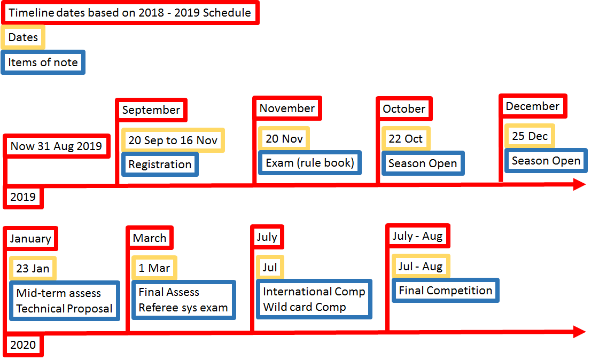

# Team RoboCop

## Introduction

Nguyen Tuan Dung

I am currently a year 1 Mechanical Engineering student who is also second majored in iDP. I have had 4 years of experience with robotics in secondary and high school. One of the competitions I participated in was VEX Robotics Competition. Within the four years, I have won 4 tournament champions and 3 excellent award for high school category in Singapore VEX Robotics Competition. I also moved on to represent Singapore in the World VEX Robotics Championship twice and the highest award I achieved was Division Finalist. For robotics, my interest focuses on mechanical design and building of the robot. I can also become the pilot or provide coaching for pilot during match.

Nicholas

Boby Halim

Isaiah Koh

### Proposed Manpower Arrangement
No| Role          |  Description                        | Assigned to       | 
--|---------------|---                                  |---                |
 1|  Mechanical   |  Chassis; Suspension                |  Dung (Leader)   |
 2|  Mechanical   |  Gun; Gimbals system                | Open Position|
 3|  Electrical   |  Power management; Electric Drive; Fail-safe   |  Sangit |
 4|  Electronics  |  Sensor interface; Close-loop Control | Huimin          | 
 5|  Software     | Linux OS; Sensor drivers            | Isaiah     | 
 6|  Software     | Computer vision; Motion planning    | Open Position     | 
 7|  Operation    | Sponsorships; Chinese-English Translation | Open Position     |   
 8|  Operation    | Accounting; Publicity Materials     | Boby     |  
 9|  Pilot        | TX & RX system; Game-play strategy  |  Nicholas            |

 For interested people to join our team, please contact Telegram @xxxx 

## Timeline & Milestones

 >   You should study the past year's competition deadlines, and align your team's progress to those deadlines

## Robot Design Considerations

We analysed several matches from this year and last year... Identified several design approaches...

...

### Proposed Budget

...