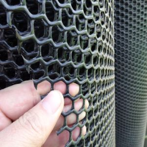
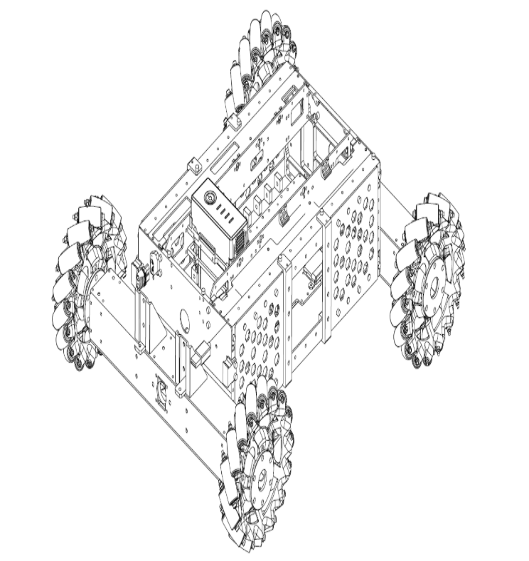

# RoboSanity

## Introduction
### Christian Chandra

Hi! I am a Year 3 Material Science Engineering student. Currently, I don’t have any background in robotics, but I am interested to know more about the Materials Fabrication for robotics and Computer Vision. That being said, I do have experience in coding with different languages, such as Matlab, Python, and C++. Also, I have experience in cadding using Autodesk Fusion 360 which I learned in my iDP program – where I and my team 3D printed our product for the project. 

I also play MOBA games, such as Mobile Legend & Arena of Valor, which I rank Top 40 locally (ML). Hence, I can also contribute in strategies when battling in the arena -  where strategies are critical.

### Gerry Windiarto Mohamad Dunda

I am third year student from Electrical Engineering major minoring in physics and computer science. I have not participated any robotic competition before, but I have strong passion in problem solving. By joining the team, I want to develop my practical skill more.

Last semester, my friend and I had a course project in embedded C system that used STM32 as its MCU and uVision as the software. One of my duties was to process the image taken by the camera and  then store the image and its relevant information into SD card. Also, my previous experience regarding the control was developing the algorithm which maintained the temperature of the silicon photonic chip by using Vivado and FPGA. I also possess knowledge in signal processing using both MATLAB and Python and some basic machine learning libraries like scikit learn and pytorch.

### Nicholas Alexander
Hi , I am Nicholas, i like pizza and coke, basically your standard hackers food. By the way, I am a tech enthusiast and like to find and run exploit and do something that's not supposed to do. Yeah i have broke more electronics than my bank account may be able cover(just a joke, i am not broke).

## Proposed Manpower Management
No| Role          |  Description                        | Assigned to       | 
--|---------------|---                                  |---                |
 1|  Mechanical   |  Chassis; Suspension                |  Christian   |
 2|  Mechanical   |  Gun; Gimbals system                | Christian |
 3|  Electrical   |  Power management; Electric Drive; Fail-safe   | Nicholas
 4|  Electronics  |  Sensor interface; Close-loop Control | Gerry | 
 5|  Software     | Linux OS; Sensor drivers            | Gerry,Nicholas    | 
 6|  Software     | Computer vision; Motion planning    | Gerry  | 
 7|  Operation    | Sponsorships; Chinese-English Translation | Open Position   |   
 8|  Operation    | Accounting; Publicity Materials     | Open Position     |  
 9|  Pilot        | TX & RX system; Game-play strategy  | Nicholas |

## Timeline

## Key Design Aspects for Standard Robot
### Movement
To ensure that the robot has smooth and fast movement throughout the match. It will be great if our robot can move/react faster compared to other robots, since timing is also important when attacking. 

Due to the fact that mecanum wheels have lower coefficient of friction (8" Mecanum Wheel - Radial Static: 0.7, Radial Dynamic: 0.6, Transverse Static: 0.7, Transverse Dynamic: 0.6) compared to regular wheels (8" Coolie Dualie Wheel - Radial Static: 1.05, Radial Dynamic: 1.0, Transverse Static: 0.29, Transverse Dynamic: 0.20), it is critical to make sure that the robot can go up the ramp.

For defense purpose, we can take advantage of the mecanum wheels to rotate the body of the robot. This movement is intended to defend against incoming bullets. Rotational movement will make it harder for the opponent to aim at our pressure pad.
	

### AI Assistance(Computer Vision)
1. Weaponry: The camera will provide information about the health bar of the enemy robot. When the user decides to fire the bullet and miss the target, the AI assistance will detect the armor of the enemy and located its relative position. After that, it will automatically adjust the positioning of the gimbal and the initial launch speed of the projectile to the desired target.

2. Self-defense: After observing the previous regional competition, It is a good idea to make the body of the robot that contains the body armor rotating when the enemy attacks our robot either manually or automatically

### Connectivity: 
RF connection 

If the communication is lost, the robot is automatically disqualified/counted as loss. Thus, it is very critical to ensure that the connectivity goes well and the material that we use does not interfere with the radio signal.

### Body

We can use a casing which covers the whole body, but also lightweight to protect the body from collision and scratch. One suggestion that we propose is to make it into net-like structure composed of hexagonal shapes (see picture below). This is to make it harder for the opponent to shoot through our pressure pad.

## General Design

The standard robot will be powered by these motors:
- RoboMaster M3508 P19 Brushless DC Gear Motor
- RoboMaster C620 Brushless DC Motor Speed Controller

For communication purposes, we will be using RF module to allow interaction between remote controller and MCU inside the robot. 

To increase friction of Mecanum Wheels for going up the ramp, we can install rubber on the wheel. However, should this still not work, we can add some detachable wheel to further increase the friction.

- RF module: Allow interaction between remote controller and the MCU inside the robot. The user will able to control the movement of the robot and the weapon.
- Use “honey comb” net structure case to protect the pressure pad from incoming bullets.
- Increase the friction of the wheels by modifying the mecanum wheels so that it can pass through slopes with the identified angle.For communication purposes, we will be using RF module to allow interaction between remote controller and MCU inside the robot. 

## Fabrication Method
To make the parts, we can use 3D printer to print out the parts and design the parts using Autodesk. The material is most likely to be PLA which is relatively easier to print and much more durable to date compared with other materials.

For metallic materials, we can use CNC Milling, which is controlled by computer, to drill or cut the metals.

### Structural Composition
The whole platform is modular-designed with quick disassembly and each part can be separately programmed and tested.

The platform is mainly composed of three parts.
1. chassis module
- Use Mecanum wheels for omnidirectional movement
- Powered by the RoboMaster M3508 P19 Brushless DC Gear Motor and RoboMaster C620 ESC)
- Use RoboMaster Development Board Type A (STM32F427) as MCU

2. Gimbal module
- Use 2-axis gimbal for two-DOF rotation movement
- Provide the mechanism for supplying and launching 17mm TPU projectiles
- Powered by RoboMaster GM6020 Brushless Motor (with the ESC) for gimbal movement
- Powered by RoboMaster M2006 P36 Brushless DC Gear Motor for projectile supply
- Powered by DJI Snail 2305 Racing Motor for projectile launching
- Use RoboMaster Development Board Type A (STM32F427) as MCU

3. Referee System Module
- An electronic penalty system that integrates computation, communication, and control features into different submodules and is used for robotic competitions only. Developers can acquire the information from specific software interface about the progress of the competition and the status of robots
- The Referee System includes the onboard terminal installed on the robot, as well as the server and client software installed on the PC
- Submodules installed on the robot consists of Armor Module，Main Control Module，Speed Monitor Module,    RFID Interaction Module and Power Management Module
 

In addition, DT7 Remote Controller and smart Lipo 6s battery (Matrice 100 TB47D Battery or TB48D) with related charger are included in the accessories of the robot platform. 
The platform accommodates an extensive variety of sensors and computing devices, customized to meet research needs easy for extended development. It provides sensor Installation holder compatible with different types of sensors including industrial mono-camera, Lidar, UWB locating kit, depth camera and so on. And the platform officially supported DJI Manifold 2 as the onboard computing device, but it is compatible with intel NUC, Nvidia Jetson TX1, TX2 or Xavier with certain type of carrier board.

## Hardware Parameters
Structure| Value|
--|-------|
Overall Size | 600 x 450 x 460 mm
Weight (Including battery)|16.6 kg

Performance| Value|
-----------| -----|
Maximum forward Speed| 3 m/s
Maximum Pan Speed| 2 m/s
Gimbal Pitch axis rotating angle| -20° ~ 20°
Gimbal Yaw axis rotating angle|-90° ~ 90°
Maximum launching frequency|10 projectiles per second
Maximum launching speed|25 m/s

Battery| Value|
-------|------|
Model|DJI DT7
Firmware Upgrade|2.4 GHz
Charging Port| Micro USB
## Budget Planning for Standard Robot

Item Name| Qty | Price (in USD)
---------|-----|------|
RoboMaster Tag for UWB Locating System| 1 | 95
RoboMaster UWB Locating System| 1 | 667
RoboMaster GM3510 Brushless DC Motor|4|188
RoboMaster Red Dot Laser|1|13
RoboMaster Mecanum Wheel (right)|2|88
RoboMaster Mecanum Wheel (left)|2|88
RoboMaster Robot Remote Controller Receiver|1|16
RoboMaster Robot Remote Controller Set|1|56
RoboMaster ESC Center Board|1|5
RoboMaster Rubber Roller for Mecanum Wheel|4|24
RoboMaster Battery Rack (compatible)|1|16
RoboMaster M3508 P19 Brushless DC Gear Motor|4|316
RoboMaster C620 Brushless DC Motor Speed Controller|4|252
RoboMaster M3508 Accessories Kit|1|54
RoboMaster Development Board Type A|1|68
RoboMaster Development Board Type B|1|35
RoboMaster Development Board OLED|1|14
RoboMaster M2006 P36 Brushless DC Gear Motor|1|41
RoboMaster Development Board Cables|1|40
TB47D Battery|1|216
Guidance|1|952
RoboMaster Referee System Main Controller Module MC02|1|72
RoboMaster Referee System Armor Module AM02|1|96
RoboMaster Referee System Armor Module AM12|4|416
RoboMaster Referee System Speed Monitor Module SM01|1|73
RoboMaster Referee System Speed Monitor Module SM11|1|84
RoboMaster Referee System RFID Interaction Module FI02|1|45
RoboMaster Referee System Power Management Module PM01|1|74
RoboMaster Referee System Light Indicator Module LI01|1|74
RoboMaster RFID Tag Card|1|28
RoboMaster Ocusync VTM Transmitter VT02|1|131
RoboMaster Ocusync VTM Receiver VT12|1|131
RoboMaster Cable Package CP02|2|60

Estimated cost = 4528 USD

## Key Aspect for Aerial Robot
### Movement
For the movement of the drone, we propose using a standard 3 axis movement configuration using 4 propellers for the left-right and forward-backward movement.
	To achieve this settings, we considers to place the propeller slanted by 20 degrees from the height axis (y axis in the cartesian coordinate) to increase the horizontal thrust force and minimally sacrificing upward thrust. .To compensate with the loss of these upward thrust. We propose the installation of additional dual bladed propeller on the hull of the drone below the gun port. Which also effectively minimise the tensile strength on the 4 hands of the quadcopter

We also propose the use of high torque, long bladed propeller to o increase power efficiency and enable longer flight time. However, during more active maneuver mode, we also expect the motor to run at higher rpm which also decrease the efficiency.Thus, we also expects the battery to be higher than the estimation  in order to ensure the expected flight time even during active movement.
### Size
For the bullet storage box, we calculate the total volume of the box which will be used for 500 17mm projectiles. It will take around 1,285,568 mm^3. Hence, we propose a storage box with dimensions of 500mm X 500mm X 20mm.

We proposed an X-type body frame due to longer hand length which translate to longer blades diameter. 
The hull if the quadcopter will be attached with the bullet storage box and gimbal weapon system.

Due to the size limitation, we proposed the box to be evenly spread across the drone to reduce tensile stress on the middle. In addition, this will allow for better movement speed more aerodynamic design for the weapon placement.
 

To further reduce weight for the frame, we propose the hand to be tapered and using honeycomb structure to increase the integrity of the frame.

We expect the weight to thrust ratio to be higher than 3.5 by minimally sacrificing.
### Power and Motor Components
To power the drone and also consider the power limitation of the drone , 600 wh , voltage 60 volt, we proposed the use of 4 motors at 12 volt and 1 motor at 15 volt (for the bigger propeller at the hull). We proposed the use of brushless dc motor due to high torque to weight ratio, more torque per watt (increased efficiency), increased reliability, For the battery, we expect the C-rating to be at least 5C at 2.5 ampere to provide heavy run for at least 20 minutes.
## Budget proposal for aerial robot
Item Name| Qty | Price (in USD)
---------|-----|------|
RoboMaster Tag for UWB Locating System|1|95
RoboMaster UWB Locating System|1|667
RoboMaster Anchor for UWB Locating System|1|133
RoboMaster Red Dot Laser|2|26
RoboMaster TB47 Battery Charger 100W (without AC cable)|1|19
RoboMaster Robot Remote Controller Receiver|1|16
RoboMaster Robot Remote Controller Set|1|56
DJI E2000 PRO Tuned Propulsion System CCW-R|2|496
DJI E2000 PRO Tuned Propulsion System CW-R|3|744
RoboMaster TB47 Battery 100W Charger AC Cable|1|4
RoboMaster Development Board Type A|1|68
RoboMaster C610 Brushless DC Motor Speed Controller|2|50
TB47D Battery|2|432
Guidance|1|952
RoboMaster GM6020 Brushless DC Motor|1|189
RoboMaster Referee System Armor Module Support Frame AH12|1|50
RoboMaster Referee System Power Management Module PM01|1|74
RoboMaster RFID Tag Card|1|47
RoboMaster Ocusync VTM Transmitter VT02|2|262
RoboMaster Cable Package CP02|2|60

Estimated cost = 4440 USD

