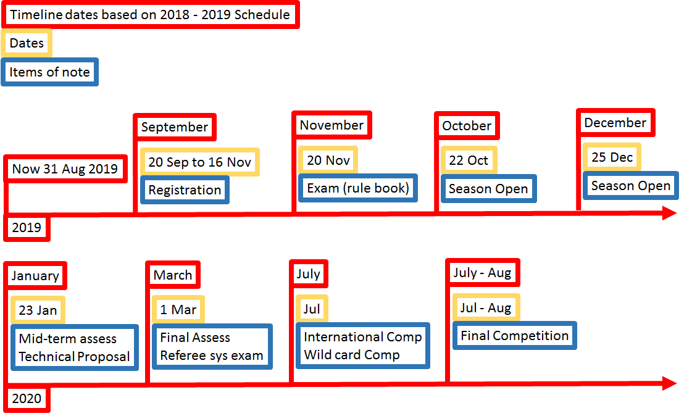

# Stark Industry

## Introduction

Haotian: Final year Electrical Engineering student. Projects: Autonomous robot, target tracking. Skills: Control, Electrical system design, C++, Python. Interest: Computer Vision.

Shuo: Final year Mechanical Engineering student. Projects: Autonomous vehicles at Micron. Skills: Robotics, Computer Vision, ROS, C++, Python

Rachiket Arya: Final year Mechanical Engineering student. Skills: ROS, C, Python, MATLAB, CAD (Solidworks, Solidedge, Fusion 360, SpaceClaim). Projects: SEDS Rover Project Manager, Printed Propulsion.

Sambhavi: Final year Electrical Engineering student. Skills: C, Python, LTspice, Verilog, Electrical and Electronic subsystems. Projects: Designed an Automated Guided Vehicle,  Experience with autonomous systems in internship at PBA,  

Zifei: Final year mechanical engineering student. Skills: C, Java, CAD, MatLab (basic). Internship experience: bearings, seals, turbine, fans, compressors

### Proposed Manpower Arrangement
No| Role          |  Description                        | Assigned to       |
--|---------------|---                                  |---                |
 1|  Mechanical   |  Sensors & Actuators Installation   |  Rachiket, Zifei  |
 2|  Mechanical   |  Gun; Gimbals system          |Zifei, Rachiket, Sambhavi|
 3|  Electrical   |  Power management; Electric Drive; Fail-safe   |  Sambhavi, Haotian |
 4|  Electronics  |MCU, Sensor interface; Close-loop Control | Haotian, Sambhavi       |
 5|  Software     | Linux OS; drivers, ROS Integration  | Shuo, Sambhavi     |
 6|  Software     | Motion planning (sentry robot)  | Rachiket   |
 7|  Software   | Computer vision | Suzanne     |   Sambhavi, Rachiket, Haotian
 8|  Operation    | Chinese-English Translation   | Zifei, Haotian, Shuo    |
 9|  Operation   |Accounting; Publicity, Sponsorship Materials|Open Position|
 10|  Pilot        | TX & RX system; Game-play strategy  |  Hoong            |

 For interested people to join our team, please contact whatsapp @81113025

## Timeline & Milestones

 >   You should study the past year's competition deadlines, and align your team's progress to those deadlines

## Robot Design Considerations

We analysed several matches from this year and last year... Identified several design approaches...

...

### Proposed Budget

...
