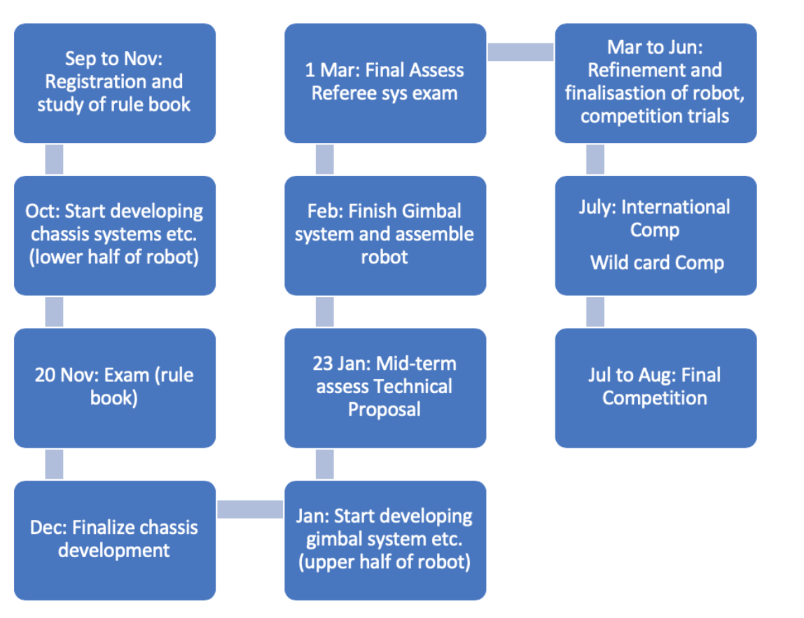
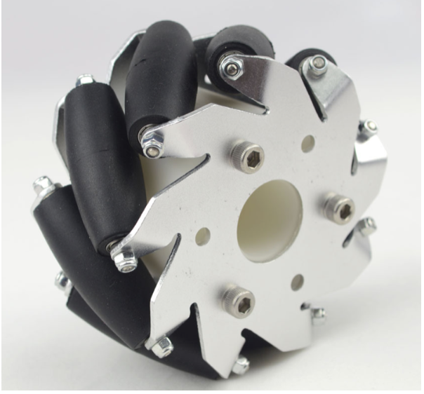
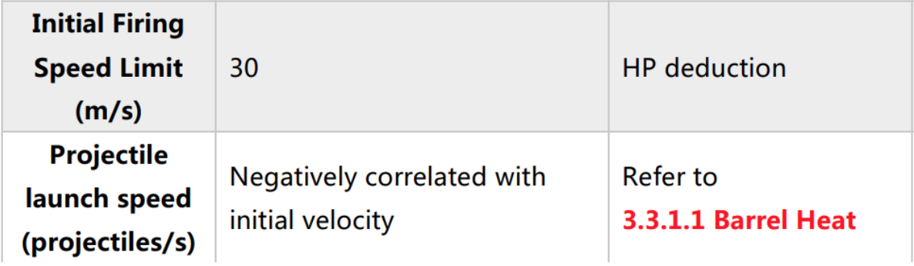
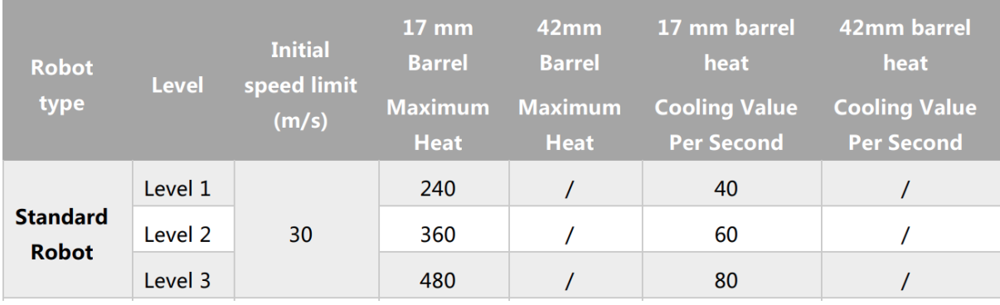
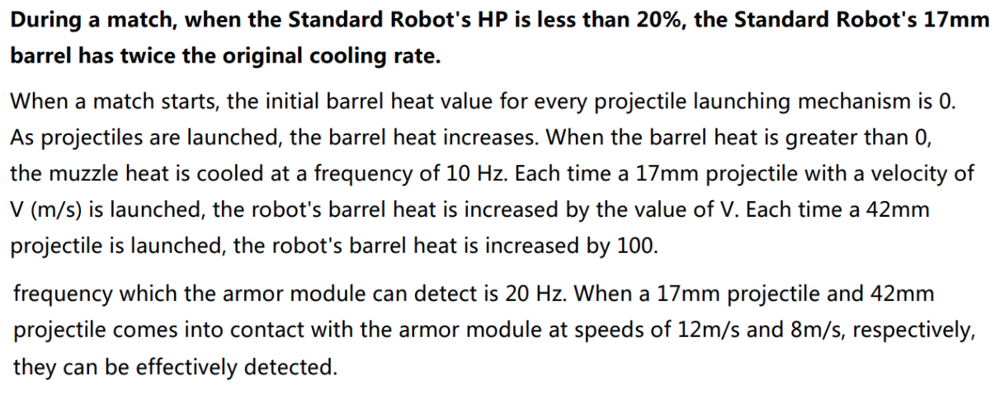
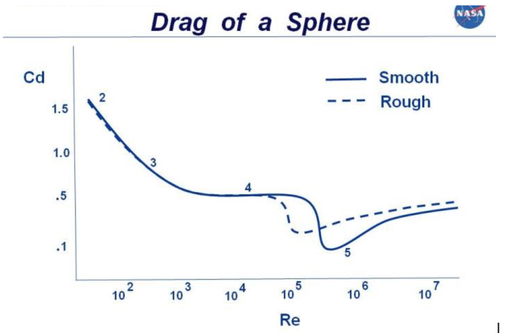
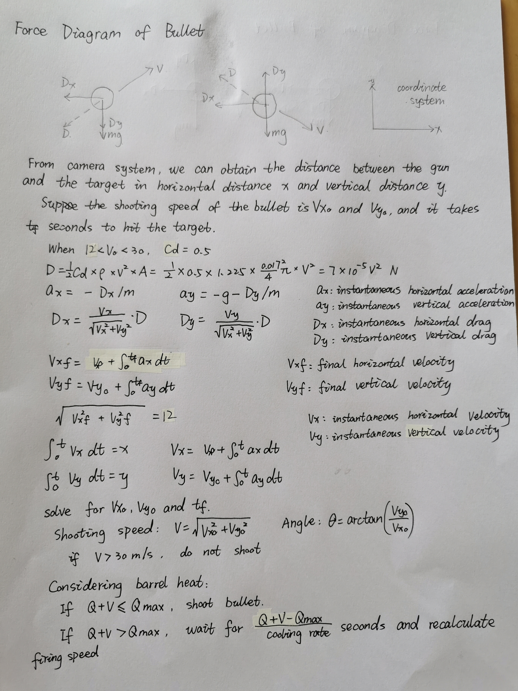
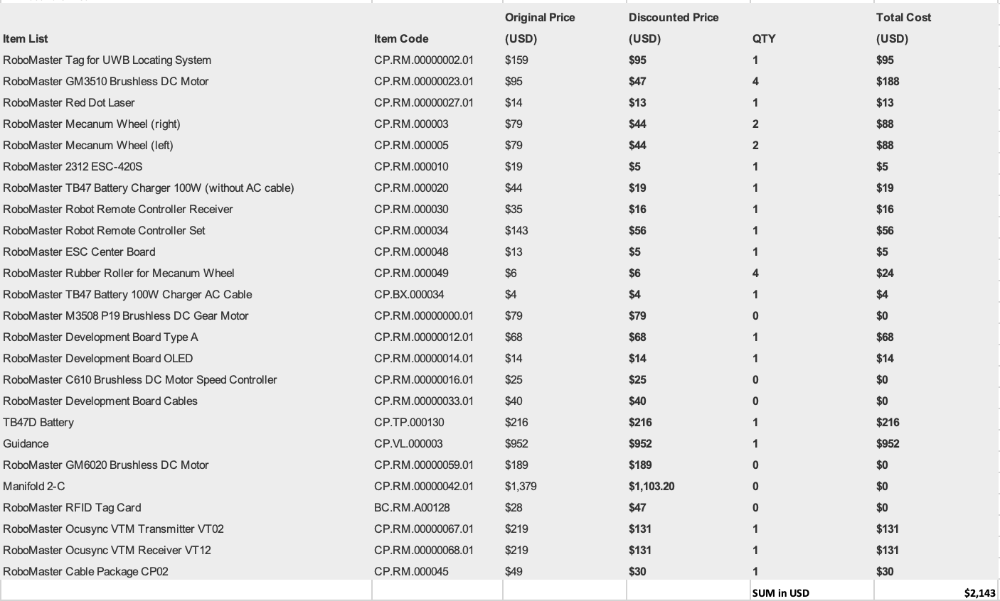

# Stark Industry

## Introduction

### Haotian
Final year Electrical Engineering student. Projects: Autonomous robot, target tracking. Skills: Control, Electrical system design, C++, Python. Interest: Computer Vision.

### Shuo
Final year Mechanical Engineering student. Projects: Autonomous vehicles at Micron. Skills: Robotics, Computer Vision, ROS, C++, Python

### Rachiket Arya
Final year Mechanical Engineering student. Skills: ROS, C, Python, MATLAB, CAD (Solidworks, Solidedge, Fusion 360, SpaceClaim). Projects: SEDS Rover Project Manager, Printed Propulsion.

### Sambhavi
Final year Electrical Engineering student. Skills: C, Python, LTspice, Verilog, Assembly(ARM), Electrical & Electronic subsystems. Projects: Automated Guided Vehicle, SEDS Rover Electrical Team Lead.  

### Zifei
Final year mechanical engineering student. Skills: C, Java, CAD, MatLab (basic). Internship experience: bearings, seals, turbine, fans, compressors

## Proposed Manpower Arrangement
No| Role          |  Description                        | Assigned to       |
--|---------------|---                                  |---                |
 1|  Mechanical   |  Sensors & Actuators Installation   |  Rachiket, Zifei  |
 2|  Mechanical   |  Gun; Gimbals system                |Zifei, Rachiket, Sambhavi|
 3|  Electrical   |  Power management; Electric Drive; Fail-safe   |  Sambhavi, Haotian |
 4|  Electronics  |MCU, Sensor interface; Close-loop Control | Haotian, Sambhavi       |
 5|  Software     | Linux OS; drivers, ROS Integration  | Shuo, Sambhavi     |
 6|  Software     | Motion planning (sentry robot)  | Rachiket   |
 7|  Software   | Computer vision |  Sambhavi, Rachiket, Haotian|
 8|  Operation    | Chinese-English Translation   | Zifei, Haotian, Shuo    |
 9|  Operation   |Accounting; Publicity, Sponsorship Materials|Open Position|
 10|  Pilot        | TX & RX system; Game-play strategy  |  Rachiket       |

 For interested people to join our team, please contact whatsapp @81113025

## Timeline & Milestones

## Key Aspects of Our Robot

### Electrical

1. The voltage of the motor needs to be temporarily boosted in extreme cases for getting sudden boosts of power to either, ram into the enemy robot or escape with a greater speed. The battery can only be of the given voltage and current rate, and boosting it to higher speeds would stress the motor. A suitable boost converter needs to be designed or selected. Since it is a tradeoff between motor life and boost speed, the boost voltage, boost duration, rest duration needs to be carefully tested and chosen. e.g. a temperature sensor could be installed to monitor the motor temperature.

2. The maximum weight of the Robot is 23.4 kgs (inclusive of the referee system)
We would be having an efficient Heat dissipation system for preventing overheating, with the help of fans and heat sinks.

3. A special connection mechanism is needed to supply power to the camera and gun when the body of the vehicle is spinning, to prevent the wires from twisting and tangling. The reason why the vehicle would be made to spin is so that the projectiles shot at it would have a lower chance of hitting the robot. This is one of the strategies employed to avoid getting hit at.

### Electronic/Software

1. Shooting Assistant System:
   - Gun Stabilizer: The pointing of the gun will remain the same in both vertical and horizontal directions.
   - Ballistic Calculator: The gun needs to automatically adjust its shooting angle and speed according to the target location. Target distance needs to be obtained in real-time through an RGB-D camera or stereo camera etc.
   - Gun sight will be provided to show the gun operator the expected trajectory of the projectile- whenever the control of the gun is taken over by the robot operators- for any emergency situation.

2. Driving Assistant System:
   - Simple to Operate: The drive-by-wire system and the keyboard-teleop we propose will be designed to be mission-friendly.
   - One-click Motions: Besides standard driving motions such as driving forward, backward, left and right, we will also enable two other more complex motions, hull-spinning, and constant speed forward for the operators to use in combat with only one click. The hull-spinning mode will be useful when the robot is standing still. While the constant speed forward is designed for the operators to shoot accurately while moving, since acceleration and deceleration caused by unsmooth manual speed adjustments will affect the aiming and shooting greatly.

### Mechanical

1. Wheel System:
   - 4 Mecanum omnidirectional wheels that allow the robot to rotate, move sideways, back and forth freely.
   \
   Retrieved from https://robu.in/product/100mm-aluminium-mecanum-wheels-bush-type-rollers-left/

2. Gimbal System:
   - A gimbal system is needed to stabilize the camera and to provide smooth image transmission.
   - The gun should have 2 axis degrees of freedom of pitching and yawing. The turret rotation should be independent of the rotation of the main chassis and the pitch rotation should have a range of about -20 degrees to 20 degrees (from the horizontal plane).

3. Anti-collision:
   - The structure design of the standard robot should be rigid so that it can withstand any possible collision with other robots.

4. Projectile Calculation:  
Relevant Rules (Retrieved from 2019 Robomaster Rules):

Drag:
\
Retrieved from https://www.grc.nasa.gov/www/K-12/airplane/dragsphere.html  
D = Cd * .5 * rho * V^2 * A\
Re = V * rho * l / mu\
Since the bullet need to hit the armour at a speed of 8m/s, the initial speed cannot be less than 8m/s, and the maximum speed is 30m/s as specified in the rules.\
Re12 = 12*1.225*0.017/1.86*10^-5=13435\
Re30 =  30*1.225*0.017/1.86*10^-5=33589\
Reynolds number is around 0.5.\

## General Design and Fabrication Methods

### Electrical

1. Power cables will be connected via standard connectors, such as XT60(for main branches) and DC Jack(for PC or Jetson TX2). A Power distribution board will be mounted on the robot to power various sensors and actuators, with suitable fuses at all major branches.

2. Signal wires will be connected via Molex connectors and Crimps.

3. Soldering and heating electrical wires are expected. Equipment needed includes soldering iron, different AWG wires, heat shrink tube, Heat gun.

### Mechanical

1. Manufacturing of Chassis Parts:
   - Materials: Aluminum or stainless steel
   - Use sheet metal processing and CNC machining to manufacture the components and weld(for main chassis parts) or bolt(for adjustable parts) them together to achieve rigidity, uniformity and higher strength. Welding methods of TIG and MIG can be considered to achieve the above qualities. Grind the surface to produce better surface finishing.

## Proposed Budget

We have estimated a budget of about _S$ 2143_.
   
