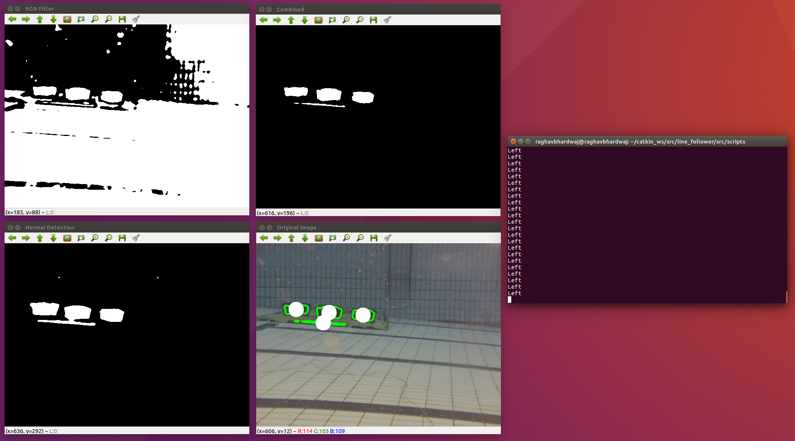

  

## Contents
1. **[Team Members](#1-team-members)**
2. **[Timeline and Milestones](#2-timeline-and-milestones)**
3. **[Key Aspects](#3-key-aspects)**
4. **[General Design](#4-general-design)**
	
	4.1 [Suspension Design](#41-suspension-design)
	
	4.2 [Weight Distribution](#42-weight-distribution)
	
	4.3 [Chassis Optimization](#43-chassis-optimization)
	
	4.4 [Power Consumption](#44-power-consumption)

5. **[Prototyping](#5-prototyping)**
6. **[Fabrication Materials and Methods](#6-fabrication-materials-and-methods)**
	
	6.1 [Fabrication Materials](#61-fabrication-materials)
	
	6.2 [Fabrication Methods](#62-fabrication-machining)

7. **[System Architecture](#7-system-architecture)**
	
	7.1 [Movement Architecture](#71-movement-architecture)
	
	7.2 [Communication Architecture](#72-communication-architecture)

8. **[Artificial Intelligence and Algorithms](#8-artificial-intelligence-and-algorithms)**
	
	8.1 [Computer Vision](#81-computer-vision)
	
	8.2 [Automatic Threat Detection](#82-automatic-threat-detection)

9. **[Proposed Budget](#9-proposed-budget)**
	
	9.1 [Electronic Parts](#91-electronic-parts)
	
	9.2 [Robotic Structure](#92-robotic-structure)
	
	9.3 [Power Supply](#93-power-supply)
	
	9.4 [Remote Control](#94-remote-control)
	
	9.5 [RoboMaster Referee System](#95-robomaster-referee-system)

10. **[Appendix](#10-appendix)**
	
	10.1 [Detailed Responsibility](#101-detailed-responsibility)
	
	10.2 [3D Drawings](#102-3d-drawings)
	
	10.3 [References](#103-references)
	
	10.4 [Resources](#104-resources)

## 1. Team-Members
[Back to Top](#contents)

We would like to express our deepest appreciation to Mechanical Engineering Department, staff and our dearest sponsor for making this competition possible to us, thus allowing us to reach our fullest potential by exposing ourselves to challenges beyond our reach. We are a team of multi-talented individuals with background ranging from Computer Engineering to Mechanical Engineering, allowing for easy workload distributions due to our experiences and skill sets.

### Raghav Bhardwaj

  

**Matric No:** A0184445Y          
**Course:** Computer Engineering  

**About Me:**                                         

> Year 2 Computer Engineer with experience with **Computer Vision**, **Artificial Intelligence**, and **Game Development + 3D Animation.** Knowledge of programming languages including **Python**, **C**, **C++**, **C#**, and **Java**, and frameworks like **Tensorflow**, **Keras**, **OpenCV**, **Robot Operating System**, and **Unity3D.** Miscellaneous skills include **CAD modelling and 3D printing, Photoshop, and Video Editing.**  

**Roles:**
> * Computer Vision and Algorithms
> * Creation of Website

### Rishi Mahadevan

  

**Matric No:** A0184381B        
**Course:** Computer Engineering

**About Me:**

> Rishi loves to push the limit of his knowledge and as such has worked in the **Hornet Project as part of NUS Bumbblebee.** He has also worked on creating a **webserver**, **database management** and on **NLP projects, such as detecting symptoms from patient's speech.**

**Roles:**
> * Electrical System
> * Robotics System Architect

### Tan Guan Zhong, John

  

**Matric No:** A0154912H           
**Course:** Mechanical Engineering

**About Me:**

> John is passionate about making cool engineering ideas come to life. Having worked on **mechanisms and engineering simulations** for **drones**, **acoustic system**s and **parallel manipulators**, he would love to expand his knowledge and skills in other displicines.

**Roles:**
> * Mechanical System Design
> * *Can add some more here hehe*

### Yu Shibin

  

**Matric No:** A0169999R                
**Course:** Mechanical Engineering

**About Me:**

> Year 4 Mechanical Engineer with experience in mechanical engineering drawings softwares such as **SolidWorks**, **AutoCAD**, **Inventor**, **ProE**, **Fusion360** and **OpenVSP** developed by NASA for aircraft modelling. Knowledgeable in the usage of different fabrication tools for rapid prototyping and proof of concepts using **CNC machining tools**, **composites materials**, **3D printing techniques (FDM, SLA)**. Miscellaneous skills include **Matlab**, **programming in Python**, **Java** and **C**, front end development for UI/UX using **HTML**, **CSS** and **bootstrap** as well as **marketing**, **sponsorship** and **business development**.

**Roles:**
> * Fabrication & Rapid Prototyping
> * Material Sourcing

## 2. Timeline and Milestones
[Back to Top](#contents)

  

## 3. Key Aspects
[Back to Top](#contents)

Design Considerations for Unmanned Ground Vehicle (UGV):
* Agile and compact
* Minimum height
* Suspension vs U-joints

According to the 2019 rules:

| Parameters | Dimensions | Additional Notes |
| --- | --- | --- |
| Initial Blood | 200 | |
| Total Power Supply Capacity (Wh) | 200 | |
| Launching Mechanism Type | 17mm projectiles | |
| Maximum Initial Size (mm) | 600 x 600 x 500 | |
| Maximum Expansion Size (mm) | 700 x 700 x 600 | |
| Maximum Weight (kg) | 20 | Includes battery |

## 4. General Design
[Back to Top](#contents)

We propose a **modular based design** as seen in the diagram below, where the shooting mechanism, camera, motorized platform, can be taken out and replaced easily. This is necessary due to the need for constant re-iterations of the design as well as the parts being easily damaged in the competition.

  

We can split the vehicle into 5 modules that can be easily taken apart from the system:

**1. Head**
	
	a. Shooter Mechanism
	
		i. Shooter Frame
		
		ii. Motors
	
	b. Projectile Speed Monitor
	
	c. Camera
	
	d. Ammo Box
	
	e. Y and X Axis Gimbals
	
	f. Servos
	
		i. Camera
		
		ii. Ammo Box Cover
	
	g. Remote Controller Receiver

**2. Base**
	
	a. Motors x4
	
	b. Mecanum Wheels x4
	
	c. ESC x4
	
	d. ESC Center Board
	
	e. Suspension System

**3. Core**
	
	a. Microcontroller Unit
	
	b. GPU
	
	c. Referee System Main Controller

**4. Chassis**

	a. Rolling Chassis
	
	b. Body Plates (To be mounted on the whole vehicle to protect its inner components)
	
	c. Head Frame (Contains the Head module)
	
	d. Referee System Armour Packs

**5. Power**
	
	a. Battery
	
	b. Power Supply Management

### 4.1 Suspension Design
Vibration control is an important aspect to consider during the design as well as the brainstorming because there is a need for a dynamic and interactive model between the manipulator and the platform to stabilise the robots when they move through rough terrain. There are two approaches: A **dependent suspension design (suspension)** or an **independent suspension design (U-joints)**. We are looking at an independent suspension system, allowing each wheel to displace vertically independent of the other wheels. In such a set-up, the whole vehicle would be more steady by  eliminating external interferences when travelling over obstacles and bumps, maintaining a higher overall accuracy.

### 4.2 Weight Distribution
The overall idea is to **lower the center of gravity** and **increase dynamic stability**. To do so, we concentrate most of the component weight in the Base module and reduce the weight of the Head module (which contains the Shooter and Camera). This is done by housing the Core and accessories attachment close towards the ground, we will be able to lower the centre of gravity, thereby providing an **optimal static stability** for the vehicle after calculation using dynamics equations. By doing so, we are able to reduce the current height from 481mm as seen in appendix 10.2 to roughly 400mm taken from calculations. 

### 4.3 Chassis Optimization
By **making it more compact**, we are able to achieve a more stable structure for maneuvering and achieving mission success. Hence, there is a need to update the frame of the vehicle in order to be in-line with the different goals we have in mind.  

### 4.4 Power Consumption
We must ensure that the peak current draw when climbing slopes do not exceed that of the max safety current draw from the battery, nor does it affect the other electrical components on the vehicle.

## 5. Prototyping
[Back to Top](#contents)

To reduce costs of prototyping, we propose **3D printing** of the different mechanisms and parts using **PolyLactic Acid (PLA) and Acrylonitrile Butadiene Styrene (ABS)**. With 3D printing, we can efficiently determine if mechanisms operate as intended and perform re-iterations of the design, without wasting resources for the final competition vehicle. We have chosen these materials due to different considerations such as their relatively comparable **structural strength**, **cost for rapid prototyping** as well as **easy access to equipment** for producing a prototype.

An alternative method would be to use **lego structures to act as a quick yet cost-friendly** method to prototype and test the more crucial parts of the robot (eg. Shooting mechanism, movement and computer vision algorithms).

## 6. Fabrication Materials and Methods
[Back to Top](#contents)

### 6.1 Fabrication Materials
The fabrication methods listed below and not exhaustive and there are various advantages and disadvantages to each of them - which is why we must utilise a whole range of methods/materials according to the purpose.

#### Aluminium
One of the materials used in designing and fabricating the covers that protect the top of the robot is formed sheet aluminium. Aluminium is **easy to machine**, and with proper structural design, it can possess a **high strength to weight ratio.**

#### Steel
The skeletal structure of the rolling chassis will **need to be extremely rigid and strong** to significantly reduce any deformation that can occur from collisions as well as enemy pellets. We can use steel beams and brackets to assemble the main skeleton.

#### Acrylic
Acrylic’s **transparency** makes it a suitable material for the chassis during the prototype stage. It is **inexpensive and easy to machine.** It is used so we can visualize and check the internal mechanisms of the shooter/motors and **effectively troubleshoot problems.**

#### Fasteners
Nuts and bolts are the bread and butter of most mechanical assemblies. However, in order to **save time when having to regularly take apart the modules in the prototyping phase**, we also propose **zip ties and velcro straps as an inexpensive and more efficient alternative** to traditional fastening methods.

### 6.2 Fabrication Methods

#### Machining
We will have a 3D design converted into a planar drawing in autocad/solidworks (They have in-built CNC G-code output) and eventually CNC machine the metal sheets. For parts that do not require CNC machining, they can be manually machined.

#### 3D Printing
There are certain parts of the vehicle that do not require a high strength, and these are the areas we can **reduce the weight through 3D printing the parts in PLA/ABS.** One of these components are the ammo box/cover, as well as the servo brackets.

#### Laser Cutting
For thin materials (thin aluminium and acrylic sheets), **laser cutting can be a quick, efficient and accurate fabrication method.** Especially in the prototyping phase. 

## 7. System Architecture
[Back to Top](#contents)

We are planning to use a **modular system** for the ease of prototyping and debugging. We plan to have **three main modules**, the Movement module, Communication module and the Threat detection module.

### 7.1 Movement Architecture
For the movement of the robot, we plan to use an Arduino Mega to get the signals from the main controller (Voodo Board), through serial connection and controls a motor controller (that controls the direction of the wheel and the speed using the PID logic from the Arduino Mega to ensure that the robot can turn and move straight accurately. The odometry data such as the number of revolutions (obtained from the wheel encoder) of the wheel will be fed into the PID to adjust the robot so that it can move straight.

  

### 7.2 Communication Architecture
We plan to use Robotic Operating System (ROS) to communicate the operator’s PC with the main controller on the robot over TCP-IP communication. We plan to build a controller script, that can be controlled using WASD and X to shoot the weapon. This will give the operator a more natural gaming feel to operating the robot. We will also have a GUI that will give them alert’s on the presence of enemy robots nearby so that the operator can take the shot. 

## 8. Artificial Intelligence and Algorithms
[Back to Top](#contents)

### 8.1 Computer Vision
We have experience with Computer Vision in the Hornet Project under NUS Bumbblebee. We have worked with **detecting objects under different lighting conditions.** We managed to detect a bucket underwater from 15 meters under varying lighting conditions without the use of any Machine learning algorithm with the computing power of an Odroid. We plan to use the same strategy that we used, dynamic whitening and contrasting using the alpha functions in the OpenCV library. This allows us to control for random increase in the lighting condition. We were successfully able to detect objects with the presence of glare by normalizing the image, then applying the dynamic whitening algorithm. After the preprocessing it will be sent to the threat detector module, which will check for the presence of any enemy bots.

  

### 8.2 Automatic Threat Detection
There are two main methods to detect objects inside an preprocessed image. Note that usage of both methods require a speed/accuracy tradeoff.

#### Image Thresholding using OpenCV

  

This is the less computationally expensive method and just requires a simple CPU. Using OpenCV's inRange() we can threshold an image between a lower and upper bound based on the selected colour method together with predefined or dynamic low and high thresholds in various colour spaces like HSV, LAB or RGB. This will return a thresholded image with contours for our chosen object. These contours can be further filtered through based on their dimensions such as ratio, area, etc. This method could potentially be used to find the location (in our robot's view) of the red or blue health bars for enemy bots.

However this method is very inaccurate compared to the next one.

#### Object Detection using Convolutional Neural Networks

  

This method requires a standalone GPU and therefore is much more computationally expensive. However it is very accurate and has extreme generalizability provided we use a large enough dataset. In the image above, a Convolutional Neural Network (RetinaNet in particular) was trained on a custom dataset to detect cars on a highway. RetinaNet can be used for our robot as well as it is a very accurate Single Shot Detector that can provide realtime object detection on any half decent GPU.

The only caveat is that we would have to train the model on hundreds of manually labelled images of enemy robots or enemy pressure plates.

## 9. Proposed Budget
[Back to Top](#contents)

The proposed budget is for one unit standard vehicle and does not include any costs that might arise from damaged components. The costs are also considered without discounts to robomaster participants, and at it’s full price.

| Category | Item | Model | Details | Cost (USD - unless specified) | Qty | Total Cost (USD - unless specified) |
| ---      | ---  | ---   | ---     | ---        | --- | ---              |
| Head | Z-axis Gimbal | Turnigy HD 3508 Brushless Gimbal Motor | Function: Rotate head about z axis (Yaw) [Link](https://hobbyking.com/en_us/turnigy-hd-3508-brushless-gimbal-motor-bldc.html) | 28.54 | 1 | 28.54 |
| | Y-axis Gimbal | Turnigy HD 3508 | | 28.54 | 1 | 28.54 |
| | Gimbal Motor Controller | Tarot ZYZ22 GOPRO Brushless Camera Gimbal Controller | [Link](https://hobbyking.com/en_us/tarot-zyz22-gopro-brushless-camera-gimbal-controller.html) | 22.2 | 1 | 22.2 |
| | First Person View Camera | RunCam 5 | Weight: 0.056kg [Link](https://sea.banggood.com/RunCam-5-12MP-56g-Smallest-4K-Cam-HD-Recording-145-Degree-NTSCPAL-16943-Switchable-FPV-Action-Camera-Bulit-in-Battery-for-RC-Racing-Drone-p-1494081.html?p=SP07155769873201608T&custlinkid=440530&cur_warehouse=CN) | S$139.79 | 1 | S$139.79 |
| | Ammo Box & Cover | Material: PLA, Fabrication Method: 3D Printing | Accounted in raw materials | | |
| | Servo (Controls pitch of Camera) | HS-5625MG (High speed digital servo) | Function: An additional degree of freedom (independent of shooter) for the camera. Requires a servo with high stall torque to reduce camera shake. [Link](https://hitecrcd.com/products/servos/sport-servos/digital-sport-servos/hs-5625mg/product) | 49 | 1 | 49 |
| | Servo (Controls Ammo box cover) | HS-311 Standard Economy Servo (Analogue) | Function: Open and close ammo box to receive ammo pellets. [Link](https://hitecrcd.com/products/servos/sport-servos/analog-sport-servos/hs-311/product) | 15 | 1 | 15 |
| | Laser | RoboMaster Red Dot Laser | Function: Provides aiming calibration for computer-vision controlled shooter | 14 | 1 | 14 |
| | Pellet transportation motor | RoboMaster M2006 P36 Brushless DC Gear Motor | Function: Transport motor | 41 | 1 | 41 |
| | Pellet propulsion motors | | | | | |
| | Remote controller receiver | RoboMaster Robot Remote Controller Receiver | | 35 | 1 | 35 |
| Chassis | Servo Brackets | Standard Servo Brackets | Function: Holds the servo in place, and can be mounted to main chassis. [Link (merely for price indication)](https://www.robotshop.com/en/servo-brackets-standard.html) | 12 | | |
| | Rolling Chassis | | Fabrication costs to be determined | | | |
| | Head frame | | Fabrication costs to be determined | | | |
| | Suspension | | Fabrication costs to be determined | | | |
| Base | Mecanum Wheels | RoboMaster Mecanum Wheel (left) | Weight: 0.353kg | 79 | 2 | 158 |
|      |                | RoboMaster Mecanum Wheel (right) | Weight: 0.353kg | 79 | 2 | 158 |
| | DC Brushless motors | RoboMaster M3508 P19 Brushless DC Gear Motor | Weight: 0.365kg [Link](https://www.robomaster.com/en-US/products/components/general/M3508) | 79 | 4 | 316 |
| | Motor cables and concentrator | RoboMaster M3508 Accessories Kit | | 54 | 1 | 54 |
| | Electronic Speed Controllers | RoboMaster C620 Brushless DC Motor Speed Controller | Function: controls M3508 motor. Weight: 0.035kg | 63 | 4 | 252 |
| | ESC Center Board | RoboMaster ESC Center Board | | 13 | 1 | 13 |
| | Arduino | Arduino Mega 2560 | [Link](https://sea.banggood.com/Mega2560-R3-ATMEGA2560-16AU-CH340-Board-With-USB-For-Arduino-p-940935.html?rmmds=buy&cur_warehouse=CN) | 11.17 | 3 | 33.51 |
| | Motor controller | TB6612FNG Dual DC Stepper Motor Driver | [Link](https://www.lazada.sg/products/best-selling-tb6612fng-dual-dc-stepper-motor-driver-module-controller-board-for-arduino-i292165237-s480025749.html?ef_id=EAIaIQobChMIzMW0uLrV5AIV2IRwCh35egGpEAQYASABEgKfbfD_BwE:G:s&s_kwcid=AL!4281!3!242381247295!!!u!762460417326!&exlaz=d_1:mm_150050845_51350205_2010350205::12:1025267241!54483208270!!!pla-762460417326!c!762460417326!480025749!129806539&gclid=EAIaIQobChMIzMW0uLrV5AIV2IRwCh35egGpEAQYASABEgKfbfD_BwE) | S$5.09 | 4 | S$20.36 |
| Core | Microcontroller unit | RoboMaster Development Board Type A| [Link](https://store.dji.com/cn/product/rm-development-board-type-a) | 68 | 1 | 68 |
| | Connection cables | RoboMaster Development Board Cables | | 40 | 1 | 40 |
| | Microcomputer unit for computer vision and AI algorithms | Manifold 2 | Components include NVIDIA Jetson TX2 & Intel Core i7-8550U. Weight: 0.23kg. [Link](https://store.dji.com/cn/product/manifold-2?site=brandsite&from=manifold-2_buy_now_bottom&vid=80932) | S$1357 | 1 | S$1357 |
| Power | Battery Rack | Self-designed and 3D printed | Function: Holds the battery. Material: PLA. Fabrication method: 3D Printing. Weight: 0.15kg - 0.3kg | Cost accounted for in raw materials | | |
| | Battery (Lithium Polymer) | Turnigy 5000mAh 5S 30C Lipo | Battery is subject to change depending on the continuous/maximum current draw, capacity requirements etc. Weight: 0.62kg. [Link](https://hobbyking.com/en_us/turnigy-5000mah-5s-30c-lipo-pack-xt-90.html) | 49.31 | 2 | 98.62 |
| RoboMaster Referee System | Speed Monitor Module (17 mm projectile) | | Total weight: 0.6kg | | | |
| | Video Transmitter Module (VTM) | | | | | |
| | Positioning Module             | | | | | |
| | Referee System Main Controller | | | | | |
| | Power Supply Management System | | | | | |
| External Components | Remote Control | RoboMaster Remote Controller Set | Function: Manual control of the vehicle | 143 | 1 | 143 |
| Raw Materials/Extra Parts | Polylactic Acid(PLA) 3D printer filament | eSun PLA Filament | PLA is easier to print compared to ABS and PETG, with comparable strength. However, most PLA filaments cannot tolerate temperatures above 60 degree Celsius [Link](https://www.lazada.sg/products/esun-pla-175mm-blue-3d-printer-filament-corn-grain-refining-material-1kg-spool-22lbs-dimensional-accuracy-005mm-consumables-i288043850-s465252461.html?spm=a2o42.searchlistbrand.list.3.2f636072pKHGSE&search=1) | S$28 | 5x1kg spools | 140 |
| | Fasteners (Nuts, bolts and screws) | | | S$20 | | S$20 |
| | Power transmission (gears, pulleys etc.) | | | S$25 | | S$25 | 

### 9.1 Electronic Parts

### 9.2 Robotic Structure

### 9.3 Power Supply

### 9.4 Remote Control

### 9.5 RoboMaster Referee System

## 10. Appendix
[Back to Top](#contents)

### 10.1 Detailed Responsibility

### 10.2 3D Drawings

### 10.3 References
1. [RoboMaster Open Source Forum](https://bbs.robomaster.com/portal.php)
2. [Official RoboMaster Resource](https://www.robomaster.com/en-US/resource/pages/1016?type=announcementSub)
3. [Campus Labs](https://auburn.campuslabs.com/engage/organization/aurobomaster/documents/view/787345)
4. [RoboMaster Images](https://www.robomaster.com/en-US/resource/image)
5. [Referee System Specification Manual 2019](https://rm-static.djicdn.com/documents/19806/351fabf70dadd1548054744443997919.pdf)
6. [Reddit Robotics Subreddit](https://www.reddit.com/r/robotics/)
7. [MAC RoboMaster Midterm Assessment Video](https://www.youtube.com/watch?v=acWxZVNQXAc)

### 10.4 Resources
