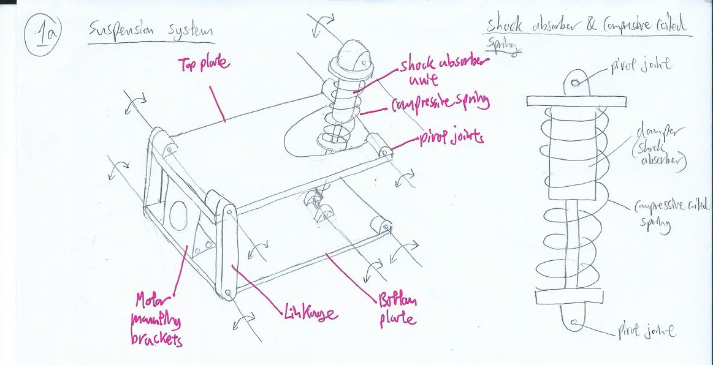

# Team JSRR

  

## Contents
1. **[Team Members](#1-team-members)**
2. **[Timeline and Milestones](#2-timeline-and-milestones)**
3. **[Key Aspects](#3-key-aspects)**
4. **[General Design](#4-general-design)**
	
	4.1 [Tilting Passive and Independent Suspension System Design](#41-tilting-passive-and-independent-suspension-system-design)
	
	4.2 [Weight Distribution](#42-weight-distribution)
	
	4.3 [Chassis Optimization](#43-chassis-optimization)
	
	4.4 [Power Consumption](#44-power-consumption)

5. **[Prototyping](#5-prototyping)**
6. **[Fabrication Materials and Methods](#6-fabrication-materials-and-methods)**
	
	6.1 [Fabrication Materials](#61-fabrication-materials)
	
	6.2 [Fabrication Methods](#62-fabrication-machining)

7. **[System Architecture](#7-system-architecture)**
	
	7.1 [Movement Architecture](#71-movement-architecture)
	
	7.2 [Communication Architecture](#72-communication-architecture)

8. **[Artificial Intelligence and Algorithms](#8-artificial-intelligence-and-algorithms)**
	
	8.1 [Computer Vision](#81-computer-vision)
	
	8.2 [Automatic Threat Detection](#82-automatic-threat-detection)

9. **[Proposed Budget](#9-proposed-budget)**

10. **[Appendix](#10-appendix)**
	
	10.1 [Non-Technical Roles](#101-non-technical-roles)
	
	10.2 [3D Drawings](#102-3d-drawings)
	
	10.3 [References](#103-references)

## 1. Team-Members
[Back to Top](#contents)

We would like to express our deepest appreciation to Mechanical Engineering Department, staff and our dearest sponsor for making this competition possible to us, thus allowing us to reach our fullest potential by exposing ourselves to challenges beyond our reach. We are a team of multi-talented individuals with background ranging from Computer Engineering to Mechanical Engineering, allowing for easy workload distributions due to our experiences and skill sets.

### Raghav Bhardwaj

  

**Matric No:** A0184445Y          
**Course:** Computer Engineering  

**About Me:**                                         

> Year 2 Computer Engineer with experience with **Computer Vision**, **Artificial Intelligence**, and **Game Development + 3D Animation.** Knowledge of programming languages including **Python**, **C**, **C++**, **C#**, and **Java**, and frameworks like **Tensorflow**, **Keras**, **OpenCV**, **Robot Operating System**, and **Unity3D.** Miscellaneous skills include **CAD modelling and 3D printing, Photoshop, and Video Editing.**  

**Roles:**
> * Computer Vision and Algorithms
> * Creation of Website

### Rishi Mahadevan

  

**Matric No:** A0184381B        
**Course:** Computer Engineering

**About Me:**

> Rishi loves to push the limit of his knowledge and as such has worked in the **Hornet Project as part of NUS Bumbblebee.** He has also worked on creating a **webserver**, **database management** and on **NLP projects, such as detecting symptoms from patient's speech.** Rishi has coded applications and projects in **Python**, **Javascript**, **PHP**, **C**, **C++** and **Java**. He also has experience with machine learning and image processing libraries such as **Tensorflow**, **OpenCV**, **Nltk.** Rishi is a person who believes in Rapid prototyping and a LEAN approach to any project and this is no exception!

**Roles:**
> * Electrical System
> * Robotics System Architect

### Tan Guan Zhong, John

  

**Matric No:** A0154912H           
**Course:** Mechanical Engineering

**About Me:**

> John is passionate about making cool engineering ideas come to life. Having worked on **mechanisms and engineering simulations** for **drones**, **acoustic systems** and **parallel manipulators**, he would love to expand his knowledge and skills in other displicines. He has experience in various **Fabrication techniques** such as **CAD modelling (SOLIDWORKS, AUTOCAD, RHINO3D)**, **parametric design**, **CNC machining** and **3D printings**. In addition, he has worked on engineering simulation in companies using **MATLAB**, **SIMULINK** and **SOLIDWORKS SIMULATION.**

**Roles:**
> * Mechanical System Design
> * Engineering Simulation

### Yu Shibin

  

**Matric No:** A0169999R                
**Course:** Mechanical Engineering

**About Me:**

> Year 4 Mechanical Engineer with experience in mechanical engineering drawings softwares such as **SolidWorks**, **AutoCAD**, **Inventor**, **ProE**, **Fusion360** and **OpenVSP** developed by NASA for aircraft modelling. Knowledgeable in the usage of different fabrication tools for rapid prototyping and proof of concepts using **CNC machining tools**, **composites materials**, **3D printing techniques (FDM, SLA)**. Miscellaneous skills include **Matlab**, **programming in Python**, **Java** and **C**, front end development for UI/UX using **HTML**, **CSS** and **bootstrap** as well as **marketing**, **sponsorship** and **business development**.

**Roles:**
> * Fabrication & Rapid Prototyping
> * Material Sourcing

## 2. Timeline and Milestones
[Back to Top](#contents)

  

## 3. Key Aspects
[Back to Top](#contents)

Design Considerations for Unmanned Ground Vehicle (UGV):
* Agile and compact
* Minimum height
* Suspension vs U-joints

According to the 2019 rules:

| Parameters | Dimensions | Additional Notes |
| --- | --- | --- |
| Initial Blood | 200 | |
| Total Power Supply Capacity (Wh) | 200 | |
| Launching Mechanism Type | 17mm projectiles | |
| Maximum Initial Size (mm) | 600 x 600 x 500 | |
| Maximum Expansion Size (mm) | 700 x 700 x 600 | |
| Maximum Weight (kg) | 20 | Includes battery |

## 4. General Design
[Back to Top](#contents)

We propose a **modular based design** as seen in the diagram below, where the shooting mechanism, camera, motorized platform, can be taken out and replaced easily. This is necessary due to the need for constant re-iterations of the design as well as the parts being easily damaged in the competition.

  

We can split the vehicle into 5 modules that can be easily taken apart from the system:

| Module | Components |
| --- | --- |
| **Head** | Shooter Mechanism (Shooter Frame, Motors) |
| | Projectile Speed Monitor |
| | Camera |
| | Ammo Box |
| | Y and X axis Gimbals |
| | Servos (Camera, Ammo box cover) |
| | Remote Control Receiver |
| **Base** | Motors (4) |
| | Mecanum wheels (4) |
| | ESC (4) |
| | ESC Center Board |
| | Suspension System |
| **Core** | Microcontroller Unity |
| | GPU |
| | Referee System Main Controller |
| **Chassis** | Rolling Chassis |
| | Body plates (To be mounted on the whole vehicle to protect it’s inner components) |
| | Head Frame (Contains the HEAD module) |
| | Referee System Armour packs |
| **Power** | Battery |
| | Power Supply Management |

For our robot, we will be looking at **stabilising and improving** the moving capabilities to accommodate for high speed maneuvers within the arena. To achieve accuracy in control, we aim to ensure **dynamic stability** and **performance** through a well-designed **suspension system** and **weight distribution** over different terrain conditions. We have attached an image of the terrain overview from 2018 Robomaster Rule Manual. 

  

### 4.1 Tilting Passive and Independent Suspension System Design
A suspension is defined as “a system of linkages, springs, dampers, and actuators that govern the relative motion between a robot’s wheels and body.”\[1] With reference to the M3 Program that showed DAROA's robotic suspension system\[2], it can be observed that without the robotic suspension system, the vehicle is prone to dynamic instability. Therefore, a well designed suspension system is required.
There are 2 types of suspensions: Active and passive suspension. In contrast to active suspensions, passive suspensions do not rely on powered rotational or linear actuators to dissipate energy. Instead they rely on conventional coiled springs and dampers to reduce the magnitude of disturbances on the robot. Our focus is on passive suspensions due to budget limitations as well as the technical complexity of active suspensions.

On our robot, the aims of the suspension design is to: 
1. Enable all the wheels to remain in contact with the ground as much as possible when driving over uneven terrain.
2. Reduce the vibrational motion from running over uneven terrain, thereby reducing the noise in the IMU sensors

In our analysis and design of the structure, we make a few assumptions:
1. All four mecanum wheels are direct drive, there is no gearbox reduction.
2. The shock absorber is mono-tube 
3. The springs are coiled compression springs
4. Fraction of mass supported by one independent suspension system is 0.25 \* maximum allowed mass of body (taken to be 20kg)
5. None of the components in the drawings are drawn to scale, and are merely used for illustration of the concepts.

This drawing below illustrates the overall design of the independent tilting suspension system.

  

  

The diagram below models the suspension system.

  

However, in our approximate model, the mass and stiffness of the wheels are negligible as they do not undergo considerable deformation in the terrain.

  

  

  

  

We aim to keep the damping ratio as close to one, so as to prevent the system from being too overdamped or underdamped.

  

**Limitations of approximation:**
We understand that the approximation model does not take into account that the center of mass of the body does not lie within the axis of the spring or damping unit, and therefore this is a limitation we will have to address in a higher order approximation of the system. Furthermore, we will need to obtain experimental data and values of the average acceleration of such a body on uneven terrain in order to use the approximation.

### 4.2 Weight Distribution
The overall idea is to **lower the center of gravity** and **increase dynamic stability**. To do so, we concentrate most of the component weight in the Base module and reduce the weight of the head module (which contains the Shooter and Camera). This is done by housing the Core and accessories attachment close towards the ground, we will be able to lower the centre of gravity, thereby providing an **optimal static stability** for the vehicle after calculation using dynamics equations. By doing so, we are able to reduce the current height from 481mm as seen in appendix 10.2 to roughly 400mm taken from calculations. 

### 4.3 Chassis Optimization
By **making it more compact**, we are able to achieve a more stable structure for maneuvering and achieving mission success. Hence, there is a need to update the frame of the vehicle in order to be in-line with the different goals we have in mind.  

### 4.4 Power Consumption
We must ensure that the peak current draw when climbing slopes do not exceed that of the max safety current draw from the battery, not does it affect the other electrical components on the vehicle.

## 5. Prototyping
[Back to Top](#contents)

To reduce time for fabrication, we propose **3D printing** of the different mechanisms and parts using **PolyLactic Acid (PLA)** and **Acrylonitrile Butadiene Styrene (ABS)**. With 3D printing, we can efficiently determine if mechanisms operate as intended and perform re-iterations of the design, without wasting resources for the final competition vehicle. We have chosen these materials due to different considerations such as their **relatively comparable structural strength**, **time for rapid prototyping** as well as **easy access to equipment** for producing a prototype. 

## 6. Fabrication Materials and Methods
[Back to Top](#contents)

### 6.1 Fabrication Materials
The fabrication methods listed below and not exhaustive and there are various advantages and disadvantages to each of them. Which is why we must utilise a whole range of methods/materials such as aluminium, steel and acrylic according to their purposes. 

Aluminium will be used as the material for fabricating the formed sheet cover that protects the top of the robot. It is chosen because of its **ease of machining**, **light-weight properties** since we like to have **as much weight saving as possible**. With proper structural design, we can make use of its property to achieve a structure with high strength to weight ratio. **Steel** will be used for the skeletal structure of the rolling chassis to **provide the rigidity and toughness** we need to reduce any deformation that could potentially occur with the enemy. Given **its high strength to toughness ratio** as well as **high Young’s Modulus**, beams and brackets produced from this material is the most suitable material for the main frame. Last but not least, we will be looking at **acrylic as a material for rapid prototyping** of chassis due to the **low cost** as well as being **easier to machine compared to steel**. Being transparent, we could visualise and check the internal mechanisms of the shooter/motors and effectively troubleshoot problems immediately as compared to using steel for prototyping. 

### 6.2 Fabrication Methods
We will be using various fabrication methods such as **laser cutting**, **CNC machining** as well as **3D printing**. For thin materials such as acrylic sheets, laser cutting can be a **quick, efficient and accurate fabrication method** - especially in the prototyping phase. 

We will have a 3D design converted into a planar drawing in autocad/solidworks. The purpose of designing in Solidworks is to allow us to see the overall structure under design conditions so that we are able to test different simulations and we would not waste time and money due to certain failures. Solidworks have in-built CNC-code which can be output into the CNC machine to cut metal sheets of certain shapes. For other parts that do not require CNC machining, we will apply manual machining to it. Last but not least, for unique parts that cannot be found on the market, we will be designing and testing them, followed by printing them using 3D printers. 

## 7. System Architecture
[Back to Top](#contents)

We are planning to use a **modular system** for the ease of prototyping and debugging. We plan to have **three main modules**, the **Movement** module, **Communication** module and the **Threat detection** module.

### 7.1 Movement Architecture
For the movement of the robot, we plan to use an Arduino Mega to get the signals from the main controller (UDOO Board), through serial connection and controls a motor controller (that controls the direction of the wheel and the speed using the PID logic from the Arduino Mega to ensure that the robot can turn and move straight accurately. The odometry data such as the number of revolutions (obtained from the wheel encoder) of the wheel will be fed into the PID to adjust the robot so that it can move straight.

  

### 7.2 Communication Architecture
We plan to use Robotic Operating System **(ROS)** to communicate the operator’s PC with the main controller on the robot over TCP-IP communication. We plan to build a controller script, that can be controlled using WASD and X to shoot the weapon. This will give the operator a more natural gaming feel to operating the robot. We will also have a GUI that will give them alert’s on the presence of enemy robots nearby so that the operator can take the shot. 

## 8. Artificial Intelligence and Algorithms
[Back to Top](#contents)

### 8.1 Computer Vision
We have experience with Computer Vision in the Hornet Project under NUS Bumbblebee. We have worked with **detecting objects under different lighting conditions.** We managed to detect a bucket underwater from 15 meters under varying lighting conditions without the use of any Machine learning algorithm with the computing power of an Odroid. We plan to use the same strategy that we used, dynamic whitening and contrasting using the alpha functions in the OpenCV library. This allows us to control for random increase in the lighting condition. We were successfully able to detect objects with the presence of glare by normalizing the image, then applying the dynamic whitening algorithm. After the preprocessing it will be sent to the threat detector module, which will check for the presence of any enemy bots.

  

### 8.2 Automatic Threat Detection
There are two main methods to detect objects inside an preprocessed image. Note that usage of both methods require a speed/accuracy tradeoff.

#### Image Thresholding using OpenCV

  

This is the less computationally expensive method and just requires a simple CPU. Using OpenCV's inRange() we can threshold an image between a lower and upper bound based on the selected colour method together with predefined or dynamic low and high thresholds in various colour spaces like HSV, LAB or RGB. This will return a thresholded image with contours for our chosen object. These contours can be further filtered through based on their dimensions such as ratio, area, etc. This method could potentially be used to find the location (in our robot's view) of the red or blue health bars for enemy bots.

However this method is very inaccurate compared to the next one.

#### Object Detection using Convolutional Neural Networks

  

This method requires a standalone GPU and therefore is much more computationally expensive. However it is very accurate and has extreme generalizability provided we use a large enough dataset. In the image above, a Convolutional Neural Network (RetinaNet in particular) was trained on a custom dataset to detect cars on a highway. RetinaNet can be used for our robot as well as it is a very accurate Single Shot Detector that can provide realtime object detection on any half decent GPU.

The only caveat is that we would have to train the model on hundreds of manually labelled images of enemy robots or enemy pressure plates.

However, considering our budget constraints and the possibility of a GPU being damaged through the course of each game round, the most realistic computer vision would most definitely be Image Thresholding using OpenCV. However, it is definitely a good idea to keep Object Detection using CNN in view for a more robust solution.

## 9. Proposed Budget
[Back to Top](#contents)

The total cost of our vehicle amounts to **SGD 2,497.36.** For a full breakdown of our budget, [please refer to the excel sheet here.](https://docs.google.com/spreadsheets/d/1hSyFkgnE2zaKy-0w9z6346uSNQ8cyk4fTempVa0A32Q/edit#gid=0)

The proposed budget is for one unit standard vehicle and does not include any costs that might arise from damaged components. The costs are also considered without discounts to robomaster participants, and are therefore at their full price.

## 10. Appendix
[Back to Top](#contents)

### 10.1 Non-Technical Roles

**Team Leader:**
> * Coordinates the different roles to ensure that they keep to the timeline for deliverables.
> * Handles communication and cooperation between the different robotic teams.

**Pilot:**
> * Main person testing the robotic controls or tuning the parameters for autonomous robots.
> * Familiar with the design and limits of the robotic system.
> * Will most likely be one of the robotic controllers in the competition.
> * Work together with other teams to devise strategies and tactics for the competition.

**Finance:**
> * In charge of managing the allocated funds or requesting for additional funds.
> * Approval of material/equipment purchase for the team.
> * Keeps a log of every material purchased and held by the team.

**Safety-in-charge:**
> * Draft and continuously review safety precautions and procedures.
> * In charge of battery charging/disposal (especially Lipo batteries) as well as monitoring safe battery usage.
> * Ensure that shooting mechanisms are handled safely.

**Admin/Logistics:**
> * Takes note of resources required for the team and purchases items.
> * Has to work together with Finance and admin to ensure that funds are sufficient for the long-term and to keep resources available according to the timeline.
> * In charge of managing documentation on Github for the team.

### 10.2 3D Drawings
Drawing of our proposed vehicle: (Source: Hubei Technological University)

  

### 10.3 References
1. Springer Handbook of Robotics: Wheeled Robot Suspensions \[2019]
2. [DARPA's Robotic Suspension System - M3 Program](https://www.youtube.com/watch?v=wUsyMDvPW6U)
3. [RoboMaster Open Source Forum](https://bbs.robomaster.com/portal.php)
4. [Official RoboMaster Resource](https://www.robomaster.com/en-US/resource/pages/1016?type=announcementSub)
5. [Campus Labs](https://auburn.campuslabs.com/engage/organization/aurobomaster/documents/view/787345)
6. [RoboMaster Images](https://www.robomaster.com/en-US/resource/image)
7. [Referee System Specification Manual 2019](https://rm-static.djicdn.com/documents/19806/351fabf70dadd1548054744443997919.pdf)
8. [Reddit Robotics Subreddit](https://www.reddit.com/r/robotics/)
9. [MAC RoboMaster Midterm Assessment Video](https://www.youtube.com/watch?v=acWxZVNQXAc)
10. [Basketball Shooter](https://www.youtube.com/watch?v=pgMU_AxzxAE)
