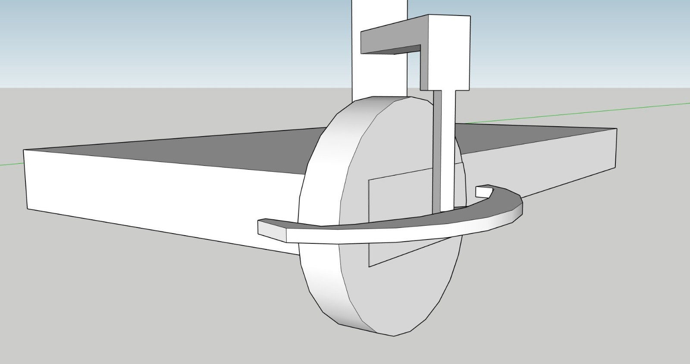

# Waffle Dudes

## Introduction :tada:

**Chen Yao**

Hello everyone, my name is Chen Yao, a year two Mechanical Engineering student. With an avid interest in robotics from years of experience with my school robotics team. After participating in various national competitions, I feel that I am rather familiar and comfortable with robotics systems. Nonetheless, I do hope to further build up my knowledge and expertise throughout the course of this project. Additionally, I have a good sense and knowledge in tools handling which I hope to apply to the small-scale robots that we’ll be working with in this competition. 

**Matthew Ong**

Hi, I am a Year 2 Mechanical Eng student. Little experience in robotics - only had a short course with Lego Mindstorm back in secondary school. Main goal of joining this project is to have fun and learn something new at the same time.

**Haikal**

Hello everyone, my name is Haikal Yusuf, a Year 2 Mechanical Engineering student. I am passionate about anything & everything STEM-related. I have experience with Robotics, having joined the Robotics club in Ngee Ann Secondary School & represented the school in multiple regional & division-level competitions. I mostly worked with the LEGO Mindstorms system but am looking to expand my knowledge to other Robotics Operating System (ROS) while also apply existing ideas to new systems I would get to learn during the span of this competition. I am keen to pursue a minor in Computer Science, even picking up Java in my free time. I hope I would be able to understand & learn better about the software that goes into robotics & hence hope to be able to interact with the Software team & contribute any ideas whilst learning from them too.

**Vanessa**

Hi, I am Vanessa, a Year 1 Common Engineering student. Previously, I have only read up very briefly about robotics online. As of currently, due to the lack of practical knowledge and experience in robotics, I will read, search and do up some hands-on application so that I will not drag my teammates down. As such, to build up on my knowledge, I will read up more on the operation and pilot side of things to navigate systems better.  From there, I can also learn more extensively from my teammates, so that I can craft out my own insights in the ideation of the systems for my teammates. Through this project, not only will I hope to experience the new and interesting robotics environment and learn more of the relevant engineering skills, but also build up friendships and teamwork along the way. 

**Ashwin**

Hi, I am Ashwin Nelanuthala, a year 2 Phd Student in Biological Sciences. I did my B.E in Mechanical Engineering and MSc in Physics. I have worked on a few engineering and science projects which required extensive designing and testing. Some of them include designing fixtures for special purpose machines in industry and high frequency invertors for my master’s thesis. My current Phd also involves designing microscopes and extensive programming for image processing. I would like to help the team in managing both electrical and mechanical systems. While working for this competition, I also wish to improve upon my image processing and software development skills. I hope that my engineering background and experience would help me guide the team to work effectively and I would love to learn and contribute to new ideas and experiences while working on this very interesting project. 

## Proposed Manpower Arrangement
No| Specialisation     |  Description                        | Personnel       | 
--|---------------|---                                  |---                |
 1|  Operation   |  Administrative Tasks                |  Chen Yao (Leader)   |
 2|  Operation   |  Accounting, Publicity                | Vanessa|
 3|  Mechanical   |  Chassis, Suspension   |  Matthew, Chen Yao |
 4|  Mechanical  |  Gun, Gimbal System | Haikal, Chen Yao          | 
 5|  Electrical     | Battery, Power Distribution System            | Ashwin     | 
 6|  Electronics    | Sensors and Cameras    | Ashwin     | 
 7|  Software    | Onboard Computer and OS | Ashwin     |   
 8|  Software    | Aimbot/ Aim Assist     | Vanessa     |  
 9|  Pilot        | Operator/ Gameplay Strategy  |  Vanessa            |

## Timeline and Milestones

For the external DJI timeline, it is based off past year deadlines.  
For the internal NUS timeline, it is a timeline with sufficient buffer zones to satisfy the requirement set by DJI (such as midterm video assessment). 
With proper concept design and directions set for the robot, we will move on to acquiring the open sourced DJI robot. After testing its limits and parameters, we will modify and tune it accordingly to suit our competition needs. 

## Robot Design Considerations

Having analysed the past year competitions and rule book we have come up with some design considerations for the soldier robot. Of course some of these are based on the previous year's rules so are subject to change.

### Overall Strategy 

The general strategy of the soldier robot is to play aggressively. Since the field is mostly flat with some cover, it would suit fast paced, close quarters combat. In the early phase of the game, the soldier robots' main objective is to rush towards the resource island to harass and block the opposing engineer from refilling their hero robot with the 42mm rounds. Ideally, the soldiers would be able to harass the opposing engineer while our own engineer refills the hero robot, massively increasing our damage potential over the enemy's.

Once the hero robot receives the 42mm rounds, the soldier robots will spread out and start to execute quick random attacks to confuse the enemy. The soldier and hero robots can then swarm and pick off stragglers the moment the enemy breaks formation. 

In consideration of this playstyle, the soldier robot must be designed to be quick and agile so that it can execute fast attacks and retreat to cover. The robot should be small and light for it to be fast and nimble. A bumper system would be also be beneficial for its aggressive playstyle. Finally, the gun placement should be low so that the robot can go up close and still be able to hit the low lying armour module. This also has the added benefit of lowering the centre of gravity of the robot to make it more stable. 

### Robot Type: Soldier Robot
 
1. Can only shoot non-aerial robots
   
    - Gun swivel movement does not need to extend to high angles along vertical axis

2. Only 1 17mm launching mechanism and one laser

    - Also limited by "barrel heat" mechanic, hence there is a need to focus on the accuracy of the gun - make every shot count

3. 17 mm ball projectile specifications

    - Size: about 16.9mm, Weight: 2.9g, Shore Hardness: 90A, Material: TPU
    
    - Tests must be done to analyse the firing arcs of these projectiles

4. Size Constraints

    - 600 x 600 x 500 (mm)

### Environmental Conditions
    
1. Some slopes up to about 20 degress including a gap on two of the roads where robot has to "jump" across (ability to climb 20 degrees also a competition requirement)

    - Low centre of gravity while keeping within size constrains to prevent overturns

    - Suspension to protect the internals and at the same time increase stability of gun 

     
    
    to be changed
    
    - Types of suspension to consider: Hydraulic (from RC car), easily available from hobby stores in Singapore, magnetic dampers which we can DIY from neodymium magnets

### Gameplay Considerations

1. High mobility required for tight corners and manoeuvres and fast reaction times

    - High torque motors for high acceleration
    - Mecanum wheels for mobility and agility

### Robot Components

1. Gun 

    - Possible mechanisms:
        1. Compressed air
        2. Flywheel

    - Laser for visual assistance when aiming
    
    - Compressed air pressure must not exceed 20 MPa, initial firing speed limit of 30 m/s
    
    - There is a focus on a aggressive close quarters playstyle with close range shooting. It is important that the gun still needs to be relatively accurate to adapt to newer strategies. Longer barrel length up to 20 cm should be utilised. Should time and resources permit, rifling and Magnus effect due to imparting spin can be considered to increase accuracy. 
    
2. Ammo collection and feeding mechanism 

    - Ammo box with simple “funnel lid”, the top surface will be lined with soft material like silicone, to prevent balls from bouncing out during refilling

    - In line with keeping gun placement low, ammo box is placed to the rear of the gun and gravity feed balls into chamber

    
    
    *Funnel Design*
    
    

    *Paintball mechanism to be considered for the launcher*
    
    **Feeding Mechanism**
    
    Base of ammo box will have a rotating disk with a notch for storing one ball at a time. When the notch reaches the outlet, the guide will push only one ball out towards the gun. For a launcher based on a flywheel, fire rate of gun can be controlled by varying the rpm of rotating disk. Software can also be used to control the fire rate in consideration of the “barrel heat” rule. The robot can shoot the first few (e.g. 6) rounds at a faster rate before it reaches the maximum heat. Then it will slow down for the subsequent shots. This will provide the robot will large bursts of damage for an aggressive playstyle.  
    
    
    
    *Feeding Mechanism*
    
    
    
    *General Overview of Gun using Flywheel Launcher*

3. Gun Stabiliser 

    - Motorised 2- axis Gimbal system 

    - Movement can be done with either servo motors / hydraulics / pneumatic system  
    
    - Inclined towards servo motors as there is a wide support for it and point of failure is low 

4. Chassis

    - Aluminium base. Lightweight and sufficiently strong

    - Can design trusses to support the wheels and suspension
    
    - Modify from reference design and manufacture a new chassis as reference design chassis is not able to mount a suspension system 
    
    The area of the chassis housing the wheel system have been tapered and narrowed, such that the overall area of the robot is minimized, hence the concept of being small and agile remains. Additionally, this suspension design allows the robot to achieve a lower Centre of Gravity, by making its body wide & flat as the motor & wheels are placed next to the chassis, instead of below the chassis. The shape of the chassis will resemble closely that of a square, effectively shortening the wheelbase (distance between the centers of the front & rear wheels), which allows the robot to achieve a smaller turning radius & thus be very agile & make quick & sharp turns. 

5. Wheels

    - Mecanum wheels for high mobility required for gameplay, including lateral movement

6. Dual Camera System 

    - Dual cameras for depth perception using triangulation method

7. Motor/ Battery/ Electronic Speed Control, Power Distribution Box

    - Use DJI made parts in the interest of time. Only when unable to meet our requirements (e.g. not enough power), should we consider other alternatives
    
    - Must comply to rules, e.g. power consumption to be under 80W

8. Ultrasonic Sensor

    - Improved environment perception

9. Communication Module

    - Produced by DJI as per stated in rule book

10. On Board Processing Unit

    - Certain features such as aim assist will be processed in the local computer of the robot for fast and efficient response time and gameplay. 
    
    - Can consider offloading intensive and non-time critical processing to an external workstation if onboard processing unit is too slow. This will be depend on the onboard processing unit's ability to handle all the tasks and also the bandwidth of communication module

### Additional Quirks and Features 
    
   - Pixelized camo / design, high gloss paint, to enhance the difficulty for opponent AI to identify the referee plate on our robot  

   

   *Source: https://www.whichcar.com.au/car-news/car-camouflage-how-carmakers-hide-prototypes-explained*

   - Rubber / Spring cushions around the referee plates, thus when the robot is hit, the referee plates not be in the same position for the second shot. Therefore, it lowers the damage taken as the opponent might have to recalibrate their aim
   
   - The guards (bumper system) will be designed such that it is angled and have a smooth finish to be able to deflect and incoming collision and prevent our robot from getting tangled with others
   
   

### Fabrication Method

To minimise the time taken to build and debug, the robot will be based of DJI’s reference model and will be modified further to improve its performance. Parts from hobbyist level of remote-control vehicles will be preferred. This is because they are readily available off the shelf components from hobby stores. They will provide us with the ease of access, wide range of choices and the support of hobby community.

In the event that parts cannot be found, we will adapt them from exising parts found in live sized vehicles and scale them down accordingly. Small parts can be 3D printed for rapid protopying before the fabrication of the actual part. With access to the school's facilities, strongly believe that we can machine out the necessary and required parts.
