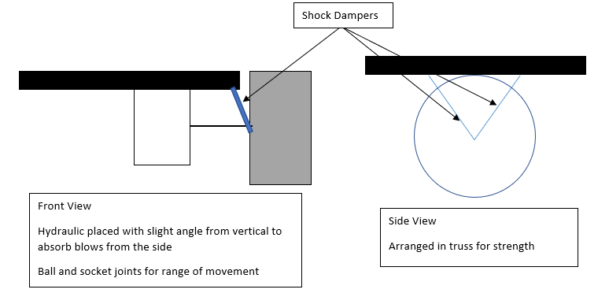

# Waffle Dudes

## Introduction :tada:

**Chen Yao**

**Matthew Ong**

Hi, I am a Year 2 Mechanical Eng student. Main goal of joining the competition is to have fun and learn something at the same time.

**Haikal**

Hello everyone, my name is Haikal Yusuf, a Year 2 Mechanical Engineering student. I am passionate about anything & everything STEM-related. I have experience with Robotics, having joined the Robotics club in Ngee Ann Secondary School & represented the school in multiple regional & division-level competitions. I mostly worked with the LEGO Mindstorms system but am looking to expand my knowledge to other Robotics Operating System (ROS) while also apply existing ideas to new systems I would get to learn during the span of this competition. I am keen to pursue a minor in Computer Science, even picking up Java in my free time. I hope I would be able to understand & learn better about the software that goes into robotics & hence hope to be able to interact with the Software team & contribute any ideas whilst learning from them too.

**Vanessa**

**Ashwin**

## Proposed Manpower Arrangement
No| Specialisation     |  Description                        | Personnel       | 
--|---------------|---                                  |---                |
 1|  Operation   |  Administrative Tasks                |  Chen Yao (Leader)   |
 2|  Operation   |  Accounting, Publicity                | Vanessa|
 3|  Mechanical   |  Chassis, Suspension   |  Matthew, Chen Yao |
 4|  Mechanical  |  Gun, Gimbal System | Haikal, Chen Yao          | 
 5|  Electrical     | Battery, Power Distribution System            | Ashwin     | 
 6|  Electronics    | Sensors and Cameras    | Ashwin     | 
 7|  Software    | Onboard Computer and OS | Ashwin     |   
 8|  Software    | Aimbot/ Aim Assist     | Open     |  
 9|  Pilot        | Operator/ Gameplay Strategy  |  Open            |

## Timeline and Milestones

pic here

For the external DJI timeline, it is based off past year deadlines.  
For the internal NUS timeline, it is a timeline with sufficient buffer zones to satisfy the requirement set by DJI (such as midterm video assessment). 
With proper concept design and directions set for the robot, we will move on to acquiring the open sourced DJI robot. After testing its limits and parameters, we will modify and tune it accordingly to suit our competition needs. 

## Robot Design Considerations

Having analysed the past year competitions and rule book we have come up with some design considerations for the soldier robot. Of course some of these are based on the previous year's rules so are subject to change.

### Robot Type: Soldier Robot
 
1. Can only shoot non-aerial robots
   
    - Gun swivel movement does not need to extend to high angles over vertical axis

2. Only 1 17mm launching mechanism and one laser

    - Also limited by "barrel heat" mechanic, hence there is a need to focus on the accuraccy of the gun - make every shot count

3. 17 mm ball projectile specifications

    - Size: about 16.9mm, Weight: 2.9g, Shore Hardness: 90A, Material: TPU
    
    - Tests must be done to analyse the firing arcs of these projectiles

4. Size Constraints

    - 600 x 600 x 500 (mm)

### Environmental Conditions

1. Collisions not allowed according to rules, however, there have been some instances of knocking and damages to robot

    - Mimic cars where there is a crumple zone to absorb the force with a rigid interior structure to protect the internal components

    - Simple design, minimise moving parts

2. Some slopes up to about 20 degress including a gap on two of the roads where robot has to "jump" across

    - Low centre of gravity while keeping within size constrains to prevent overturns

    - Suspension to protect the internals and at the same time increase stability of gun 

    
    
    - Suspension will be considered towards the later part of the build process where we have a rough weight of the robot and its structures. We will source the suspension to specifications of the robot.  
    
    - Types of suspension to consider: Hydraulic (from RC car), easily available from hobby stores in Singapore, magnetic dampers which we can DIY from neodymium magnets

### Gameplay Considerations

1. High mobility required for tight corners and manoeuvres and fast reaction times

    - High torque motors for high acceletaion
    - Mecanum wheels for mobility and agility

### Robot Components

1. Gun 

    - Possible mechanisms:
        1. Compressed air
        2. Flywheel

    - Laser for visual assistance when aiming

2. Ammo collection and feeding mechanism 

    - Simple “double funnel”, the interior will be lined with soft material like silicone, so the balls do not bounce back out easily 

    - Gravity feed balls into chamber 

    
    
    *Funnel Design*
    
    

    *Paintball mechanism to be considered for the launcher*

3. Gun Stabiliser 

    - Motorised 2- axis Gimbal system 

    - Movement can be done with either servo motors / hydraulics / pneumatic system  
    
    - Inclined towards servo motors as there is a wide support for it and point of failure is low 

    - It should be designed such that the gun can aim at a fixed location while the base (chassis) of the robot can spin continuously to actively avoid being shot at 

4. Chassis

    - Aluminium base. Light Weight and sufficiently strong

    - Can design trusses to support the wheels and suspension

5. Wheels

    - Mecanum wheels for high mobility required for gameplay, including lateral movement

6. Dual Camera System 

    - Dual cameras for depth perception using triangulation method

7. Motor/ Battery/ Electronic Speed Control, Power Distribution Box

    - Use DJI made parts in the interest of time. Only when unable to meet our requirements (e.g. not enough power), should we consider other alternatives

8. Ultrasonic Sensor

    - Close range obstacle avoidance and better environment perception

9. Communication Module

    - Produced by DJI as per stated in rule book

10. On Board Processing Unit

    - Certain features such as aim assist, obstacle avoidance will be processed in the local computer of the robot for fast and efficient response time and gameplay. 
    
    - Can consider offloading intensive and non-time critical processing to an external workstation if onboard processing unit is too slow. This will be depend on the onboard processing unit's ability to handle all the tasks and also the bandwidth of communication module

### Additional Quirks and Features 
    
   - Pixelized camo / design, high gloss paint, to enhance the difficulty for opponent AI to identify the referee plate on our robot  

   

   *Source: https://www.whichcar.com.au/car-news/car-camouflage-how-carmakers-hide-prototypes-explained*

   - Rubber / Spring cushions around the referee plates, thus when the robot is hit, the referee plates not be in the same position for the second shot. Therefore, it lowers the damage taken as the opponent might have to recalibrate their aim

### Fabrication Method

To minimise the time taken to build and debug, the robot will be based of DJI’s reference model and will be modified further to improve its performance. Parts from hobbyist level of remote-control vehicles will be preferred. This is because they are readily available off the shelf components from hobby stores. They will provide us with the ease of access, wide range of choices and the support of hobby community.

In the event that parts cannot be found, we will adapt them from exising parts found in live sized vehicles and scale them down accordingly. Small parts can be 3D printed for rapid protopying before the fabrication of the actual part. With access to the school's facilities, strongly believe that we can machine out the necessary and required parts.
