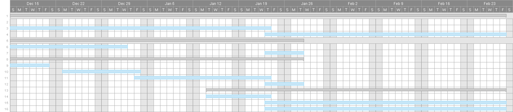

# RoboMasters YOGA

# Self Introductions

## Wang Haozhe
I am a year 3 electrical engineering student pursuing an IoT specialization. I am currently doing my Industrial Attachment (IA) at NUS Optical Science and Engineering Center, in charge of developing software for an industrial smart microscope. I am passionate about embedded systems design, machine learning, and computer vision. My current IA project requires me to make use of computer vision algorithms to develop a passive autofocus system for the smart microscope. Some of my past projects include designing a digital real-time audio processing device using an FPGA and simulating the operation of a fitness tracking system using an ARM Cortex-M3 based microcontroller. I hope to strengthen my skill sets in embedded systems, microcontroller programming and interfacing, as well as my knowledge of computer vision and machine learning algorithms through participating in this competition.

## Ganapathy Sanath Balaji
I am a year 2 Computer engineering student. I am interested in the fields of embedded programming, theoretical computer science, and artificial intelligence. I have previously participated in robotics competitions during my secondary schooling. I do have a little bit of electrical engineering background because I was an EE student for 1 year before I transferred over to CEG. During my time at NUS, I have previously designed a real-time voice scope using an FPGA and also programmed a m-bot based on Arduino to perform simple tasks. My future plans are to pursue a career in AI. I do think that joining the robomasters team could be hugely beneficial for me.

## R Ramana
I am a first year computer engineering student keen on pursuing Intelligent Systems as a specialization. I am passionate about technology especially machine learning and AI. I feel that RoboMasters will be a great platform to strengthen my skill sets as we will not only be working on the software but also the hardware components, which is in line with my field of studies. Furthermore, this is a good opportunity to work with fellow like minded peers on a project, which would be very helpful as it would give us all a glimpse of the working world where we will work in teams in order to achieve certain key performance indicators.

## Aritejh KR Goil
I am a year 1 Engineering Science student, who is interested in designing electrical and mechanical components. I have previously participated in various robotics competitions, the latest one involving designing an electric car at SUTD, for which we won second place. I have worked with power delivery and control systems as well as sensor integrations. My future plan is to work in the energy or automation sector, and RoboMasters would be highly beneficial for the latter as I can build up my skills in computer vision, multi-level systems integration, embedded systems, and 3D modeling.

## Tze Yee Koh
I am a Year 1 Industrial and Systems Engineering student with an interest in mechanical design, systems engineering, and project management. I have worked with a variety of robotics platforms (Vex, FTC, FRC, MATE) similar to Robomaster. I competed at international robotics competitions where I learned various mechanical designs, manufacturing practices, and fabrication techniques. Prior to NUS, I was a CNC Mill machinist specializing in toolpath optimization with Solidworks and Mastercam. Joining NUS Robomaster, I look forward to further sharpening my skills in mechanical design. I am also interested in the integration of software and hardware and look forward to learning and experimenting with image recognition and computer vision. I look forward to spending my undergraduate years creating the foundations for Robomaster on which future students can build upon.

# Proposed Manpower Arrangement
No| Role          |  Description                        | Assigned to       |
--|---------------|---                                  |---                |
 1|  Mechanical   |  Chassis; Suspension; CAD and engineering drawings; Fabrication               |  Tze Yee Koh      |
 2|  Mechanical   |  Gun control; Gimbal system; Feeder mechanism; Storage chamber design                | Aritejh           |
 3|  Electrical   |  Power management; Electric Drive; Referee system implementation; Integration and checking of systems   |  Haozhe (Leader)  |
 4|  Electronics  |  Sensor interface; Closed-1 | Sanath          |
 5|  Software     | Linux OS; Sensor drivers; UI; Implementation of SDK and referee system            | Ramana     |
 6|  Software     | Computer vision; Motion planning; Macros    | Open Position     |
 7|  Operation    | Sponsorships; Chinese-English Translation | Open Position     |   
 8|  Operation    | Accounting; Publicity Materials     | Open Position     |  
 9|  Pilot        | TX & RX system; Game-play strategy; Advising on macros and speed controllers  |  Open Position            |

 For interested people to join our team, please contact Telegram @aritejh

# Timeline

There are no submissions due  during the the date period not shown in the gantt chart.

# Overview & Game strategy
Robomasters 2019 is a 7v7 robotics tournament centered around the destroying of opponent bases by shooting projectiles. The are 7 robots in each team: 1 Engineer, 1 Hero, 1 sentry, 1 aerial and 3 standard robots. Amongst the 5 types of robots, the standard soldier robot plays the most versatile role and act as the frontline in most matches. Based on what we have seen in Robomaster competitions from previous years, the standard robot has been utilized in the 4 main ways:

1. Stay on the bunker to aid the sentry in defending the base. When the standard robot is on the bunker it can obtain 50% defense bonus and the barrel cooling value per second is increased to 5 times before the occupation. This makes the bunker a good location for defense.

2. All three standard robots work as a team to hunt down the enemy’s engineering and hero robots. Using this strategy deals more damage to the engineering and hero robots in a short period of time while minimizing the vulnerability of each standard robot from enemy attacks.

3. Shooting at the engineer robot from outside the penalty zone of the resource island. This distracts the enemy’s engineering robot and increases the difficulty for the enemy to acquire the 42mm projectiles.

4. Moving in quickly to shoot at the enemy base once the base shield is opened.

In order to hold a strong frontline, the standard robot should be fast and agile around the battlefield, and should also be able to accurately shoot opponents from a distance of 5 meters using a firing mechanism mounted on a gimbal that is controlled autonomously using trained computer vision algorithms. Making a lightweight robot and incorporating mecanum wheels into the chassis will also help with the agility and maneuverability of the robot and help us achieve this goal.

# Robot Specifications

## Limitations
Power supply voltage: 30V with Total capacity 200Wh
Chassis power draw: 80W
Weight: 20Kg
Robot dimensions: 600x600x500mm

## Electronics Layout

(Source: RoboMaster)

## Chassis
6in Robomaster mecanum wheels will be driven by 4x Robomaster M3508 motors utilizing C620 ESC with 24V input. The compact size and weight of the motor will allow for lighter and smaller robot. Assuming 15W power draw per motor, this allows us to achieve 500rpm (unweighted) and around 0.5Nm of torque per motor. Assuming the robot is 20kg, we will be able to accelerate at 0.65 m/s2 and achieve a top speed of 3.5m/s under ideal conditions. This is on par with other competitive robot in the competition. The mecanum wheels also make it easier to climb ramps, are more power efficient and allow for complicated motions such as drifting and turning while aiming in another direction.

## Gimbal
Since gimbal would be subject to a number of forces such as rebound from firing and even loading the balls, good stability is needed. Stability would also allow the AI targeting system to work better. The motors also need to move the relatively heavy gimbal with ease. High precision is needed as well, and thus the DJI GM6020 motors are used as they allow us to do so in a compact space. Snail motors are high RPM motors used for drones. Since a higher velocity is preferred over torque, no gearbox is needed to alter the output of the motor. Fitting them with friction wheels can allow us to fire 17mm projectiles at the ideal 30m/s speed. For the feeding mechanism, it is designed to optimise volume so that more projectiles can be stored in the robot. The feeder motors require high speed to maintain a high rate of fire. For our loading motor, we plan to use the same snail motors to launch projectiles into the firing chamber. This ensures projectiles are fed into the firing mechanism at the same rate they are launched, allowing us to maintain a high rate of fire without bottlenecking the firing mechanism.

## Driver Aids
Since the drivers would be the ones playing the game, it is essential to encode functionality into the UI, and allowing them access to certain shortcuts. According to the strategy, we can have macros for switching between high fire or low fire modes, which can be used in different situations. For example, during an intense fight and to hold the frontline the high firing mode can be activated which might allow for slight overheating but overpower the opposing robot whereas a low fire mode can be used for defensive positions and longer range shooting. Furthermore, we can develop and intelligent armour plate detection and aiming system using trained computer vision algorithms to do motion tracking and aiming to increase our shooting accuracy while engaging fast moving targets. An AI with a hit accuracy between 20-30% would be ideal as upon observation that is the usual accuracy rate. The accuracy rate could be further improved by training the computer vision model with better training data sets. This can be done using the RoboRTS software available on robomaster git.

# Key Design Aspects
### 1. Chassis Assembly
Rectangular aluminium 2inx1in stock will be used to fabricate the chassis. Aluminium is easy to fabricate and is robust enough for our application. In addition, aluminium is light and can reduce the weight of the entire robot, helping with acceleration and overall efficiency. Since the chassis is unlikely to change, rivets and aluminium L-brackets will be used to attach assemble the aluminium stock together. This is to eliminate the possibility of the chassis parts loosening during competition. For components that require bolts and nuts to assemble, loctite adhesive threadlockers and nylon nuts will be used to prevent the fasteners from loosening.

### 2. Suspension System
We will design a cantilever suspension system for the chassis of the robot to keep the robot stable on uneven terrain. In addition, the suspension system will be adjusted to compensate for the vibration caused by the mecanum wheels. Reducing vibrations will throughout the chassis will reduce the chances of fasteners loosening, improving the overall reliability of the robot. We proposed a cantilever system since it is simple and has the least number of moving joints. This will help with repairability and reliability of the robot during competition.

### 3. Gimbal Stability and Rotation
The suspension system also ensures the clarity of the incoming video stream for the pilot and optimizes the performance of the computer vision aiming algorithm. Ensure the stability of the gimbal design so that the computer vision algorithms can perform optimally and we can have maximum accuracy when we launch the projectiles at the enemy robots. Robomaster GM6020 Motors will be used to provide rotation in the X/Y direction. The hollow shaft design allows us to use electrical slip rings and improves wiring organization. The motor also allows has a high-precision angle sensor allowing for small accurate adjustments to our firing trajectory. To improve accuracy, two snail motors will be used to propel projectiles forward. This is to reduce the amount of spin in the individual projectiles and ensures the projectiles consistently land at the same point.

### 4. Armour Assembly
As part of the referee system, the armour assembly has a quick-disassembly feature. Direct impacts with the armour board can activate this feature, detaching the board from the frame. As a result, the armour board will have to mounted such that it is not the first point of contact during impacts and is protected (but not covered) by other components on the chassis.

### 5. Modularity of Parts
Ensure the modularity of the design of the robots so that we can easily replace damaged components during battle. For example, subsystems such as the gimbal assembly will be fastened down with bolts and nuts so as to ensure the entire assembly can be removed from the chassis in the event the chassis is severely damaged. This will allow parts to be quickly replaced during competition and can help with the maintenance of the robot.

### 6. Accounting for Manufacturing Errors
There will be certain manufacturing errors between the actual objects and the drawings. When designing the mechanical structure of the robot, consider the manufacturing errors of the Battlefield Components and do not overly rely on the accuracy of the size of measurements. It is important to add appropriate tolerances for manufacturing errors for the mechanical CAD drawings as well.

### 7. Projectile Feeding Mechanism
There will be a feeding mechanism that propels the projectiles vertically upwards from the projectile storage chamber fixed on the chassis into a U-bend that acts as a small holding chamber to ensure that the firing mechanism is not bottlenecked by the feeder mechanism. We use snail motors to propel the projectiles for both the feeding and firing mechanism. This design is simple and effective, reducing the probability of components failing.

### 8. Projectile Storage Chamber Design
Slight incline is present at the base of the storage chamber to allow for balls to be guided smoothly into the feeder mechanism. The incline and chamber will also incorporate a groove design near the entry point to ensure balls enter one by one and drain efficiently. This ensures all pellets are used, maximizing efficiency.

# General Design and Fabrication Methods
### Machinery Available
Harrison CNC Lathe Alpha 330 Plus
 - For custom shafts and axles

Avemax Conventional Mill & DMG Mori NVX 5080 3-Axis CNC Mill
 - For custom aluminium stock

UP!BOX 3D Printer
 - For custom 3D Printed ABS/PLA Parts

Epilog M2 40 Laser Cutting Machine
 - For custom acrylic sheet patterns

Basic Workshop Tools (Bandsaws/Drill Press)
 - For quick fabrication of simple custom parts that do not require a high level of precision

### Raw Materials
In order to maintain continuity and form a design language, we plan to use standard Aluminium tube and Aluminium plate stock for custom components on the robot. Components should be designed such that they are easy to fabricate by hand for low tolerances and with workshop machinery for high tolerances. Other materials used include acrylic/polycarbonate sheets for the electronics board and 3D printed parts for components under low-stress.

### Tolerances
Assemblies such as the cantilever suspension joints, motor mounting holes and cut-outs, and custom Gimbal parts require a higher level of precision. Additionally, custom shafts for joints in the cantilever system will have to lathed to fit bearings securely. The high tolerances in these parts reduce the possibility of misalignment and human error during fabrication. Workshop tools like the CNC Mill and CNC Lathe can fabricate these parts. Ideally, when designing the robots, parts should be simple and easy to fabricate without high precision machinery. This reduces the time needed to produce custom parts and reduces the overall manufacturing cost.

### Gimbal Design
Because the shooter and gimbal are key components of the standard robot, our team placed an emphasis on the gimbal and shooter design. Custom parts in the model can be fabricated in-house. Metal components can be CNC Milled from the standard 2inX1in Aluminium stock and 2in Aluminium Plate. Plastic components are under low stress and can be fabricated with laser-cut acrylic sheets and 3D printed ABS.

# Proposed Budget
No | Component Name                        | Unit Cost (USD) | Qty | Total |
---|---------------------------------------|---              |---  |---    |
 01|  RoboMaster Development Board Type A  |  68             | 2   | 136   |
 02|  RoboMaster Development Board Type B  |  35             | 1   | 35    |
 03|  RoboMaster Development Board OLED    |  14             | 1   | 14    |
 04|  RoboMaster Development Board Cables  |  40             | 1   | 40    |
 05|  RoboMaster M3508 P19 Brushless DC Gear Motor  |  79            | 4   | 316   |
 06|  RoboMaster C620 Brushless DC Motor Speed Controller  |  63             | 4   | 252   |
 07|  RoboMaster Center Board              |  5              | 1   | 5     |
 08|  RoboMaster M3508 Accessories Kit     |  54             | 1   | 54    |
 09|  RoboMaster GM6020 Brushless DC Motor |  189            | 2   | 378   |
 10|  RoboMaster M2006 P36 Brushless DC Gear Motor  |  41             | 2   | 82   |
 11|  Snail Racing Propulsion System(4 Motors, 4 ESC)  |  89             | 2   | 178    |
 12|  Neoprene Roller, Drive, Aluminum Hub, 1" Roller Diameter, 3/16" Roller Width    |  1             | 50   | 50    |
 13|  RoboMaster Mecanum Wheel (Right)     |  44             | 2   | 88    |
 14|  RoboMaster Mecanum Wheel (Left)      |  44             | 2   | 88    |
 15|  RoboMaster Red Laser Sight           |  14             | 1   | 14    |
 29|  RoboMaster Remote Controller         |  56             | 1   | 56    |
 31|  RoboMaster Battery Holder (Compatible)| 16             | 1   | 16    |
 32|  Matrice 100 TB47D Battery            |  216            | 1   | 216   |
 33|  RHW201030 2inx1in Aluminium Tube 6 meters (Quoted Chip Aik Aluminium)   |  32.7           | 1   | 32.7  |
 34|  FB2060 2inx6mm Aluminium Plate 6.1 meters (Quoted Chip Aik Aluminium)   |  25.2           | 1   | 25.2  |

##### Total: 2075.9

##### The following table lists the required materials and cost for the referee system (which should be issued by DJI)
No | Component Name                        | Unit Cost (USD) | Qty | Total |
---|---------------------------------------|---              |---  |---    |
01|  Speed Monitor Module SM01 (17mm Projectile)             |  73              | 1   | 73     |
02|  Armor Module AM12 (Large Plate)      |  104            | 1   | 104   |
03|  Armor Module AM02 (Small Plate)      |  96             | 4   | 384   |
04|  Armor Module Support Frame Type A    |  50             | 3   | 150   |
05|  Main Control Module MC02             |  72             | 1   | 72    |
06|  Power Management Module PM01         |  74             | 1   | 74    |
07|  Light Indicator Module LI01          |  74             | 1   | 74    |
08|  RoboMaster VTM Transmitter VT12      |  131            | 1   | 131   |
09|  RoboMaster VTM Transmitter VT02      |  131            | 1   | 131   |   
10|  RFID Interaction Module FI02         |  45             | 1   | 45    |
11|  RFID Interaction Card TC01           |  47             | 1   | 47    |
12|  RoboMaster Cable Package CP02        |  30             | 1   | 30    |
13|  RoboMaster DR16 Receiver             |  16             | 1   | 16    |
14|  RoboMaster UWB Positioning System Set|  667            | 1   | 667   |

##### Total: 1998
