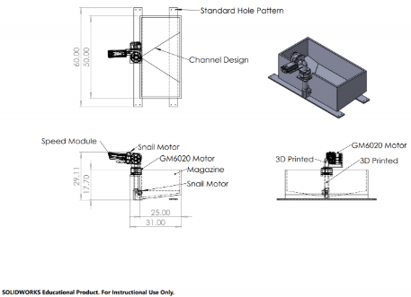

# RoboMasters YOGA

# Introduction of Team

## Wang Haozhe

I am a year 3 electrical engineering student pursuing an IoT specialization. I am currently doing my Industrial Attachment (IA) at NUS Optical Science and Engineering Center, in charge of developing software for an industrial smart microscope. I am passionate about embedded systems design, machine learning, and computer vision. My current IA project requires me to make use of computer vision algorithms to develop a passive autofocus system for the smart microscope. Some of my past projects include designing a digital real-time audio processing device using an FPGA and simulating the operation of a fitness tracking system using an ARM Cortex-M3 based microcontroller. I hope to strengthen my skill sets in embedded systems, microcontroller programming and interfacing, as well as my knowledge of computer vision and machine learning algorithms through participating in this competition.

## Ganapathy Sanath Balaji

I am a year 2 Computer engineering student. I am interested in the fields of embedded programming, theoretical computer science, and artificial intelligence. I have previously participated in robotics competitions during my secondary schooling. I do have a little bit of electrical engineering background because I was an EE student for 1 year before I transferred over to CEG. During my time at NUS, I have previously designed a real-time voice scope using an FPGA and also programmed a m-bot based on Arduino to perform simple tasks. My future plans are to pursue a career in AI. I do think that joining the robomasters team could be hugely beneficial for me.

## R Ramana

I am a first year computer engineering student keen on pursuing Intelligent Systems as a specialization. I am passionate about technology especially machine learning and AI. I feel that RoboMasters will be a great platform to strengthen my skill sets as we will not only be working on the software but also the hardware components, which is in line with my field of studies. Furthermore, this is a good opportunity to work with fellow like minded peers on a project, which would be very helpful as it would give us all a glimpse of the working world where we will work in teams in order to achieve certain key performance indicators.

## Aritejh KR Goil

I am a year 1 Engineering Science student, who is interested in designing electrical and mechanical components. I have previously participated in various robotics competitions, the latest one involving designing and electronic car. I have worked with power delivery and control systems as well as sensor integrations. My future plan is to work in the energy or automation sector, and RoboMasters would be highly beneficial for the latter as I can build up my skills in computer vision, multi-level systems integration, embedded systems, and 3d modeling.

## Tze Yee Koh

I am a Year 1 Industrial and Systems Engineering student with an interest in mechanical design, systems engineering, and project management. I have worked with a variety of robotics platforms similar to Robomaster and have participated in various international robotics competitions where I gained experience in mechanical design, manufacturing, and fabrication techniques. Prior to NUS, I was a CNC Mill machinist specializing in toolpath optimization with Solidworks and Mastercam. Joining NUS Robomaster, I look forward to further sharpening my skills in mechanical design. I am also interested in the integration of software and hardware and look forward to learning and experimenting with image recognition and computer vision. I look forward to spending my undergraduate years creating the foundations for Robomaster on which future students can build upon.

# Proposed Manpower Arrangement
No| Role          |  Description                        | Assigned to       |
--|---------------|---                                  |---                |
 1|  Mechanical   |  Chassis; Suspension; CAD and engineering drawings; Fabrication               |  Tze Yee Koh      |
 2|  Mechanical   |  Gun control; Gimbal system; Feeder mechanism; Storage chamber design                | Aritejh           |
 3|  Electrical   |  Power management; Electric Drive; Referee system implementation; Integration and checking of systems   |  Haozhe (Leader)  |
 4|  Electronics  |  Sensor interface; Closed-1 | Sanath          |
 5|  Software     | Linux OS; Sensor drivers; UI; Implementation of SDK and referee system            | Ramana     |
 6|  Software     | Computer vision; Motion planning; Macros    | Open Position     |
 7|  Operation    | Sponsorships; Chinese-English Translation | Open Position     |   
 8|  Operation    | Accounting; Publicity Materials     | Open Position     |  
 9|  Pilot        | TX & RX system; Game-play strategy; Advising on macros and speed controllers  |  Open Position            |

 For interested people to join our team, please contact Telegram @aritejh

# Timeline

There are no submissions due  during the the date period not shown in the gantt chart.

# Robot Design Considerations

## Key Design Aspects of the Robot
1. Ensure that the front armour of the robot is well protected to avoid impact on the amour board and prevent quick disassembly function from activating.

2. Ensure the stability of the gimbal design so that the computer vision algorithms can perform optimally and we can have maximum accuracy when we launch the projectiles at the enemy robots. We can also design a gimbal that is able to turn 360 degrees so that we are able to observe and fire projectiles at enemy robots all around us since only a first-person view is allowed.

3. Ensure the modularity of the design of the robots so that we can easily replace damaged components during battle. Hole patterns in the chassis will be standardized to allow for easy repairability and replaceability of separate components both during the design phase and the competition.

4. There will be certain manufacturing errors between the actual objects and the drawings. When designing the mechanical structure of the robot, consider the manufacturing errors of the Battlefield Components and do not overly rely on the accuracy of the size of measurements. It is important to add appropriate tolerances for manufacturing errors for the mechanical CAD drawings as well.

5. We will design a cantilever suspension system for the chassis of the robot to keep the robot stable on uneven terrain. This ensures the clarity of the incoming video stream for the pilot and optimizes the performance of the computer vision aiming algorithm.

6. Feeding mechanism (shooting vs feeder)
There will be a feeding mechanism that propels the projectiles vertically upwards from the projectile storage chamber fixed on the chassis into a U-bend that acts as a small holding chamber to ensure that the firing mechanism is not bottlenecked by the feeder mechanism. We use snail motors to propel the projectiles for both the feeding and firing mechanism.

7. Projectile Storage Chamber Design
Slight incline is present at the base of the storage chamber to allow for balls to be guided smoothly into the feeder mechanism. The incline and chamber will also incorporate a groove design near the entry point to ensure balls enter one by one and drain efficiently.

8. All of the electronic control systems mounted on the chassis of the robot must be covered up and protected to prevent incoming projectiles that miss the armour plate from landing inside the robot and damaging the control system.

## General Design and Fabrication Methods
In order to maintain continuity and form a design language, we plan to use standard Aluminium tube and Aluminium plate stock for custom components on the robot. Components are designed so they can be manufactured in-house with the CNC Mill, 3D Printer, or basic workshop tools.

To ensure modularity and ease of design, aluminum stock used in the chassis design will have a standardized hole pattern milled into the top and bottom face. This standardized hole pattern ensures parts are easily interchangeable between robots and swappable during competition.

Because the shooter and gimbal are key components of the standard robot, our team placed an emphasis on the gimbal and shooter design. Custom parts in the Solidworks model (https://grabcad.com/library/robomaster-yoga-cad-1) can be fabricated in-house. Metal components can be CNC Milled from the standard 2inX1in Aluminium stock and 2in Aluminium Plate. Plastic components are under low stress and can be fabricated with acrylic sheets and 3D printed ABS.

## Proposed Budget
No | Component Name                        | Unit Cost (USD) | Qty | Total |
---|---------------------------------------|---              |---  |---    |
 01|  RoboMaster Development Board Type A  |  68             | 2   | 136   |
 02|  RoboMaster Development Board Type B  |  35             | 1   | 35    |
 03|  RoboMaster Development Board OLED    |  14             | 1   | 14    |
 04|  RoboMaster Development Board Cables  |  40             | 1   | 40    |
 05|  RoboMaster M3508 P19 Brushless DC Gear Motor  |  79            | 4   | 316   |
 06|  RoboMaster C620 Brushless DC Motor Speed Controller  |  63             | 4   | 252   |
 07|  RoboMaster Center Board              |  5              | 1   | 5     |
 08|  RoboMaster M3508 Accessories Kit     |  54             | 1   | 54    |
 09|  RoboMaster GM6020 Brushless DC Motor |  189            | 2   | 378   |
 10|  RoboMaster M2006 P36 Brushless DC Gear Motor  |  41             | 2   | 82   |
 11|  Snail Racing Propulsion System(4 Motors, 4 ESC)  |  89             | 2   | 178    |
 12|  Neoprene Roller, Drive, Aluminum Hub, 1" Roller Diameter, 3/16" Roller Width    |  1             | 50   | 50    |
 13|  RoboMaster Mecanum Wheel (Right)     |  44             | 2   | 88    |
 14|  RoboMaster Mecanum Wheel (Left)      |  44             | 2   | 88    |
 15|  RoboMaster Red Laser Sight           |  14             | 1   | 14    |
 16|  Speed Monitor Module SM01 (17mm Projectile)             |  73              | 1   | 73     |
 17|  Armor Module AM12 (Large Plate)      |  104            | 1   | 104   |
 18|  Armor Module AM02 (Small Plate)      |  96             | 4   | 384   |
 19|  Armor Module Support Frame Type A    |  50             | 3   | 150   |
 20|  Main Control Module MC02             |  72             | 1   | 72    |
 21|  Power Management Module PM01         |  74             | 1   | 74    |
 22|  Light Indicator Module LI01          |  74             | 1   | 74    |
 23|  RoboMaster VTM Transmitter VT12      |  131            | 1   | 131   |
 24|  RoboMaster VTM Transmitter VT02      |  131            | 1   | 131   |   
 25|  RFID Interaction Module FI02         |  45             | 1   | 45    |
 26|  RFID Interaction Card TC01           |  47             | 1   | 47    |
 27|  RoboMaster Cable Package CP02        |  30             | 1   | 30    |
 28|  RoboMaster DR16 Receiver             |  16             | 1   | 16    |
 29|  RoboMaster Remote Controller         |  56             | 1   | 56    |
 30|  RoboMaster UWB Positioning System Set|  667            | 1   | 667   |
 31|  RoboMaster Battery Holder (Compatible)| 16             | 1   | 16    |
 32|  Matrice 100 TB47D Battery            |  216            | 1   | 216   |
 33|  RHW201030 2inx1in Aluminium Tube 6 meters (Quoted Chip Aik Aluminium)   |  32.7           | 1   | 32.7  |
 34|  FB2060 2inx6mm Aluminium Plate 6.1 meters (Quoted Chip Aik Aluminium)   |  25.2           | 1   | 25.2  |

##### Total: 4073.9

We can try to manufacture or DIY certain parts, however, due to the tight specifications from DJI, it is recommended to buy major components from them. Complex components that cannot be fabricated in-house will have to be outsourced to commercial vendors, adding to the manufacturing and total cost of the robot.
