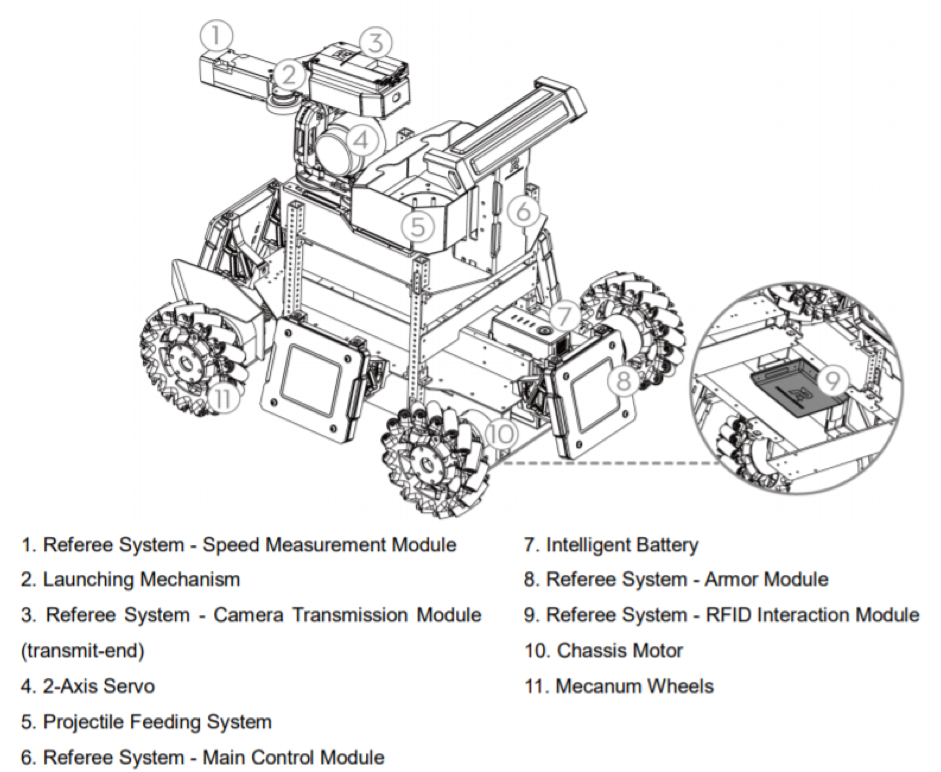
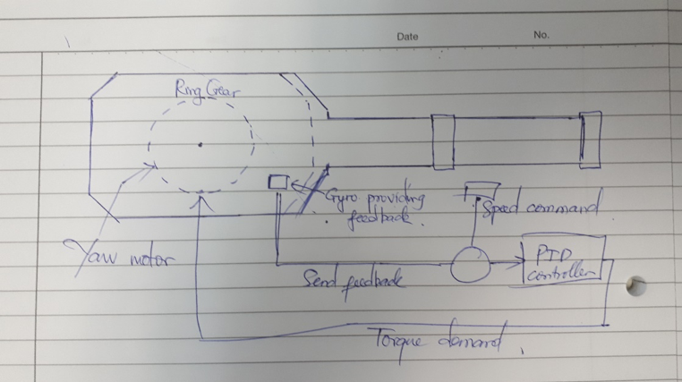
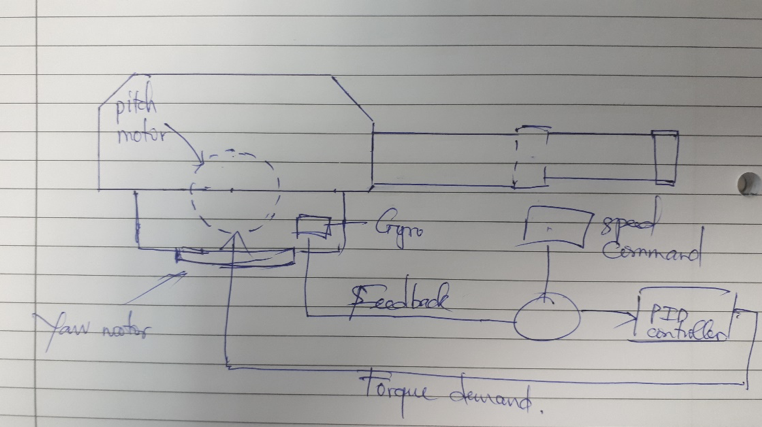
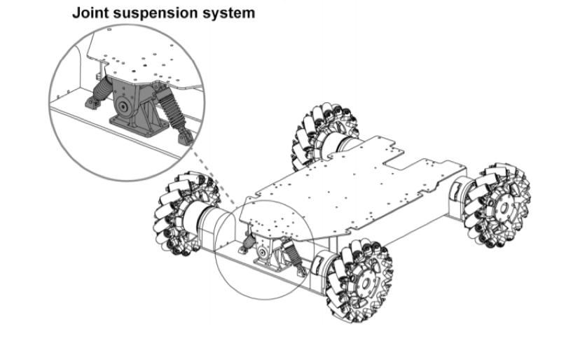
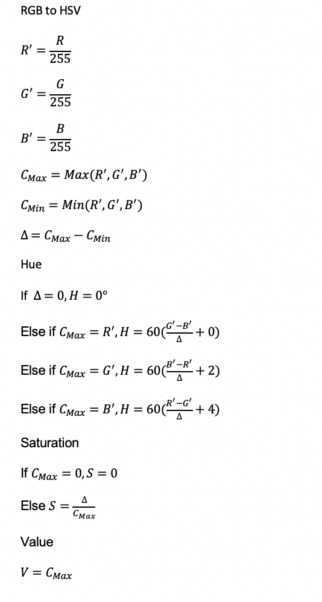
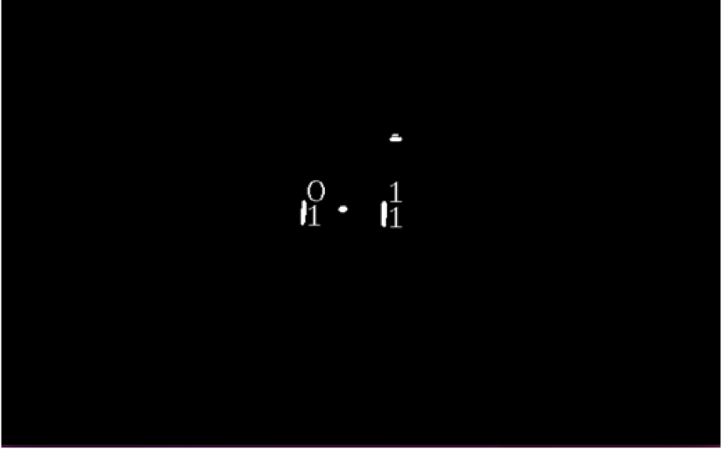
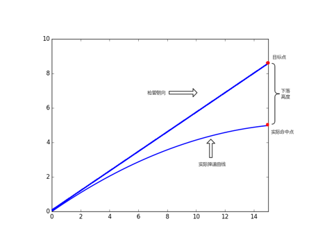
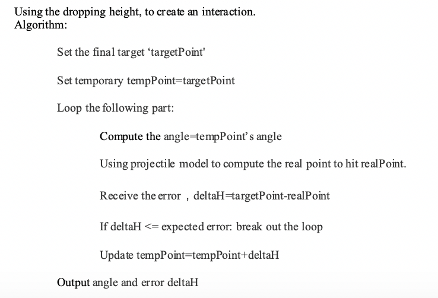
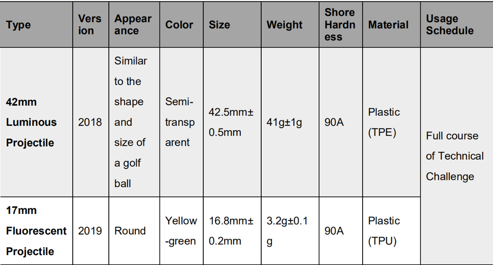
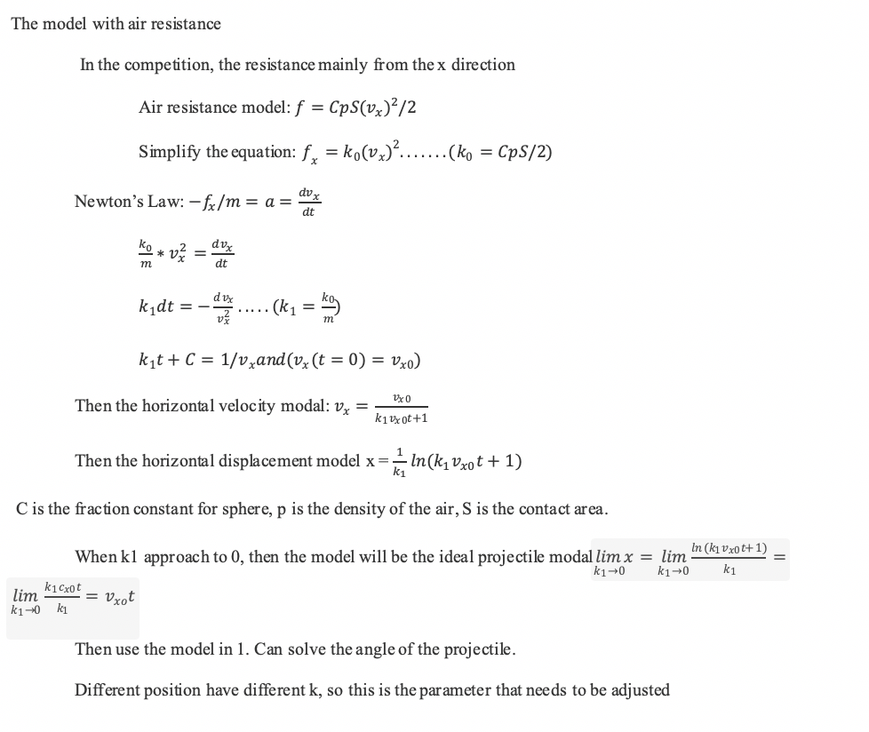

#  groundZero 

 The story of groundZero begins with a team of five engineering undergraduates who share the same excitement towards robotics and artificial intelligence. We strive to idealize, pilot and launch awesome robots that result in maximum impact on the job.
 
## Making groundZero perfection
As the great Alan Turing once said:
> Sometimes it's the people no one imagines anything of who do the things that no one can imagine

### Introducing groundZero's builders
We are a team of five as for now. We welcome like-minded individuals to join us in the journey of creating something magical together.

#### Phan Tuan Linh

Mechanical engineering student. Year 2. I study innovation and Design Program (iDP) as my second major. I have achieved several awards in Physics competitions in high school. However, I have no prior knowledge about robotics. 

#### Tew Wei Jie

Mechanical Engineering student, Year 2. I am studying Innovation and Design Program as my second major as well. Currently, I am involved with Space Challenge which focuses on space debris clearance. Robotics has been an interest of mine and hope to understand more about it. I first encountered robotics as my part time job as I teach students how to use EV3 to create their own robots and the programming logic for it. I would like to deal with the mechanical portion of the robotics and learn as much as possible. 

#### Chen Qixing
I am currently a year 1 computer engineering student. My first experience in robotic is a simple robotics workshop I have attempted in secondary school. I took H2 computing in junior college, so I have some programming experiences in Python and little knowledge about C. Furthermore, I like to play strategy games. I have participated in several chess competitions and won some prizes. I am currently interested in the area of computer vision and machine learning and hope I could gain some insights from this competition.

#### Lin Geyu
My name is Lin Geyu, I am an international student from China. I am studying Computer Engineering in Year 1. I haven’t done some project. But I want to try robomaster. Because I think this is a good place to make use of the knowledge from the classroom to build the robot. I know I still need to learn a lot if I can be a part of this project. I have tried to learn some about ROS and some programming language. I want to give the practical algorithm to the robot so that it can work more accurately, I think this is the most important thing in the competition. So I would like to learn more, even if there are some difficulties, I believe I will conquer. 

#### Mai Xueqiao
I am a year 2 industrial and system engineering student in NUS. I am passionate about creating things which bring a positive value to people around me with the advance of technology. Joining Robomaster is my first and major project which serves to challenge myself in the field of robotics as well as to sharpen both my soft and hard skills. I wish to contribute to the team to the best of my ability in any sorts. During my free time, I enjoy travelling and drink lots of coffee. :tada:
### Proposed Manpower Arrangement
No| Role          |  Description                        | Assigned to       | 
--|---------------|---                                  |---                |
 1|  Mechanical   |  To be confirmed               |  Phan Tuan Linh (Leader)   |
 2|  Mechanical   |  To be confirmed                  | Wei Jie |
 3|  Software   |  To be confirmed     |  Lin Geyu | 
 4|  Software  |  To be confirmed   | Chen Qixing          | 
 5|  Software     | To be confirmed           | Mai Xueqiao
 6|  Software     | Computer vision; Motion planning    | Open Position     | 
 7|  Operation    | Sponsorships; Chinese-English Translation | Open Position    |   

  For interested people to join our team, please contact Telegram @xxxx 

## Timeline & Milestones

## Robot Design Considerations

After reviewing relevant resources, these are some ideas we have for our first robot design.

### Battery 

One of the key aspects for the robot is the battery life. In order to robot to last the entire match which is approximately 1hr 30min, it is essential to ensure that the battery provide sufficient power throughout. For our robot, we will be using the Model DJI TB478D which is a Lithium Polymer battery type and it is lighter than normal batteries and it can last for a long period of time. As shown in Figure 1, the specific details for the battery is stated. 

### Control Kit (Pairing and Receiver)

The receiver that we decide to use is the 2.4 GHz 16-Channel Receiver that can be used with the DT7 remote control. 

### Projectile Feeding System and Launching Mechanism 

For the competition itself, the storing mechanism and accuracy of projectile plays an important part in the robot. There must also be a chamber pipe between the projectile cartridge and the barrel to ensure that the loaded projectiles are able to fire accurately. 
For our robot, we intend to have a separate cartridge and launching mechanism to increase the flexibility of the launching mechanism and capacity of the cartridge. The projectile feeding system will be located at the lower part of the robot. After the cartridge is loaded, there will be a time gap for the loading mechanism to fill the projectile pipeline before being shot through the barrel. Projectile loading will be driven the Robomaster M2006 P36 DC Brushless DC Gear motor with the C610 Brushless Motor Speed Controller. 
The launching mechanism shoots projectiles using the friction wheel that are powered by the two brushless DC motors that rotates in opposing directions. Through the rotational motion, the projectiles get kinetic energy after they are pushed pass the 2 friction wheels and it is then shot out of the barrel. Friction wheels are then driven by the DJI Snail 2305 Racing Motor with the Snail 430-R Racing ESC. For our robot, we will improve the accuracy and efficiency of the robot by using laser rangefinder to calculate the approximate distance between our robot and the enemy robots and using the data inputted to shoot the enemy. By collecting multiple data with the projectile system and plot it into the graph, we will be able to know the relative distance in order for the bullets to hit on target, thus, making our system more accurate. This idea utilises of feedback system from the sensors. The general process for this mechanism will be as follows, after the command to shoot is given to the robot, the laser will then be sent out to detect the approximate distance between our robot and the enemy robot. Using the data collected for the projectile motion according to distance for the bullets to travel, the power supplied to the two DC brushless motor will defer. One of the advantages of doing so is conservation of power. For further distance, more power will then be used to ensure that the bullets are able to travel straight throughout. On the other hand, for shorter distances, less power will be supplied to the projectile mechanism. Doing so will then allow battery conservation and ensure the accuracy of the projectile. 

### Gimbal:

With the RoboMaster robots, the system that we use to connect the chassis and the launching system is a 2-axis gimbal. In order to shoot opponent robots, we need to build gimbals so that they can rotate around vertical and lateral axes.
There are some limitations of the rotations. Pitch rotation can range from - 38° to +24° and yaw range is ±110°. The gimbal is integrated with an electronic stability control to improve the stability for the sake of better shooting efficiency while moving. It is drive by a brushless motor. An Inertia measurement unit (IMU) is built in to enable smooth movements and increase stability. 

### Chassis and Mecanum wheels:

The key factor of the chassis is that it comes with four Mecanum wheels. This special design of wheels enables robots to move in many directions such as forwards, sideways and diagonally. This means that robots can remain their orientations while moving in different directions. This helps the work of gimbals significantly and thus, facilitating shooting process. Additionally, this implementation of Mecanum wheels allows robots to rotate in place. Finally, four wheels should come with four electronic stability control systems. 

### Sensors: 
    
Two cameras are integrated on two sides of robots to achieve a broad view. High resolution and frame rates are desired to enhance robots’ performance. However, using to high resolution cameras may cause problems since they must be compatible with the other parts of robots, especially regarding to power supply. 

In addition, our group plan to attach the gyro sensor at the top of the camera to improve the stability of the robot. By calculating the angle of the robots, any deviation from the motion angle will be adjusted back to the original direction to ensure stability of the robot.  it will be able to sense the rotational motion and changes in orientation of the car. Since the angle at which the car faces can be set using the motion controllers on the car, we will then be able to program the gyro sensors in such a way that, it detects the deviation in the robot and sends a signal back to the control module and the control module will then change the angle back by using the mecanum wheels. This sensor can also be used as a camera-shake correction to ensure that the view of the robot will be accurate. 

For our team, what we will be looking at is a digital gyro sensor that range between 3.3V to 5V. One of the main advantages of it will be the low power that it consumes and can be used in battery powered applications. Moreover, having discrete information rather than analog will make the software portion easier to code as well. 

A general logic for this portion will be as follows: 

#### Considerations: 

The weight distribution of the robot must be spread evenly to ensure that there is equal contact between the wheels and ground. 

### Problem :

### Stabilization: 
- Gimbal

As mentioned above, we use a 2-axis gimbal. In terms of detecting enemy, error in direction of coordinates pitch and yaw between target location and the location of gun turret are processed by PID controllers. This control system follows two identical loops.

PID is used to mitigate error down to zero. Proportional control generates an output that is proportional to the error when it senses an error. To avoid saturation (constant error) that might occur, the integral controller is used. However, with high integral gain, the robot might experience high oscillations. Derivative controller is introduced to overcome this. The gyro outputs are served as feedback to torque motors of the gimbal in order to provide error tracking and stabilization purpose.

- 2)    Suspension system at the connection of the chassis and the wheels

## Computer vision
### Programming language options: C++ VS Python

C++ is a compiled language while Python is an interpreted language, python codes need to be interpreted first before it is compiled and executed while C++ codes skip the interpreting process. This means C++ is more efficient in terms of execution.
In terms of coding difficulty, python is easier to code and shortens the development process. Coders could focus on the functionality of the program rather than its process. 

### External library
Open-source computer vision (OpenCV) is a library that consists of programming functions that are extensively used in the field of computer vision. OpenCV supports both languages mentioned above. Many functions of a standard robot require the use of OpenCV, such as detection, recognition, mapping and localisation

### Targeting Algorithm

#### Frame rate and exposure

Set suitable frame rate and exposure for the camera, high frame rate and low exposure time can be extremely useful to image processing, it helps to reduce excessive disturbance and avoid blurry image due to fast movements. These parameters should be tested under various light intensities.

#### Image preprocessing 

The robots have blue and red lighting on their armour plate according to the referee system specifications. Preprocessing involve the use of HSV (Hue, Saturation, Value) colour model, then the image is represented with a binary value diagram.
Usually, cameras capture images with the RGB colour model, which is inconvenient to separate the colours, thus it needs to be converted to HSV first.

Comparison of binarization algorithms: Otsu VS Kittler
Otsu’s method: Exhausting threshold space to find minimum intra-class variance, pixels are separated into two classes, foreground and background, and it returns single threshold value that is determined by minimizing intra-class variance. Its performance reduces when the object is very small, small mean difference between foreground and background, large amount of noise and uneven distribution of light.
Kittler’s method: It makes used of Gaussian distribution and calculates the grayscale mean gradient of the image, which determines the threshold value between foreground and background. Its result is comparable to Otsu’s method but more efficient. However, it requires higher quality image.

- Before:

- After

Source: https://bbs.robomaster.com/thread-7873-1-1.html

### Data extraction
Extract contour information from the binary value diagram using findContours function from OpenCV, then through a series of conditions to rule out the unlikely lamps, use the smallest rectangle or oval to estimate the shape of the detected lamps and find the most likely target.

### Armour plate detection

After filtering out all the possible lamps, pair the lamps, by calculating the distance, the difference between the slopes and length ratio between the lamps, sieving out the most likely target and calculate the centre point of the plate.

###  Gimbal control
After receiving the position of the centre point, calculate the distance between the centre point and the current image centre, input the difference in the x-axis to gimbal yaw axis and difference in y-axis to gimbal pitch axis. By sending the difference value continuously to complete a closed-loop control.

### Projectile model in standard robot
+ Introduction
The model for bullet while flying is important for standard robot. A good model for the projectile can help to increase the accuracy of shooting. First, consider about a simple ideal projectile model without air resistance. Then add the impact from the air resistance, and build a model for the projectile.

+ Ideal Projectile model
If only consider about the gravity, the projectile motion of the pilot is shown: 

The detecter can give the location (x,y), robot needs an algorithm to solve the shooting angle.

Using the dropping height, to create an interaction : 

+ Algorithm

- Set the final target ‘targetPoint' 
- Set temporary tempPoint=targetPoint
- Loop the following part:
  -  Compute the angle=tempPoint’s angle
  -  Using projectile model to compute the real point to hit realPoint.
  -  Receive the error，deltaH=targetPoint-realPoint
  -  If deltaH <= expected error: break out the loop 
  -  Update tempPoint=tempPoint+deltaH 
- Output angle and error deltaH 

### Modeling with air resistance

### Proposed Budget

| Part            | Product Name       | Quantity      | Price (USD) | Total |
| --------------------- |:--------------:| -------------:|  -------------:|  -------------:|
| Mecanum Wheels Chassis | RoboMaster M3508 P19 Brushless DC Gear Motor             | 4           | 79 | 316
|                                             | RoboMaster C620 Brushless DC Motor Speed Controller   | 4           | 63 | 252
|                                             | RoboMaster ESC Center Board                                            | 1           | 5 | 5
|                                             | RoboMaster Mecanum Wheel (left)                                       | 2           | 44 | 88
|                                             | RoboMaster Mecanum Wheel (right)                                     | 2           | 44 | 88
|Gimbal                                 | RoboMaster GM6020 Brushless DC Motor                           | 2          | 189 | 378
|Trigger Mechanism              | RoboMaster M2006 P36 Brushless DC Gear Motor              | 1          | 41 | 41
|                                             | RoboMaster C610 Brushless DC Motor Speed Controller   | 1           | 25 | 25
|                                             | RoboMaster Red Dot Laser                                                   | 1           | 13| 13
|                                             | TB47D Battery                                                                       | 2           | 216 | 432
|                                             | RoboMaster Battery Rack (compatible)                                | 1           | 16 | 16
|Control System                    | RoboMaster Robot Remote Controller Set                            | 1          | 56 | 56
|                                             | RoboMaster Development Board Type A                               | 1           | 68 | 68
|                                             | RoboMaster Development Board Cables                              | 1           | 40| 40
| Enclosure                            | RoboMaster TB47 Battery 100W Charger AC Cable             | 1           | 4 | 4
|                                            |RoboMaster TB47 Battery Charger 100W (without AC cable) | 1          |19 | 19
| Total Budget                       |                                                                                                 |             |      | 1841

### References 

1. https://robomaster.github.io/RoboRTS-Tutorial/#/en/hardware_specifications
2. https://cdn-hz.robomaster.com/documents/935c504aecb741521451469256431010.pdf
3. https://normxu.github.io/resource/Johns_Hopkins_University__Hopkins_AI_ICRA_Technical_Report-ilovepdf-compressed.pdf
4. https://www5.epsondevice.com/en/information/technical_info/gyro/
5. https://hub.hamamatsu.com/us/en/application-note/measuring-distance-with-light/index.html
6. https://bbs.robomaster.com/thread-7873-1-1.html
7. https://bbs.robomaster.com/thread-7873-1-1.html

