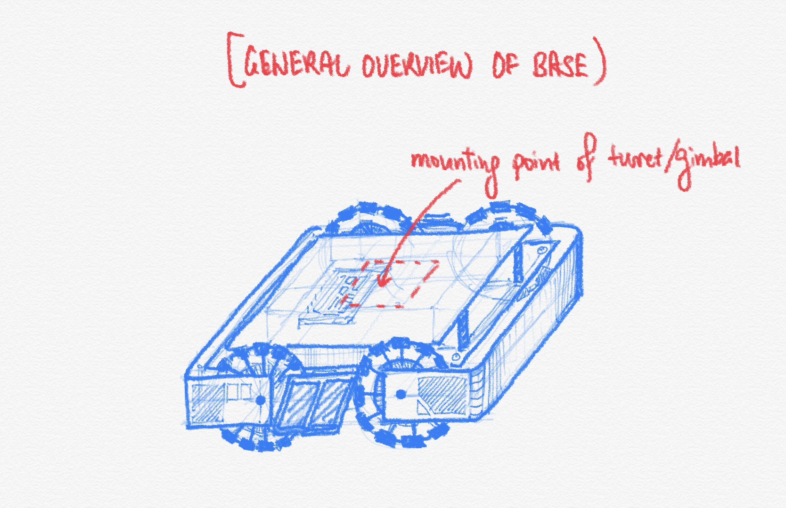
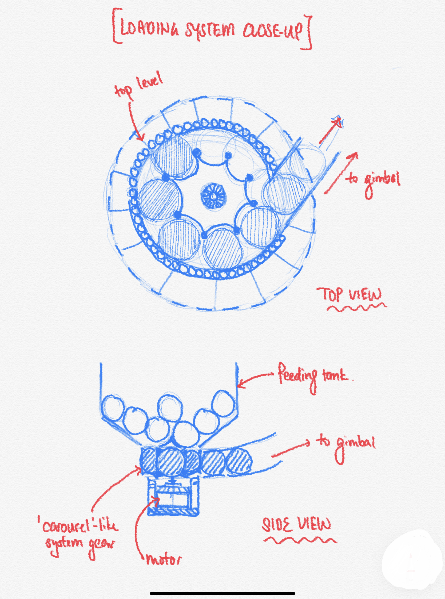
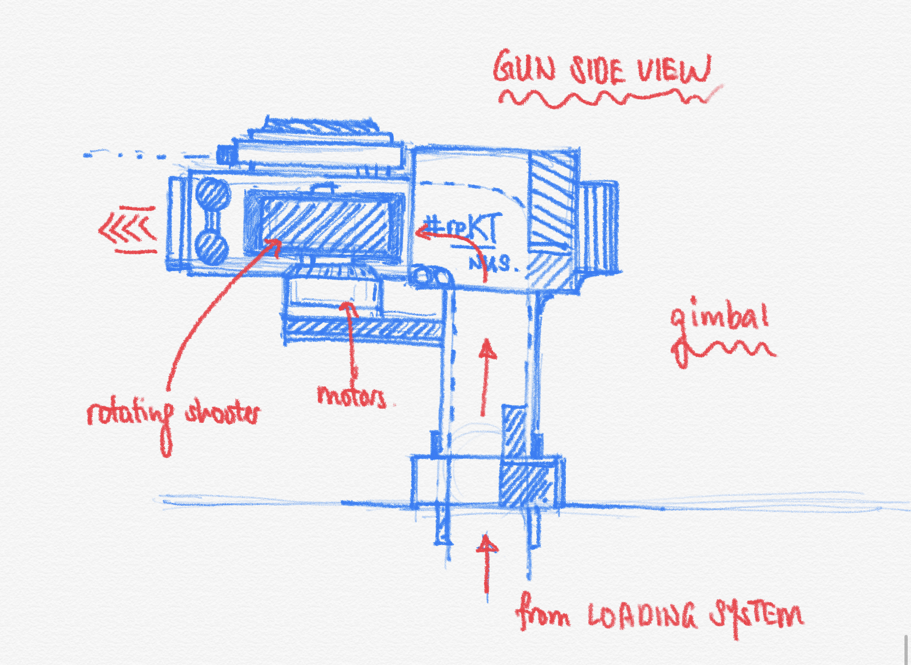
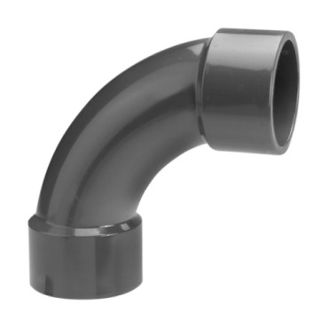

# reKt.robotiKs

## Introduction

## robotiKs specialisKs

### Mong Juin Hwaye (Hwaye)

A dare-to-dream Mechanical Engineering freshman from NUS. With a strong passion, I have been active in the field of robotics and automation for about a decade. Prior to joining NUS, I was part of the NUS-MOE Science Research Program, specializing in the mapping and simulation of self-driving vehicles in the SMART-FUM Lab. This 1.5 year attachment was where I delved into learning about the Robot Operating System (ROS) and Gazebo simulation platforms. I was an active representative of the school team, where I represented the country to several robotic competitions including the First Lego League 2016 World Festival in the USA - Mechanical Design Award. These experiences reassured me that I would always enjoy working with mechanical structures and software controls. What motivates even further is that the DJI Robomasters requires a large collective effort, including so many more fields that I’m also interested in! Can’t wait to compete in the finals, and finally visit the Silicon Valley of the East as a robotics specialist!

### Tan Je Sean (Je Sean)

I am currently a Year 1 Mechanical Engineering student and have quite a large interest in the field of robotics. I was part of the robotics team back in Secondary and High School. Having also had the opportunity to participate in WRO, it showed me how designs and concepts can vary widely between others and my own and this really sparked a fire within me to further dive into the field of robotics. I loved seeing when my robot is able to run as designed, it is almost as if watching your child grow up. From the stages of conception or the final stage of completion, every step of the way is a learning journey. Whenever I stumble across an obstacle I will take it as a challenge and not rest until it has been solved. I have also undertaken an apprenticeship in a mechanic shop, providing me with relevant skills on how to use power tools and the use of nuts and bolts for fabrication techniques and mechanical systems that are readily-used in the industry.

### Teo Ru Min (Ru Min)

As a current Mechanical Engineering student, I had been into the robotics team in secondary school and had developed a passion in this area. I would really like to join this competition, and it is mainly to deepen my knowledge and understanding in this specific sector. Out of the 7 robots, I am particularly interested in the Engineer robot since this robot have more freedom in terms of the designing of mechanism. Since I plan to venture into this sector, I would like to take this opportunity to learn more about it. 

### Kelly Ha (Kelly)

Being a biomedical engineering undergraduate, I always wonder how the robot mechanism can help humans. Taking this opportunity, I can adapt the future technologies with the properties and characteristics of homo sapiens in order to have a real high intelligence robot. Things including how the movement of the body or fluid mechanism of the human body can be adapted to the machine. I have never been into any robotics event unlike the rest of my team, however, I'm willing to learn and support them with my passion. I take this as one of my obstacles, and like always, I will find a way to go across it. By the meantime, I will like to take this opportunity to reach my hand to those talented in electrical components to join our team!

### Proposed Manpower Arrangement
No| Role          |  Description                        | Assigned to       | 
--|---------------|---                                  |---                |
 1|  Mechanical   | Chassis; Suspension                 |  Hwaye            |
 2|  Mechanical   | Gun; Gimbals system                 |  Je Sean          |
 3|  Electrical   | Power management; Electric Drive; Fail-safe   | Ru Min |
 4|  Electronics  | Sensor interface; Close-loop Control  |  Open position      | 
 5|  Software     | Linux OS; Sensor drivers            | Hwaye             | 
 6|  Software     | Computer vision; Motion planning    | Open position           | 
 7|  Operation    | Sponsorships; Chinese-English Translation | Kelly, Hwaye |   
 8|  Operation    | Accounting; Publicity Materials     | Kelly             |  
 9|  Pilot        | TX & RX system; Game-play strategy  | Ru Min, Kelly     |

 For interested people to join our team, please contact Telegram @felixmong

## Timeline & Milestones

## robotiKs Design Considerations

### BASE

1. Standard guidelines for Hero robot (from DJIRoboMaster 2019 Technical Challenge Rules Manual V2.1 (20190725)):

	- Allowed Targets: non-Aerial robots
	- Total Power Supply Capacity: 200 Wh
	- Power Supply Voltage: 30V
	- Robot Chassis Power Consumption: 80W
	- Initial Firing Speed Limit: 30 m/s (Note: Barrel Heat game mechanic)
	- Maximum Weight: 20 kg
	- Maximum Initial Size (mm): 600(L) x 600(W) x 500 (H)   (L & W: Orthographic Projection)
	- Maximum Expansion Size (mm): 700(L) x 700(W) x 600 (H) (L & W: Orthographic Projection)
	- Only 17mm standard projectiles can be received and launched
	
2. RoboMaster Referee System (from DJIRoboMaster 2019 Technical Challenge Rules Manual V2.1 (20190725)):
	- 4 Small Armor Modules 
	- 1 Large Armor Module
	- Speed Monitor Module (17 mm projectile)
	- Video Transmission Module (VTM)
	- RFID Interaction Module
	- Positioning Module
	- Main Control ModulE
	- Power Supply Management Module
	- Light Strip Module
	- Projectiles:
		- 42mm, Similar to Golf Ball, 42mm +- 0.5mm, 40.2 +- 0.2g, 90A Shore Hardness, TPE Plastic
		- 17mm, Round, 16.9 +- 0.1g, 2.9 +- 0.1g, 90A Shore Hardness, TPU Plastic

2. Mecanum wheels are to be utilised as the main driving wheel. The base of the robot in contact with the ground would form a square/rectangle, such that the centre of rotation of the base is equidistant to all force wheels.

3. Each individual wheel and motor assembly will be suspended by a double wishbone system to ensure stability of robot during jumps, climbing over inclined surfaces and collisions with other robots.

4. The use of coilovers to dampen oscillations and provide a smoother ride and movement and allow for precision targeting of turret.

5. Wheels to be directly mounted onto driving motors to reduced total suspended weight and reduce stress on suspension system and reduce positioning error due to slight flexing in the power transmission (such as flex from chains or rubber pulleys).

6. Bumper to be placed around the wheels to prevent the wheels from getting stuck in the event of collision or projectiles being stuck. Small plating and foam insulation to cover up crevices and prevent projectiles from getting stuck and robot from getting damaged.

7. Electronic Speed Control (ESC) will be installed on the movement wheels.
	- To monitor speed of all individual motors, while easing the calibration and accuracy of robot movements.
	
8. Electric Voltage and Current Limiter Control Boards should be added to prevent overcurrent and overvoltage to sensitive electronics.

### GIMBAL/TURRET

1. The gun/gimbal system shall be mounted in the centre of rotation of the base to allow for 360° rotation of the body and gimbal system. This allows a wider firing range and allows the robot to spin on its base without much effect to the gun, as one of the strategies is to keep the touch pads in motion to reduce chance of damage. As all robots are free to move, there might be incoming robots from all directions. Therefore, it is essential to design the robot in a way which can counter-attack the enemy in the shortest time possible. By allowing the gimbal to turn 360 degrees, the robot can quickly react to other enemy robot.

2. Majority of the motor/movement systems will be mounted lower to reduce the centre of gravity, increasing stability of robot.

3. The turret will have minimum 45° degrees angle relative to the horizon for maximum transverse distance and 360 degrees left and right sweep angle to allow maximum firing range.

4. Gimbal systems will be designed separately with its own MCU mounted within the module. This will prevent entanglement of wires and allow for unrestricted movement of turret.

5. The projectile hopper will be mounted on the base itself to reduce weight on the gimbal system to ensure mobility of turret and reduce the overall centre of gravity.

6. A “carousel” like system with slanted base leading to the feeding system in the bottom of hopper to feed projectiles to the turret. Bullets will be fired by feeding the gun with projectiles to ensure continuous fire rate.

7. A cone to be placed over the rotating mechanism to direct the projectiles into the firing mechanism.

8. The feeding system will be mounted in the centre of rotation for all axis of gimbal (i.e. axis of yaw and axis of pitch) to allow for rotation along both axis of gimbal. Each connection will be sleeved into each other to ensure unobstructed path for projectiles and all joints to be fit with rollers to ensure smooth movement.

9. Electronic Speed Control (ESC) on firing mechanisms motors
	- To regulate the speed of shooting of firing motors within the regulation maximum of 30m/s for 70mm projectiles.
	- It can be used to control the amount of projectiles shot based on radius calculations of motor rotations per projectile.

## General Design and Fabrication Methods

We plan to use Aluminium Extrusions as the basic building block of the robot base while PVC pipes for the feeder mechanism due to their low cost and high availability of material. The feeding mechanism will utilise PVC pipes with slight bigger diameter  than projectile to ensure projectiles move in a single file without being stuck and the corner pieces to utilise bends with large bend radius to allow smooth movement. It can be easily cut and connected to form different shapes and sizes according to our needs and dimensions.

 
 
 

Certain parts that cannot be sourced or require more strength than 3D printed stuff we will utilise milling, lathing, CNC and other available workshop tools to fabricate certain connecting parts. Other elements that does not require high strength can be 3D modelled and 3D printed to save costs.

Both the base and gimbal module will be developed separately but in close communication to allow modularity and ease of maintenance in the case of a need to swap. Easy to remove mounts as well as standardised mounting frames will be incorporated as modularity will remain a large part in our design process.

Since the robot will be constantly moving and will have much impact with other robots, dish-locking washer and nuts will be used to ensure all connections are tight and will not be loosened by impact.

## Proposed Budget

No| Component     |  Unit Price (USD)                   | Quantity       | Total |
--|---------------|---                                  |---                |---  |
 1| MAIN CONTROL MODULE MC02MAIN CONTROL MODULE MC02 | 120 | 1 | 120 |
 2| POWER MANAGEMENT MODULE PM01 | 124 | 1 | 124 |
 3| LIGHT INDICATOR MODULE C101 | 124 | 1 | 124 |
 4| ROBOMASTER VTM TRANSMITTER VT12 | 219 | 1 | 219 |
 5| ROBOMASTER VTM TRANSMITTER VT02 | 219 | 1 | 219 |
 6| SPEED MONITOR MODULE SM11 | 140 | 1 | 140 |
 7| SPEED MONITOR MODULE SM01 | 122 | 1 | 122 |
 8| ARMOR MODULE AM12 | 173 | 1 | 173 |
 9| ARMOE MODULE AM02 | 159 | 1 | 159 |
10| ARMOR SUPPORT FRAME TYPE A | 85 | 1 | 85 |
11| ARMOR SUPPORT FRAME TYPE B | 83 | 1 | 83 |
12| POSITIONING MODULE VW01 | NA | 1 | NA |
13| RFID INTERACTION MODULE F102 | 75 | 1 | 75 | 
14| RFID INTERACTION CARD TC01 | 47 | 1 | 47 |
15| ROBOMASTER CABLE PACKAGE CP02 |49|1|49|
16| ROBOMASTER DEVELOPMENT BOARD TYPE A |89|1|89|
17| ROBOMASTER DEVELOPMENT BOARD TYPE B |49|1|49|
18| ROBOMASTER DEVELOPMENT BOARD OLED |25|1|25|
19| ROBOMASTER DEVELOPMENT CABLES |49|1|49|
20| ROBOMASTER GM6020 BRUSHLESS DC MOTOR |189|1|378| 
21| DJI SNAIL 2305 RACING MOTOR |20|1|20|
22| ROBOMASTER M3508 P19 BRUSHLESS DC GEAR MOTOR |115|1|115|
23| ROBOMASTER C620 BRUSHLESS DC MOTOR SPEED CONTROLLER |89|1|89|
24| ROBOMASTER RED LASER SIGHT |4|1|4|
25| MECANUM WHEEL(RIGHT) |65|2|130|
26| MECANUM WHEEL(LEFT) |65|2|130|
27| ROBOMASTER RM35 BRUSH DC GEAR MOTOR |60|4|240|
28| ROBOMASTER CENTER BOARD |120|1|120|
29| ROBOMASTER BATTERY HOLDER(COMPATIBLE) |10|1|10|
30| ROBOMASTER UWB POSITIONING SYSTEM SET |NA|1|NA|
31| MACHIFIT 300MM LENGTH 3030 T-SLOT ALUMINIUM PROFILES  EXTRUSION FRAME FOR CNC |7|17|120|
32| SILVER RECTANGULAR TIN (HOPPER) |10|1|10|
33| PVC 90 DEGREE JOINT |2|1|2|
34| BALL BEARING |2|2|4|
35| ALUMINUM FLAT PLATE HA0523 (20CM X 30CM) |4|6|24|
36| HOSIM RC SHOCK ABSORBER |13|4|52|
37| MISCELLANEOUS ITEMS |200| |200|
38| NVIDIA JETSON NANO DEV KIT | 170 | 1 | 170 |
39| TF MINI - MICRO LIDAR MODULE | 64 | 1 | 64 |
40| ADAFRUIT ULTRASONIC DISTANCE | 4 | 1 | 4 |
| | | | TOTAL | 3837 |

   
 
