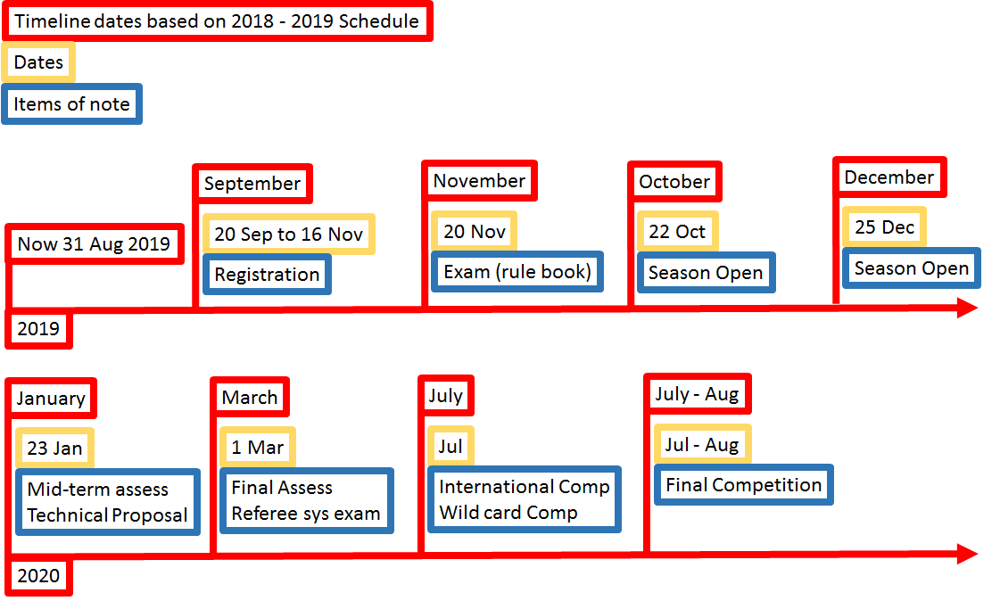
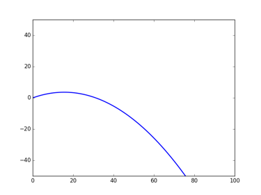
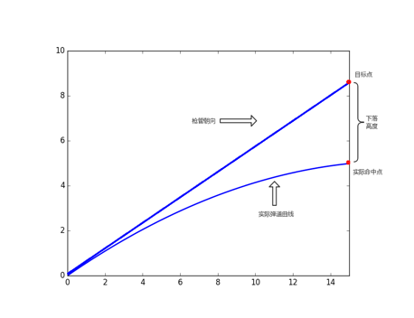

#  groundZero 

 The story of groundZero begins with a team of five engineering undergraduates who share the same excitement towards robotics and artificial intelligence. We strive to idealize, pilot and launch awesome robots that result in maximum impact on the job.
 
## Making groundZero perfection
As the great Alan Turing once said:
> Sometimes it's the people no one imagines anything of who do the things that no one can imagine

### Introducing groundZero's builders
We are a team of five as for now. We welcome like-minded individuals to join us in the journey of creating something magical together.

#### Nathan

... insert intro

#### Wei Jie

... insert intro

#### Chen Qixing
I am currently a year 1 computer engineering student. My first experience in robotic is a simple robotics workshop I have attempted in secondary school. I took H2 computing in junior college, so I have some programming experiences in Python and little knowledge about C. Furthermore, I like to play strategy games. I have participated in several chess competitions and won some prizes. I am currently interested in the area of computer vision and machine learning and hope I could gain some insights from this competition.

#### Lin Geyu
My name is Lin Geyu, I am an international student from China. I am studying Computer Engineering in Year 1. I haven’t done some project. But I want to try robomaster. Because I think this is a good place to make use of the knowledge from the classroom to build the robot. I know I still need to learn a lot if I can be a part of this project. I have tried to learn some about ROS and some programming language. I want to give the practical algorithm to the robot so that it can work more accurately, I think this is the most important thing in the competition. So I would like to learn more, even if there are some difficulties, I believe I will conquer. 

#### Mai Xueqiao
I am a year 2 industrial and system engineering student in NUS. I am passionate about creating things which bring a positive value to people around me with the advance of technology. Joining Robomaster is my first and major project which serves to challenge myself in the field of robotics as well as to sharpen both my soft and hard skills. I wish to contribute to the team to the best of my ability in any sorts. During my free time, I enjoy travelling and drink lots of coffee. :tada:

### Proposed Manpower Arrangement
No| Role          |  Description                        | Assigned to       | 
--|---------------|---                                  |---                |
 1|  Mechanical   |  To be confirmed               |  Brian (Leader)   |
 2|  Mechanical   |  To be confirmed                  | Open Position|
 3|  Software   |  To be confirmed     |  Lin Geyu | 
 4|  Software  |  To be confirmed   | Chen Qixing          | 
 5|  Software     | To be confirmed           | Mai Xueqiao
 6|  Software     | Computer vision; Motion planning    | Open Position     | 
 7|  Operation    | Sponsorships; Chinese-English Translation | Open Position    |   

  For interested people to join our team, please contact Telegram @xxxx 

## Timeline & Milestones

## Robot Design Considerations

After reviewing relevant resources, these are some ideas we have for our first robot design.

### Control Kit (Pairing and Receiver)

The receiver that we decide to use is the 2.4 GHz 16-Channel Receiver that can be used with the DT7 remote control. 
Projectile Feeding System and Launching Mechanism 
For the competition itself, the storing mechanism and accuracy of projectile plays an important part in the robot. There must also be a chamber pipe between the projectile cartridge and the barrel to ensure that the loaded projectiles are able to fire accurately. 
For our robot, we intend to have a separate cartridge and launching mechanism to increase the flexibility of the launching mechanism and capacity of the cartridge. The projectile feeding system will be located at the lower part of the robot. After the cartridge is loaded, there will be a time gap for the loading mechanism to fill the projectile pipeline before being shot through the barrel. Projectile loading will be driven the Robomaster M2006 P36 DC Brushless DC Gear motor with the C610 Brushless Motor Speed Controller. 
The launching mechanism shoots projectiles using the friction wheel that are powered by the two brushless DC motors that rotates in opposing directions. Through the rotational motion, the projectiles get kinetic energy after they are pushed pass the 2 friction wheels and it is then shot out of the barrel. Friction wheels are then driven by the DJI Snail 2305 Racing Motor with the Snail 430-R Racing ESC. 

### Gimbal:

With the RoboMaster robots, the system that we use to connect the chassis and the launching system is a 2-axis gimbal. Why do we need 2-axis one but not 3? Because we do not expect the launching system of robots to “roll”, we eliminate the roll axis. In other words, we fix the rotation around the longitudinal axis. In order to shoot opponent robots, we need to build gimbals so that they can rotate around vertical and lateral axes. Regarding to aiming the enemy armours, the first step is to make yaw rotation so that the vertical plane containing the launching system goes through the target. Then we consider the pitch rotation. The projectile does not go in a straight trajectory due to gravity and air resistance. It could result in decrease of projectile velocity and the projectile tend to be pulled towards the Earth. Therefore, the closer the enemy, the more accurate and easier for us to shoot. The factors that define the probability of hitting the opponent armours are the distance from our robot to the enemy and how large the distance of two lights on the enemy armours is. 
There are some limitations of the rotations. Pitch rotation can range from - 38° to +24° and yaw range is ±110°. The gimbal is integrated with an electronic stability control (ESC) to improve the stability for the sake of better shooting efficiency while moving. It is drive by a brushless motor. An Inertia measurement unit (IMU) is built in to enable smooth movements and increase stability. 
Chassis and Mecanum wheels:

The key factor of the chassis is that it comes with four Mecanum wheels. This special design of wheels enables robots to move in many directions such as forwards, sideways and diagonally. This means that robots can remain their orientations while moving in different directions. This helps the work of gimbals significantly and thus, facilitating shooting process. Additionally, this implementation of Mecanum wheels allows robots to rotate in place. This strategy can drastically minimize the impact of being hit by enemy robots. When robots are spinning, the angle between the trajectory of coming projectiles and the armours will change. The impact would be largest if projectiles hit the armours directly orthogonally. A spinning robot makes it almost impossible to be hit by projectiles orthogonally. Besides from special wheels, the chassis should be equipped with a front-wheel suspension system to move effectively in the competition zones. Finally, four wheels should come with four electronic stability control (ESC) systems. 

### Sensors: 
	
Lidar is used in the robots for the purpose of localization algorithms. Moreover, two cameras are integrated on two sides of robots to achieve a broad view. Regarding to detecting and tracking enemies, high resolution and frame rates are desired to enhance robots’ performance. However, using to high resolution cameras may cause problems since they have to be compatible with the other parts of robots, especially regarding to power supply. 

### Considerations: 

Lubrication must be applied to the mechanical component of the wheels to reduce friction that can potentially affect the direction of travel for the robot. In addition, the weight distribution of the robot must be spread evenly to ensure that there is equal contact between the wheels and ground. 

### Projectile model in standard robot
+ Introduction
The model for bullet while flying is important for standard robot. A good model for the projectile can help to increase the accuracy of shooting. First, consider about a simple ideal projectile model without air resistance. Then add the impact from the air resistance, and build a model for the projectile.

+ Ideal Projectile model
If only consider about the gravity, the projectile motion of the pilot is shown: 

The detecter can give the location (x,y), robot needs an algorithm to solve the shooting angle.

Using the dropping height, to create an interaction : 

+ Algorithm

1. Set the final target ‘targetPoint' 

2. Set temporary tempPoint=targetPoint

3. Loop for 10 times 

4. Compute the angle=tempPoint’s angle

5. Using projectile model to compute the real point to hit realPoint.

6. Receive the error，deltaH=targetPoint-realPoint 

7. Update tempPoint=tempPoint+deltaH 

8. Output angle and error deltaH 

### Modeling with air resistance

In the competition, the resistance mainly from the x direction

### Proposed Budget

| Part            | Product Name       | Quantity      | Price (USD) | Total |
| --------------------- |:--------------:| -------------:|  -------------:|  -------------:|
| Mecanum Wheels Chassis | RoboMaster M3508 P19 Brushless DC Gear Motor             | 4           | 79 | 316
|                                             | RoboMaster C620 Brushless DC Motor Speed Controller   | 4           | 63 | 252
|                                             | RoboMaster ESC Center Board                                            | 1           | 5 | 5
|                                             | RoboMaster Mecanum Wheel (left)                                       | 2           | 44 | 88
|                                             | RoboMaster Mecanum Wheel (right)                                     | 2           | 44 | 88
|Gimbal                                 | RoboMaster GM6020 Brushless DC Motor                           | 2          | 189 | 378
|Trigger Mechanism              | RoboMaster M2006 P36 Brushless DC Gear Motor              | 1          | 41 | 41
|                                             | RoboMaster C610 Brushless DC Motor Speed Controller   | 1           | 25 | 25
|                                             | RoboMaster Red Dot Laser                                                   | 1           | 13| 13
|                                             | TB47D Battery                                                                       | 2           | 216 | 432
|                                             | RoboMaster Battery Rack (compatible)                                | 1           | 16 | 16
|Control System                    | RoboMaster Robot Remote Controller Set                            | 1          | 56 | 56
|                                             | RoboMaster Development Board Type A                               | 1           | 68 | 68
|                                             | RoboMaster Development Board Cables                              | 1           | 40| 40
| Enclosure                            | RoboMaster TB47 Battery 100W Charger AC Cable             | 1           | 4 | 4
|                                            |RoboMaster TB47 Battery Charger 100W (without AC cable) | 1          |19 | 19
| Total Budget                       |                                                                                                 |             |      | 1841

